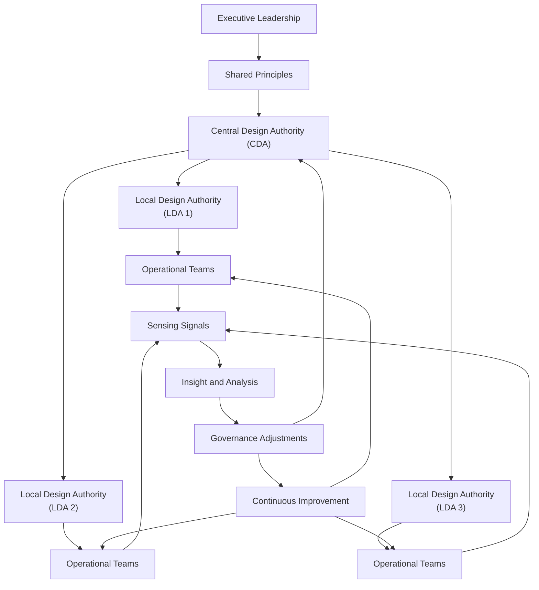
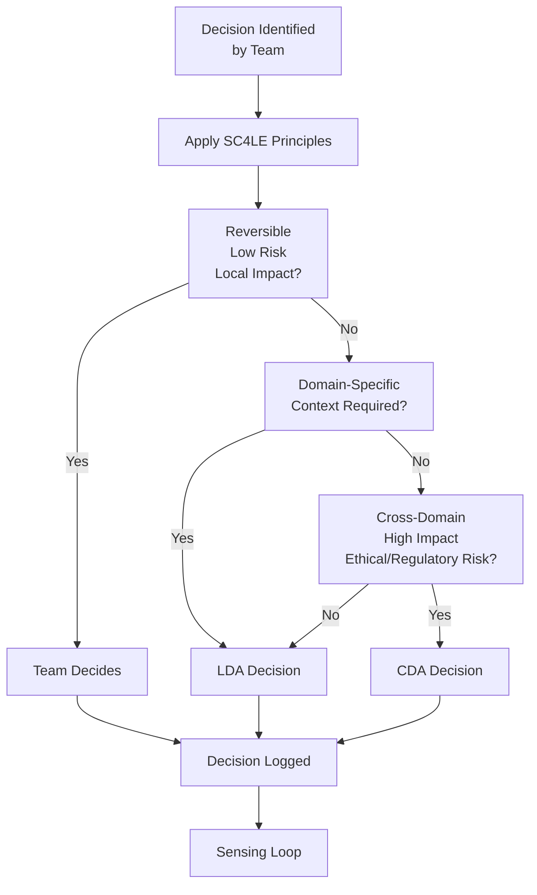
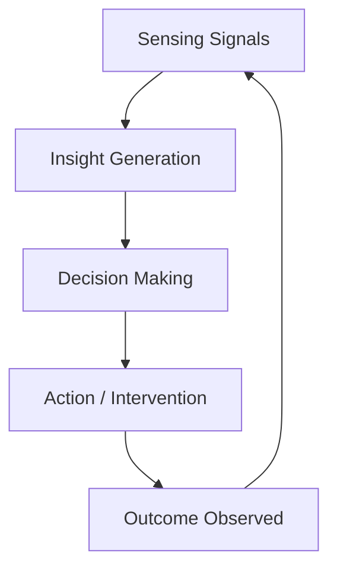
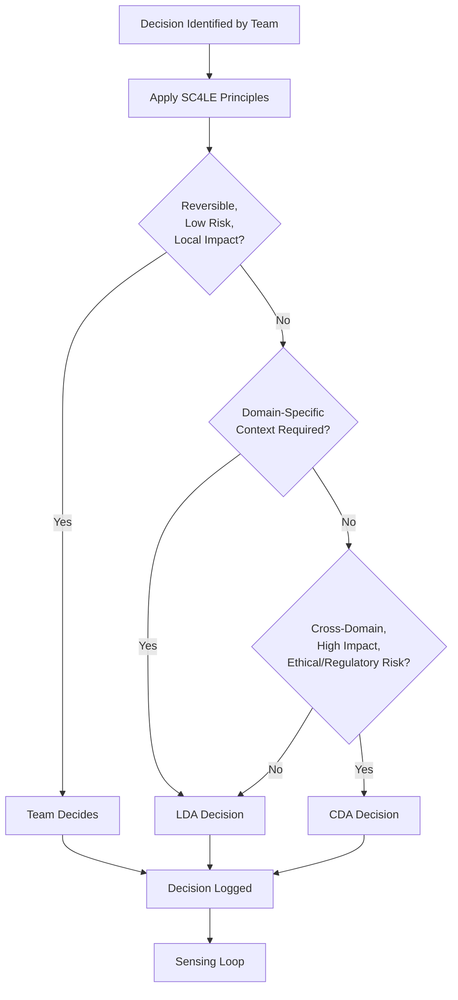
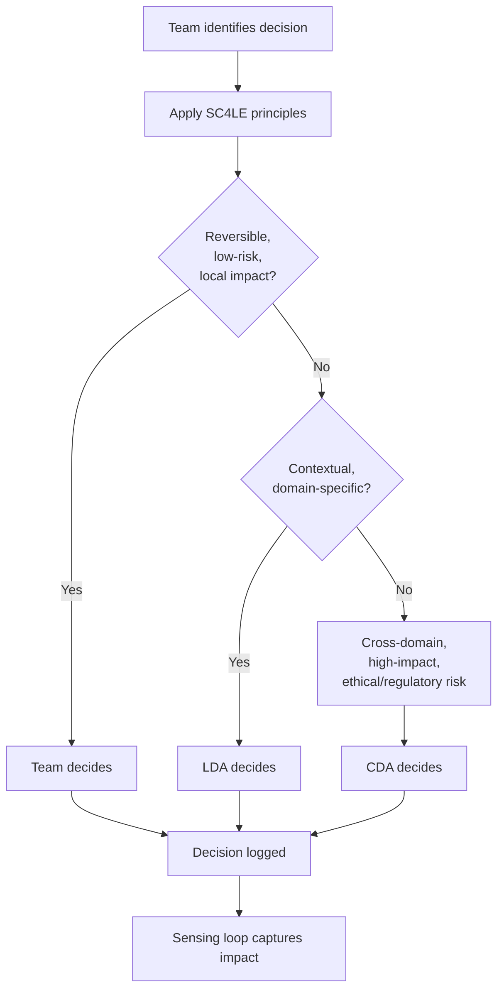

# Repository export: sc4le-standards (part 1)

- commit: `83eeea6d51137b900f1eae9594cdca57a9520444`
- branch: `main`
- generated_by: tools/export_repo.py
- generated_at: 2026-09-09T16:01:31.589727Z

---

## Directory tree (Markdown files)

```text
ai-assisted-sensing/
    adaptation-log.md
    outcome-dashboard.md
brand/
    brand-overview.md
    logo-usage.md
    tone-of-voice.md
diagrams/
    README.md
    SC4LE-diagrams.md
    decision-pathway.md
    governance-architecture.md
    sensing-loop.md
foundations/
    README.md
    evidence-base.md
    sc4le-narrative-architecture.md
    sc4le-principles.md
maturity-model/
    README.md
    maturity-assessment-template.md
    maturity-dashboard.md
    maturity-heatmap.md
operating-model/
    decision-pathways/
        cda-decision-guide.md
        escalation-thresholds.md
        lda-decision-guide.md
        standard-decision-flow.md
    rhythms/
        flow-cadence.md
        improvement-cadence.md
        leadership-cadence.md
        sensing-cadence.md
    roles/
        cda.md
        lda.md
        sc4le-academy-lead.md
        sc4le-enablement-lead.md
        sc4le-flow-architect.md
        sc4le-governance-architect.md
        sc4le-insight-architect.md
    ai-enabled-sensing-operating-model.md
    federated-governance.md
    index.md
    maturity-model.md
    operating-model-index.md
    sc4le-federated-governance-standard.md
    sc4le-model-overview.md
    sc4le-operating-model-standard.md
programmes/
    SC4LE-SCALE-UPS.md
services/
    commercial/
        Advisory‑as‑a‑Service (Fractional Transformation Office).md
        change-portfolio-prioritisation-and-decision-frameworks.md
        leadership-decision-coaching-and-executive-enablement.md
        strategy-activation-and-alignment-workshops.md
        value-stream-mapping-and-flow-optimisation.md
    standard/
        Principle System Design.md
        SC4LE Operating Model Design & Blueprinting.md
        ai-enabled-sensing-and-insight-system-design.md
        federated-governance-system-design-and-assurance.md
        local-design-authority-setup-and-enablement.md
        operating-model-health-check.md
        risk-dependency-and-decision-latency-diagnostics.md
        sc4le-academy-capability-building-and-skills-development.md
        sc4le-enablement-cycles-and-continuous-improvement-system.md
        service-interlink-map.md
        service-to-principle-map.md
    index.md
standards/
    governance-brand.md
    governance-content.md
    governance-diagrams.md
    governance-messaging.md
    governance-standard.md
    governance-templates.md
    index.md
    messaging-matrix.md
    page-templates.md
    website-content-matrix.md
    website-ia.md
    website-publishing-playbook.md
templates/
    README.md
    decision-log.md
    flow-diagnostic-template.md
    governance-record.md
    prioritisation-template.md
    risk-log.md
value-propositions/
    framework/
        sc4le-value-proposition-framework.md
web/
    master-prompt.md
    page-templates.md
    workspace-pack.md
CONTRIBUTING.md
LICENSE.md
README.md
TRADEMARKS.md
```

## Table of Contents

- [CONTRIBUTING.md](#contributing-md)
- [LICENSE.md](#license-md)
- [README.md](#readme-md)
- [TRADEMARKS.md](#trademarks-md)
- [ai-assisted-sensing/adaptation-log.md](#ai-assisted-sensing-adaptation-log-md)
- [ai-assisted-sensing/outcome-dashboard.md](#ai-assisted-sensing-outcome-dashboard-md)
- [brand/brand-overview.md](#brand-brand-overview-md)
- [brand/logo-usage.md](#brand-logo-usage-md)
- [brand/tone-of-voice.md](#brand-tone-of-voice-md)
- [diagrams/README.md](#diagrams-readme-md)
- [diagrams/SC4LE-diagrams.md](#diagrams-sc4le-diagrams-md)
- [diagrams/decision-pathway.md](#diagrams-decision-pathway-md)
- [diagrams/governance-architecture.md](#diagrams-governance-architecture-md)
- [diagrams/sensing-loop.md](#diagrams-sensing-loop-md)
- [foundations/README.md](#foundations-readme-md)
- [foundations/evidence-base.md](#foundations-evidence-base-md)
- [foundations/sc4le-narrative-architecture.md](#foundations-sc4le-narrative-architecture-md)
- [foundations/sc4le-principles.md](#foundations-sc4le-principles-md)
- [maturity-model/README.md](#maturity-model-readme-md)
- [maturity-model/maturity-assessment-template.md](#maturity-model-maturity-assessment-template-md)
- [maturity-model/maturity-dashboard.md](#maturity-model-maturity-dashboard-md)
- [maturity-model/maturity-heatmap.md](#maturity-model-maturity-heatmap-md)
- [operating-model/ai-enabled-sensing-operating-model.md](#operating-model-ai-enabled-sensing-operating-model-md)
- [operating-model/decision-pathways/cda-decision-guide.md](#operating-model-decision-pathways-cda-decision-guide-md)
- [operating-model/decision-pathways/escalation-thresholds.md](#operating-model-decision-pathways-escalation-thresholds-md)
- [operating-model/decision-pathways/lda-decision-guide.md](#operating-model-decision-pathways-lda-decision-guide-md)
- [operating-model/decision-pathways/standard-decision-flow.md](#operating-model-decision-pathways-standard-decision-flow-md)
- [operating-model/federated-governance.md](#operating-model-federated-governance-md)
- [operating-model/index.md](#operating-model-index-md)
- [operating-model/maturity-model.md](#operating-model-maturity-model-md)
- [operating-model/operating-model-index.md](#operating-model-operating-model-index-md)
- [operating-model/rhythms/flow-cadence.md](#operating-model-rhythms-flow-cadence-md)
- [operating-model/rhythms/improvement-cadence.md](#operating-model-rhythms-improvement-cadence-md)
- [operating-model/rhythms/leadership-cadence.md](#operating-model-rhythms-leadership-cadence-md)
- [operating-model/rhythms/sensing-cadence.md](#operating-model-rhythms-sensing-cadence-md)
- [operating-model/roles/cda.md](#operating-model-roles-cda-md)
- [operating-model/roles/lda.md](#operating-model-roles-lda-md)
- [operating-model/roles/sc4le-academy-lead.md](#operating-model-roles-sc4le-academy-lead-md)
- [operating-model/roles/sc4le-enablement-lead.md](#operating-model-roles-sc4le-enablement-lead-md)
- [operating-model/roles/sc4le-flow-architect.md](#operating-model-roles-sc4le-flow-architect-md)
- [operating-model/roles/sc4le-governance-architect.md](#operating-model-roles-sc4le-governance-architect-md)
- [operating-model/roles/sc4le-insight-architect.md](#operating-model-roles-sc4le-insight-architect-md)
- [operating-model/sc4le-federated-governance-standard.md](#operating-model-sc4le-federated-governance-standard-md)
- [operating-model/sc4le-model-overview.md](#operating-model-sc4le-model-overview-md)
- [operating-model/sc4le-operating-model-standard.md](#operating-model-sc4le-operating-model-standard-md)
- [programmes/SC4LE-SCALE-UPS.md](#programmes-sc4le-scale-ups-md)
- [services/commercial/Advisory‑as‑a‑Service (Fractional Transformation Office).md](#services-commercial-advisoryasaservice-fractional-transformation-office-md)
- [services/commercial/change-portfolio-prioritisation-and-decision-frameworks.md](#services-commercial-change-portfolio-prioritisation-and-decision-frameworks-md)
- [services/commercial/leadership-decision-coaching-and-executive-enablement.md](#services-commercial-leadership-decision-coaching-and-executive-enablement-md)
- [services/commercial/strategy-activation-and-alignment-workshops.md](#services-commercial-strategy-activation-and-alignment-workshops-md)
- [services/commercial/value-stream-mapping-and-flow-optimisation.md](#services-commercial-value-stream-mapping-and-flow-optimisation-md)
- [services/index.md](#services-index-md)
- [services/standard/Principle System Design.md](#services-standard-principle-system-design-md)
- [services/standard/SC4LE Operating Model Design & Blueprinting.md](#services-standard-sc4le-operating-model-design-blueprinting-md)
- [services/standard/ai-enabled-sensing-and-insight-system-design.md](#services-standard-ai-enabled-sensing-and-insight-system-design-md)
- [services/standard/federated-governance-system-design-and-assurance.md](#services-standard-federated-governance-system-design-and-assurance-md)
- [services/standard/local-design-authority-setup-and-enablement.md](#services-standard-local-design-authority-setup-and-enablement-md)
- [services/standard/operating-model-health-check.md](#services-standard-operating-model-health-check-md)
- [services/standard/risk-dependency-and-decision-latency-diagnostics.md](#services-standard-risk-dependency-and-decision-latency-diagnostics-md)
- [services/standard/sc4le-academy-capability-building-and-skills-development.md](#services-standard-sc4le-academy-capability-building-and-skills-development-md)
- [services/standard/sc4le-enablement-cycles-and-continuous-improvement-system.md](#services-standard-sc4le-enablement-cycles-and-continuous-improvement-system-md)
- [services/standard/service-interlink-map.md](#services-standard-service-interlink-map-md)
- [services/standard/service-to-principle-map.md](#services-standard-service-to-principle-map-md)
- [standards/governance-brand.md](#standards-governance-brand-md)
- [standards/governance-content.md](#standards-governance-content-md)
- [standards/governance-diagrams.md](#standards-governance-diagrams-md)
- [standards/governance-messaging.md](#standards-governance-messaging-md)
- [standards/governance-standard.md](#standards-governance-standard-md)
- [standards/governance-templates.md](#standards-governance-templates-md)
- [standards/index.md](#standards-index-md)
- [standards/messaging-matrix.md](#standards-messaging-matrix-md)
- [standards/page-templates.md](#standards-page-templates-md)
- [standards/website-content-matrix.md](#standards-website-content-matrix-md)
- [standards/website-ia.md](#standards-website-ia-md)
- [standards/website-publishing-playbook.md](#standards-website-publishing-playbook-md)
- [templates/README.md](#templates-readme-md)
- [templates/decision-log.md](#templates-decision-log-md)
- [templates/flow-diagnostic-template.md](#templates-flow-diagnostic-template-md)
- [templates/governance-record.md](#templates-governance-record-md)
- [templates/prioritisation-template.md](#templates-prioritisation-template-md)
- [templates/risk-log.md](#templates-risk-log-md)
- [value-propositions/framework/sc4le-value-proposition-framework.md](#value-propositions-framework-sc4le-value-proposition-framework-md)
- [web/master-prompt.md](#web-master-prompt-md)
- [web/page-templates.md](#web-page-templates-md)
- [web/workspace-pack.md](#web-workspace-pack-md)

---

<a name="contributing-md"></a>
## CONTRIBUTING.md

- **Size:** 604 bytes
- **Language:** markdown
- **Last commit SHA:** 90b97013b56a6750f1c1338533991e1442f417c9
- **Last commit date:** 2026-06-03T21:01:28+01:00
- **Last commit author:** SC4LE-Stack
- **Blob SHA:** 9d5163929899ff16603960018dea58bc17813f22
# SC4LE Contributor License Agreement (CLA)

By submitting a contribution to the SC4LE Standards Repository, you agree that:

1. You grant SC4LE Limited a perpetual, worldwide, irrevocable, royalty‑free license to use, modify, and distribute your contribution.
2. You confirm that your contribution is your original work and that you have the right to license it.
3. You assign to SC4LE Limited all copyright in your contribution.
4. You understand that SC4LE may incorporate your contribution into proprietary or commercial materials.

If you cannot agree to these terms, do not submit contributions.

<a name="license-md"></a>
## LICENSE.md

- **Size:** 1840 bytes
- **Language:** markdown
- **Last commit SHA:** e7a608780873cc28384addff7762473ca134e337
- **Last commit date:** 2026-08-04T14:12:44+01:00
- **Last commit author:** Scott Zebedee
- **Blob SHA:** 269639f0aff46a8ee588fea2a984f5fc659e14d6
Business Source License 1.1  
© 2026 SC4LE Limited

Licensor: SC4LE Limited  
Licensed Work: SC4LE Standards, Operating Model, Frameworks, and Source Materials  
Change Date: 9999-01-01  
Change License: Apache 2.0 (effective on the Change Date)

---

## 1. Grant of Rights

The Licensor grants you the right to copy, use, and reference the Licensed Work for **non‑commercial, internal purposes only**.

You may not:
- use the Licensed Work to provide consulting, advisory, training, coaching, or transformation services for commercial gain  
- modify, fork, or create derivative works  
- redistribute or publish the Licensed Work or derivatives  
- use the Licensed Work to build a competing framework, methodology, or product  
- remove or alter copyright notices, trademarks, or attribution

All rights not expressly granted are reserved by the Licensor.

---

## 2. Additional Use Grants

The Licensor may provide written permission for:
- authorised partners  
- accredited practitioners  
- certified training providers  

Such permissions must be explicitly granted in writing and are not implied.

---

## 3. Trademarks

Nothing in this license grants rights to use the trademarks **SC4LE™**, **Strategic Centre for Leading Enablement™**, or any associated marks, logos, or brand assets.

Use of trademarks is governed by the SC4LE Trademark Policy.

---

## 4. Change Date

On the Change Date, this license will convert to the Change License for the Licensed Work version as it exists on that date.

Until then, this license applies in full.

---

## 5. Disclaimer

The Licensed Work is provided “as is”, without warranty of any kind.

---

## 6. Termination

Any breach of this license terminates your rights immediately.

---

For commercial licensing, partnership, or accreditation, contact:  
**legal@sc4le.co.uk**

<a name="readme-md"></a>
## README.md

- **Size:** 716 bytes
- **Language:** markdown
- **Last commit SHA:** 22bbe6d01f8e4c586678b245b4e341d3ab83c81a
- **Last commit date:** 2026-06-03T21:02:43+01:00
- **Last commit author:** SC4LE-Stack
- **Blob SHA:** de14d241ee7454c3f8c9f5b9065081e1bcdad693
# sc4le-standards
Canonical SC4LE standards, operating model, brand system, value propositions, and design tokens.
## Licensing

SC4LE is published under the **Business Source License 1.1 (BUSL‑1.1)**.

- You may **use** SC4LE internally within your organisation.  
- You may **not** sell, modify, fork, or create derivative frameworks.  
- You may **not** use SC4LE for commercial consulting, training, or advisory services without a commercial licence.

SC4LE™, Strategic Centre for Leading Enablement™, and associated marks are protected trademarks of **SC4LE Limited**.  
See **TRADEMARKS.md** for permitted and prohibited use.

For commercial licensing or partnership enquiries:  
**contact@sc4le.co.uk**

<a name="trademarks-md"></a>
## TRADEMARKS.md

- **Size:** 938 bytes
- **Language:** markdown
- **Last commit SHA:** 3a584c6ca32df11fcf1eac9706fc8f4eeb8eecca
- **Last commit date:** 2026-06-03T21:00:41+01:00
- **Last commit author:** SC4LE-Stack
- **Blob SHA:** 88a3d082ac4fd44057826235f727978ba7238580
# SC4LE Trademark Policy

The following trademarks are owned by SC4LE Limited:

- **SC4LE™**  
- **Strategic Centre for Leading Enablement™**  
- SC4LE logos, icons, and brand assets  
- SC4LE Framework, SC4LE Operating Model, SC4LE Standards

## Permitted Use

You may:
- reference SC4LE in descriptive, factual statements  
- link to the official SC4LE website or GitHub repository  
- describe that your organisation “uses SC4LE internally”

## Prohibited Use

You may not:
- claim to be an official SC4LE partner, trainer, or consultant  
- use SC4LE trademarks in product names, service offerings, or marketing  
- create derivative frameworks using the SC4LE name  
- imply endorsement or affiliation without written permission

## Accredited Use

Accredited partners and practitioners may use specific marks provided under a separate written agreement.

For licensing or accreditation enquiries:  
**partners@sc4le.co.uk**

<a name="ai-assisted-sensing-adaptation-log-md"></a>
## ai-assisted-sensing/adaptation-log.md

- **Size:** 243 bytes
- **Language:** markdown
- **Last commit SHA:** 61e887c54330962f8d8d46a77f4b92c930321860
- **Last commit date:** 2026-09-09T10:18:22Z
- **Last commit author:** SC4LE Sensing Engine
- **Blob SHA:** 63c212e17a013a059bcd3ffc8391d458bfbd9c0c
# SC4LE Adaptation Log
_Last updated: 2026-09-09T10:18:22.269001Z_

---

- **./services/index.md**
  - metadata_missing_header
- **./standards/index.md**
  - metadata_missing_header
- **./operating-model/index.md**
  - metadata_missing_header

<a name="ai-assisted-sensing-outcome-dashboard-md"></a>
## ai-assisted-sensing/outcome-dashboard.md

- **Size:** 389 bytes
- **Language:** markdown
- **Last commit SHA:** 61e887c54330962f8d8d46a77f4b92c930321860
- **Last commit date:** 2026-09-09T10:18:22Z
- **Last commit author:** SC4LE Sensing Engine
- **Blob SHA:** cfb6738558e991b3750898909131f2b056524b36
# SC4LE Adaptation Log
_Last updated: 2026-09-09T10:18:22.309618Z_

---

## 🔍 Summary of Signals
- **High severity files:** 3
- **Medium severity files:** 0
- **Low severity files:** 0

---

## 🚨 High Severity Issues
### ./services/index.md
- metadata_missing_header

### ./standards/index.md
- metadata_missing_header

### ./operating-model/index.md
- metadata_missing_header

---


<a name="brand-brand-overview-md"></a>
## brand/brand-overview.md

- **Size:** 2126 bytes
- **Language:** markdown
- **Last commit SHA:** 0856fad0eb9cfd3828854b9deeb71aed8ae3c2b9
- **Last commit date:** 2026-08-26T18:38:23+01:00
- **Last commit author:** Scott Zebedee
- **Blob SHA:** 8dd86dd66eda5684770d2c529d3b6c19df267d44
---
schema: sc4le-brand-v1
title: "SC4LE Brand Overview"
brand_asset_type: "brand-overview"
usage_rules: "Use as the canonical description of SC4LE brand identity."
tags: ["brand", "overview", "identity", "sc4le"]
---

# SC4LE Brand Overview

SC4LE is a modern, AI‑aligned transformation and governance model designed for organisations of all sizes — startups, scale‑ups, SMEs, and enterprises. The brand represents structured enablement, federated decision‑making, sensing, learning, and continuous improvement.

The identity must always feel:

- **Strategic** — grounded in clarity, alignment, and principled decision‑making.
- **Confident** — authoritative, precise, and consultancy‑grade.
- **Minimal** — clean layouts, generous spacing, no clutter.
- **Geometric** — shapes and compositions echo the SC4LE spiral.
- **Premium** — modern, polished, and professional.
- **AI‑Ready** — sensing‑driven, gradient‑accented, forward‑looking.

## Brand Essence

SC4LE exists to help organisations scale clarity, capability, and governance.  
It replaces episodic transformation with continuous, systems‑led enablement.

The brand expresses:

- Momentum and evolution  
- Federated alignment  
- Intelligent sensing  
- Clarity and flow  
- Sustainable capability uplift  

## Brand Purpose

To enable organisations to **sense, decide, and adapt** with speed, coherence, and confidence.

## Brand Promise

SC4LE delivers **principle‑driven alignment**, **federated governance**, and **AI‑enabled sensing** that reduce cognitive load and accelerate decision‑making.

## Brand Personality

- **Clear** — direct, structured, outcome‑focused.
- **Modern** — AI‑aligned, forward‑looking.
- **Enabling** — empowering leaders and teams.
- **Confident** — no fluff, no ambiguity.
- **Intelligent** — systems‑thinking, insight‑driven.

## Brand Positioning Statement

SC4LE is the strategic enablement model that helps organisations of any size build clarity, capability, and governance through shared principles, federated decision‑making, and AI‑augmented feedback loops.


<a name="brand-logo-usage-md"></a>
## brand/logo-usage.md

- **Size:** 2846 bytes
- **Language:** markdown
- **Last commit SHA:** c2fd0a93fb70df6cf92f3b9e52db1ab63d3b2ba6
- **Last commit date:** 2026-08-26T18:38:39+01:00
- **Last commit author:** Scott Zebedee
- **Blob SHA:** da0dc4efe9f7e40f88491dd42b8fcbaaee8b6b2f
---
schema: sc4le-brand-v1
title: "SC4LE Logo Usage"
brand_asset_type: "logo-usage"
usage_rules: "Follow spacing, colour, and placement rules."
tags: ["brand", "logo", "usage", "sc4le"]
---

# SC4LE Logo Usage Guidelines

The SC4LE logo is a protected brand asset and must be used consistently across all applications.  
Always use the **official uploaded SC4LE logo file**.  
Never recreate, reinterpret, regenerate, or redesign the logo from description.

---

## Core Rules

- **Use only the official uploaded logo.**
- **Do not modify** the logo in any way.
- **Do not regenerate** the logo using AI tools.
- **Maintain original proportions**, spacing, colours, and gradients.
- **Do not rotate, stretch, skew, or crop** the logo.
- **Do not recolour** the spiral or the wordmark.
- **Do not add effects** such as shadows, glows, or outlines.
- **Do not place on busy or low‑contrast backgrounds.**

---

## Logo Structure

The SC4LE logo consists of two elements:

### **1. Spiral Symbol**
- A dynamic spiral with **3–4 smooth arcs** rotating clockwise.
- Arcs increase subtly in size and thickness to express **momentum and evolution**.
- The central core is solid and dark, representing **principles and alignment**.

### **2. Wordmark**
- “SC4LE” in uppercase, modern sans‑serif.
- The **numeral 4** uses the same teal‑blue gradient as the spiral.
- S, C, L, and E are charcoal.
- The wordmark sits **bottom‑right** of the spiral to create a sense of emergence and forward motion.

---

## Colour Requirements

- Use the logo only in its **official colourway**:
  - Charcoal (#1A1A1A)
  - Teal (#0099A8)
  - Electric Blue (#0066CC)
  - White (#FFFFFF)
- Gradients must remain **exactly as provided**.
- Monochrome versions may be used only when required for accessibility or print.

---

## Backgrounds

- Preferred backgrounds:
  - **White**
  - **Charcoal**
  - **Deep teal**
- Avoid:
  - Busy imagery
  - Low‑contrast colours
  - Gradients or patterns behind the logo

---

## Clear Space

Maintain clear space around the logo equal to the **radius of the central spiral core**.  
No text, icons, or elements may intrude into this area.

---

## Minimum Size

- Digital: **No smaller than 48px height**
- Print: **No smaller than 12mm height**

Below these sizes, the arcs lose clarity and the gradient becomes indistinct.

---

## Incorrect Usage Examples

Do **not**:

- Recreate the spiral using AI or design tools.
- Replace the gradient with flat colours.
- Change the position of the wordmark.
- Use drop shadows or glows.
- Place the logo inside shapes or containers.
- Animate the logo without explicit brand approval.

---

## Summary

The SC4LE logo is a core brand asset.  
Use it **exactly as provided**, with no modifications, to maintain consistency, clarity, and brand integrity across all touchpoints.


<a name="brand-tone-of-voice-md"></a>
## brand/tone-of-voice.md

- **Size:** 2730 bytes
- **Language:** markdown
- **Last commit SHA:** 2d26d11986f0c040d0d073e4f7a08fdae57d8478
- **Last commit date:** 2026-08-26T18:39:02+01:00
- **Last commit author:** Scott Zebedee
- **Blob SHA:** 32c8373e47fade67c59631c563d2f4be73a2d395
---
schema: sc4le-brand-v1
title: "SC4LE Tone of Voice"
brand_asset_type: "tone-of-voice"
usage_rules: "Use approved tone guidelines for all SC4LE communications."
tags: ["brand", "tone-of-voice", "messaging", "sc4le"]
---
# SC4LE Tone of Voice

The SC4LE tone of voice expresses clarity, confidence, and modern strategic leadership.  
It reflects the principles of structured enablement, federated governance, and AI‑ready transformation.

The tone must always feel:

- **Clear** — direct, structured, outcome‑focused.
- **Strategic** — executive‑level reasoning, systems‑thinking, principled.
- **Modern** — AI‑aligned, forward‑looking, technology‑aware.
- **Enabling** — empowering leaders and teams, reducing cognitive load.
- **Confident** — precise, authoritative, no fluff, no ambiguity.
- **Minimal** — clean language, no unnecessary adjectives or jargon.

---

## Core Tone Behaviours

### **1. Clarity**
- Use simple, precise language.
- Prioritise meaning over decoration.
- Avoid jargon unless it adds value.

### **2. Strategic Depth**
- Connect ideas to principles, governance, flow, or sensing.
- Show reasoning, not just statements.
- Use systems‑thinking language where appropriate.

### **3. Modernity**
- Reflect AI‑readiness and sensing‑driven decision‑making.
- Use contemporary terminology without hype.
- Emphasise evolution, adaptability, and continuous improvement.

### **4. Enablement**
- Focus on capability uplift.
- Empower the reader with clarity and structure.
- Reduce cognitive load through clean phrasing.

### **5. Confidence**
- Speak with authority.
- Avoid hedging language.
- Use assertive, declarative sentences.

---

## Writing Rules

- Keep sentences concise and purposeful.
- Use active voice.
- Avoid clichés and generic consulting language.
- Use SC4LE terminology consistently (principles, federated governance, sensing, flow, uplift).
- Maintain a professional, premium tone.
- Use spacing and structure to support readability.

---

## Examples

### **Preferred**
- “SC4LE enables organisations to scale clarity, capability, and governance.”
- “Principles reduce cognitive load and accelerate decision‑making.”
- “Federated governance empowers teams while maintaining strategic coherence.”

### **Avoid**
- “SC4LE is kind of like a framework for doing agile better.”
- “We help companies transform in a really innovative way.”
- “Governance is important so we make it more efficient.”

---

## Summary

The SC4LE tone of voice is clear, strategic, modern, enabling, and confident.  
It reflects a brand built on principles, flow, governance, and AI‑ready sensing — always communicating with precision and purpose.


<a name="diagrams-readme-md"></a>
## diagrams/README.md

- **Size:** 331 bytes
- **Language:** markdown
- **Last commit SHA:** f14609687dbf4dbcc315de635c5dbd39265097af
- **Last commit date:** 2026-08-26T19:37:03+01:00
- **Last commit author:** Scott Zebedee
- **Blob SHA:** b0e4f0fd66f5a461264d2bfa08ae452b8ba0803a
# SC4LE Diagrams Overview

The diagrams in this folder provide visual representations of key SC4LE concepts, including:

- governance architecture  
- decision pathways  
- sensing loops  
- federated operating model structure  

These diagrams support clarity, alignment, and shared understanding across teams, LDAs, and the CDA.

<a name="diagrams-sc4le-diagrams-md"></a>
## diagrams/SC4LE-diagrams.md

- **Size:** 4125 bytes
- **Language:** markdown
- **Last commit SHA:** 26fd0eae1ace5d12d369753dec24be75dab3c3a9
- **Last commit date:** 2026-08-26T19:13:07+01:00
- **Last commit author:** Scott Zebedee
- **Blob SHA:** aa11a8bf9b963e7646c0eaf07d797635acb183e8
---
schema: sc4le-diagram-v1
title: "SC4LE Diagrams Overview"
diagram_type: "overview"
source_file: "SC4LE-diagrams.md"
tags: ["diagram", "overview", "sc4le"]
---


# SC4LE Diagrams Library (Master File)

This master file provides a single reference point for all SC4LE diagrams, including:
- GitHub‑safe Mermaid diagrams  
- Image‑based diagrams (EPA versions + upgraded SC4LE versions)  
- Links to individual diagram files  

All Mermaid diagrams use minimal styling for maximum GitHub compatibility.

---

# 1. Governance Architecture Diagram (Mermaid)

This diagram shows how governance flows through the SC4LE federated model:  
Executive Leadership → Shared Principles → CDA → LDAs → Operational Teams → Sensing → Improvement.



---

# 2. Decision Pathway Diagram (Mermaid)

This diagram shows how decisions move through Teams → LDAs → CDA, based on reversibility, risk, impact, and ethical/regulatory thresholds.



---

# 3. Sensing Loop Diagram (Mermaid)

This diagram shows the continuous sensing cycle:  
Sensing → Insight → Decision → Action → Outcome → Sensing.



---

# 4. Image-Based Diagrams (EPA Versions + Upgraded SC4LE Versions)

The following diagrams exist in **two styles**:
- **Monochrome (consulting-grade)**  
- **SC4LE Brand Colour (Deep Teal + Charcoal)**  

And in **two conceptual versions**:
- **EPA-faithful version**  
- **Upgraded SC4LE version**  

## 4.1 Operating Model Diagrams

### EPA Version
- `/diagrams/images/epa/operating-model-epa-mono.png`
- `/diagrams/images/epa/operating-model-epa-colour.png`

### SC4LE Upgraded Version
- `/diagrams/images/sc4le/operating-model-sc4le-mono.png`
- `/diagrams/images/sc4le/operating-model-sc4le-colour.png`

---

## 4.2 Ecosystem Diagrams

### EPA Version
- `/diagrams/images/epa/ecosystem-epa-mono.png`
- `/diagrams/images/epa/ecosystem-epa-colour.png`

### SC4LE Upgraded Version
- `/diagrams/images/sc4le/ecosystem-sc4le-mono.png`
- `/diagrams/images/sc4le/ecosystem-sc4le-colour.png`

---

## 4.3 Enablement Cycle Diagrams

### EPA Version
- `/diagrams/images/epa/enablement-cycle-epa-mono.png`
- `/diagrams/images/epa/enablement-cycle-epa-colour.png`

### SC4LE Upgraded Version
- `/diagrams/images/sc4le/enablement-cycle-sc4le-mono.png`
- `/diagrams/images/sc4le/enablement-cycle-sc4le-colour.png`

---

# 5. Links to Individual Diagram Files

- `/diagrams/governance-architecture.md`
- `/diagrams/decision-pathway.md`
- `/diagrams/sensing-loop.md`
- `/diagrams/operating-model.md`
- `/diagrams/ecosystem.md`
- `/diagrams/enablement-cycle.md`

---

# 6. Notes

- Mermaid diagrams are GitHub‑safe and minimal.  
- Image diagrams exist in both EPA and upgraded SC4LE versions.  
- Colour diagrams use the SC4LE palette:  
  - Teal `#009CA6`  
  - Charcoal `#1A1A1A`  
  - White `#FFFFFF`  
  - Optional accent `#0066CC`  

```

<a name="diagrams-decision-pathway-md"></a>
## diagrams/decision-pathway.md

- **Size:** 866 bytes
- **Language:** markdown
- **Last commit SHA:** eb1953dbd2f84b682fae803efd8f555c4fbc0ab6
- **Last commit date:** 2026-08-26T19:12:27+01:00
- **Last commit author:** Scott Zebedee
- **Blob SHA:** f5bc1b3629d127660df6cc475570368966bb9330
---
schema: sc4le-diagram-v1
title: "Decision Pathway Diagram"
diagram_type: "decision-pathway"
source_file: "decision-pathway.md"
tags: ["diagram", "decision", "pathway", "sc4le"]
---


# SC4LE Decision Pathway Diagram

This diagram shows how decisions move through Teams → LDAs → CDA, based on reversibility, risk, impact, and ethical/regulatory thresholds.



<a name="diagrams-governance-architecture-md"></a>
## diagrams/governance-architecture.md

- **Size:** 1054 bytes
- **Language:** markdown
- **Last commit SHA:** 5cb09f575a8abacfbba68260c7dfbddb31be0611
- **Last commit date:** 2026-08-26T19:12:43+01:00
- **Last commit author:** Scott Zebedee
- **Blob SHA:** 400141d3c470584fdc712348c8d75ff4af73ff9e
---
schema: sc4le-diagram-v1
title: "Governance Architecture Diagram"
diagram_type: "governance-architecture"
source_file: "governance-architecture.md"
tags: ["diagram", "governance", "architecture", "sc4le"]
---


# SC4LE Governance Architecture Diagram

This diagram shows how governance flows through the SC4LE federated model:  
Executive Leadership → Shared Principles → CDA → LDAs → Operational Teams → Sensing → Improvement.


<a name="diagrams-sensing-loop-md"></a>
## diagrams/sensing-loop.md

- **Size:** 508 bytes
- **Language:** markdown
- **Last commit SHA:** b454aa0e7fd9078bda62805cc76adcbd1f9d21e4
- **Last commit date:** 2026-08-26T19:13:36+01:00
- **Last commit author:** Scott Zebedee
- **Blob SHA:** 6686de41bfd575092e5c3407f1c8dd7a53a46bb2
---
schema: sc4le-diagram-v1
title: "SC4LE Sensing Loop Diagram"
diagram_type: "sensing-loop"
source_file: "sensing-loop.md"
tags: ["diagram", "sensing", "loop", "sc4le"]
---


# SC4LE Sensing Loop Diagram

This diagram shows the continuous sensing cycle:  
Sensing → Insight → Decision → Action → Outcome → Sensing.

```mermaid
flowchart TD

    A[Sensing Signals] --> B[Insight Generation]
    B --> C[Decision Making]
    C --> D[Action / Intervention]
    D --> E[Outcome Observed]
    E --> A

<a name="foundations-readme-md"></a>
## foundations/README.md

- **Size:** 3022 bytes
- **Language:** markdown
- **Last commit SHA:** 36a9e308424ea972e267c02d6c1b8ece1e1feb82
- **Last commit date:** 2026-08-26T19:36:18+01:00
- **Last commit author:** Scott Zebedee
- **Blob SHA:** 1c937ef05710336dd0fd2368f70c27e05c37e9ca
# Foundations

The Foundations layer defines the core concepts, principles, and architectural elements that underpin the SC4LE Standard.  
It provides the shared mental models, language, and structural patterns that enable federated autonomy without fragmentation.

Foundations reduce cognitive load, accelerate decision‑making, and ensure that every SC4LE service, role, and governance mechanism is built on a coherent, stable base.

---

# 1. Purpose of the Foundations Layer

The Foundations layer exists to:

- Establish the **core principles** that guide behaviour and decision‑making.  
- Define the **structural elements** of the SC4LE Operating Model.  
- Provide **shared language** and **conceptual clarity** across teams, LDAs, and the CDA.  
- Anchor the **governance model**, **decision pathways**, and **templates**.  
- Ensure that SC4LE remains coherent as it scales across domains.  
- Enable federated autonomy by giving teams a clear, lightweight framework to operate within.

Foundations are intentionally minimal.  
They are not a rulebook — they are the *load‑bearing architecture* of SC4LE.

---

# 2. What Foundations Contain

The Foundations folder includes the following canonical elements:

## 2.1 Shared Principles  
The SC4LE Shared Principles define the behavioural and decision‑making guardrails that apply across all domains.  
They reduce the need for heavy governance by providing a consistent, lightweight framework for alignment.

File:  
- `shared-principles.md`

## 2.2 Governance Model  
The SC4LE Governance Model defines how decisions flow through the federated structure:  
Executive Leadership → CDA → LDAs → Teams → Sensing → Improvement.

File:  
- `SC4LE-GOVERNANCE.md`

## 2.3 Operating Model (Referenced)  
The Operating Model describes how SC4LE functions as a federated enablement system, including roles, rhythms, and the enablement cycle.

Referenced folder:  
- `/operating-model/`

## 2.4 Templates and Standards (Referenced)  
Foundations anchor the templates and standards used across SC4LE, ensuring consistency and traceability.

Referenced folder:  
- `/templates/`

## 2.5 Diagrams (Referenced)  
Foundational diagrams provide visual representations of the SC4LE architecture, governance, and sensing loops.

Referenced folder:  
- `/diagrams/`

---

# 3. How Foundations Fit Into the SC4LE Architecture

SC4LE is built as a **federated enablement system**.  
Foundations sit at the base of this system and provide the structural integrity required for:

- **Autonomy** at the team and domain level  
- **Alignment** across the organisation  
- **Scalability** without central bottlenecks  
- **Governance** without bureaucracy  
- **Continuous improvement** through sensing and feedback loops  

Foundations ensure that every SC4LE component — services, governance, templates, roles, and diagrams — is coherent and interoperable.

---

# 4. When to Use the Foundations Layer

Use the Foundations layer when:

- Designing or updating SC4

<a name="foundations-evidence-base-md"></a>
## foundations/evidence-base.md

- **Size:** 6102 bytes
- **Language:** markdown
- **Last commit SHA:** f1e8ac18329fe45517d934620fad39caf467f242
- **Last commit date:** 2026-08-26T19:16:05+01:00
- **Last commit author:** Scott Zebedee
- **Blob SHA:** 23a4b7da4815e61cfb0874c667ef42913e2913c0
---
schema: sc4le-standard-v1
title: "SC4LE Evidence Base"
owner: "CDA"
status: "draft"
version: "1.0.0"
updated: "2026-08-26"
tags: ["foundations", "evidence", "sc4le", "research", "case-studies"]
---


# SC4LE Evidence Base

## 1. Purpose
The SC4LE Evidence Base provides the academic, industry and cross‑sector foundations that underpin the SC4LE operating model, governance patterns, value propositions and service catalogue. It ensures that all SC4LE artefacts are grounded in credible, external research rather than internal or organisation‑specific sources.

## 2. Scope
This evidence base covers:
- Academic theories relevant to organisational design, governance, leadership and systems thinking  
- Industry research and guidance from recognised bodies  
- Cross‑industry patterns observed in transformation and operating model design  
- SC4LE’s own diagnostic insights and sensing patterns  

It does not include:
- Proprietary frameworks  
- Organisation‑specific case studies  
- EPA‑specific content or internal assessments  

## 3. Context
SC4LE is a federated, principle‑driven operating model designed to improve decision‑making, reduce cognitive load, accelerate flow and enable AI‑ready governance. Its foundations draw from decades of research in organisational theory, systems thinking, cognitive science and governance design.

This evidence base provides the external validation for SC4LE’s mechanisms and principles.

## 4. Core Content

### 4.1 Academic Foundations
SC4LE draws on well‑established academic research, including:

**Systems Thinking**
- Donella Meadows – *Thinking in Systems*  
- Peter Senge – *The Fifth Discipline*  
- Complex adaptive systems theory (Holland, Kauffman)

**Cognitive Load Theory**
- John Sweller (1988 onwards)  
- Applied to organisational design and decision‑making

**Sociotechnical Systems Theory**
- Trist & Emery  
- Joint optimisation of people, process and technology

**Organisational Learning**
- Argyris & Schön  
- Single‑loop and double‑loop learning

**Evidence‑Based Decision‑Making**
- Center for Evidence‑Based Management (CEBMa)  
- Triangulation of scientific, organisational, experiential and stakeholder evidence

### 4.2 Industry Bodies & Standards
SC4LE aligns with guidance from globally recognised institutions:

**OECD**
- Governance, public sector innovation, risk management

**NIST**
- AI Risk Management Framework  
- Cybersecurity governance principles

**ISO Standards**
- ISO 56002 (Innovation Management)  
- ISO 38500 (IT Governance)  
- ISO 9001 (Quality Management)

**MIT Sloan**
- Research on digital transformation, leadership and organisational agility

### 4.3 Cross‑Industry Patterns
SC4LE incorporates patterns consistently observed across sectors:

- Centralised transformation offices often create dependency and slow decision‑making  
- Federated governance increases adaptability and reduces bottlenecks  
- High cognitive load correlates with poor decision quality and delivery friction  
- Value‑stream alignment improves flow and reduces rework  
- AI‑enabled sensing improves early risk detection and governance effectiveness  
- Principle‑driven alignment outperforms rule‑based governance in complex environments  

These patterns are derived from:
- Transformation programmes across financial services, retail, public sector and technology  
- Industry research from Gartner, McKinsey, Deloitte and academic institutions  
- Organisational design literature and case studies  

### 4.4 SC4LE Diagnostic Insights
SC4LE incorporates insights from repeated diagnostic patterns observed across organisations:

- Decision latency is a primary cause of transformation regression  
- Governance is often unclear, inconsistent or overly centralised  
- Teams experience high cognitive load due to unclear ownership and conflicting priorities  
- Value streams are frequently misaligned with strategic outcomes  
- Organisations lack early‑warning sensing mechanisms for risk and dependency management  

These insights inform SC4LE’s federated governance model, shared principles, LDAs, CDAs and sensing loops.

## 5. Principles
- **Evidence over opinion**: SC4LE recommendations are grounded in research and cross‑industry patterns.  
- **Triangulation**: Insights combine academic theory, industry research, organisational data and experiential evidence.  
- **Transparency**: Evidence sources are clear, credible and externally recognisable.  
- **Non‑proprietary**: SC4LE builds on open, widely accepted research rather than vendor‑specific frameworks.  

## 6. Processes / Models / Frameworks
The evidence base supports:
- SC4LE Operating Model  
- Federated Governance  
- Principle‑Driven Alignment  
- AI‑Enabled Sensing  
- Flow Diagnostics  
- Cognitive Load Assessment  
- Value‑Stream Alignment  

## 7. Roles & Responsibilities
**SC4LE Authors & Maintainers**
- Curate and update the evidence base  
- Ensure references remain current and credible  
- Maintain alignment with SC4LE principles  

**SC4LE Practitioners**
- Use the evidence base to support recommendations  
- Reference it in service delivery and client engagements  

## 8. Deliverables
- A single, authoritative evidence base  
- Cross‑references to SC4LE services and operating model components  
- A foundation for public‑facing artefacts  

## 9. Metrics & Indicators
- Evidence base updated annually  
- Alignment with emerging research  
- Practitioner adoption and usage  

## 10. Risks & Considerations
- Outdated research reducing credibility  
- Over‑reliance on a single evidence category  
- Misinterpretation of academic concepts  

Mitigations:
- Annual review cycle  
- Triangulation across multiple evidence types  
- Clear definitions and context  

## 11. Cross‑References
- SC4LE Operating Model Overview  
- SC4LE Value Proposition Framework  
- All SC4LE Services  
- Principle System Design  
- Federated Governance System Design  

## 12. Version History
- **1.0.0** – Initial canonical version created (2026-06-03)

<a name="foundations-sc4le-narrative-architecture-md"></a>
## foundations/sc4le-narrative-architecture.md

- **Size:** 12852 bytes
- **Language:** markdown
- **Last commit SHA:** d030536ad86d7eac7c19f86d213356a2b6d8f16a
- **Last commit date:** 2026-08-26T19:17:11+01:00
- **Last commit author:** Scott Zebedee
- **Blob SHA:** c83da964b3f74b455e1d93395534df06da796a1c
---
schema: sc4le-standard-v1
title: "SC4LE Narrative Architecture"
owner: "CDA"
status: "draft"
version: "1.0.0"
updated: "2026-08-26"
tags: ["foundations", "narrative", "architecture", "sc4le", "story", "positioning"]
---

# 1. Executive Summary

Organisations today face a structural challenge: they are collapsing under the weight of their own complexity. As they grow, they accumulate layers of governance, controls, processes, and communication pathways intended to create safety and alignment. Instead, these layers often create cognitive overload, slow decision‑making, and a widening gap between leadership intent and operational reality.

Traditional transformation models fail because they treat change as an episodic intervention rather than a continuous capability. Centralised Centres of Excellence become bottlenecks. Governance becomes theatre. Controls multiply without improving outcomes. People become overwhelmed, unable to learn or adapt, and innovation stalls.

SC4LE (Strategic Centre for Leading Enablement) offers a different approach. It is not a framework, not a methodology, and not a delivery model. It is a **pattern** for building organisations that can sense, adapt, and evolve continuously. SC4LE centralises purpose and principles while federating control. It replaces bureaucracy with clarity, episodic change with continuous adaptation, and centralised authority with distributed decision‑making supported by AI‑enabled sensing.

SC4LE is applicable across organisation sizes: preventing complexity in startups, stabilising scale‑ups, restoring adaptability in SMEs, and unwinding systemic complexity in large enterprises.

The strategic promise is simple:  
**SC4LE enables organisations to evolve faster than their environment — without relying on episodic transformation or centralised control.**

---

# 2. The Complexity Trap

Every organisation begins with clarity. Small teams share context, decisions are fast, and purpose is obvious. But as organisations grow, they accumulate complexity faster than they accumulate capability.

## 2.1 The Accumulation of Governance Layers

In highly regulated or risk‑sensitive environments, controls multiply. Each new incident, audit finding, or regulatory update adds another layer of governance. Over time:

- Controls overlap  
- Processes contradict  
- Decision pathways fragment  
- Accountability becomes unclear  

The intent is safety. The outcome is confusion.

## 2.2 Cognitive Overload as a Systemic Risk

People cannot learn, adapt, or innovate when they are cognitively overloaded. In complex organisations:

- Teams spend more time navigating governance than delivering value  
- Leaders struggle to communicate intent through layers of interpretation  
- Operational teams lose sight of purpose and focus on compliance  
- Innovation becomes a luxury rather than a necessity  

Cognitive overload becomes a **strategic risk**, not just an operational one.

## 2.3 The Collapse of Leadership Intent

As complexity grows, leadership messages become distorted:

- Vision becomes diluted  
- Priorities become unclear  
- Strategy becomes disconnected from execution  

Operational teams do not resist change — they simply cannot see it clearly.

## 2.4 The Result: Slow, Episodic, Fragile Change

Organisations trapped in complexity:

- Change slowly  
- Change episodically  
- Change reactively  
- Change with high cost and low sustainability  

This is the complexity trap. SC4LE exists to break it.

---

# 3. Why Traditional Models Fail

Traditional transformation approaches fail not because they are poorly executed, but because they are structurally mismatched to the complexity of modern organisations.

## 3.1 Centralised Control Cannot Scale

Centralised Centres of Excellence (CoEs):

- Become bottlenecks  
- Are spread too thin  
- Cannot understand local context  
- Create dependency rather than capability  
- Slow down decision‑making  

Centralisation creates the illusion of control while reducing actual control.

## 3.2 Governance Theatre

When governance becomes performative:

- People follow the process, not the purpose  
- Controls exist without clear outcomes  
- Compliance replaces learning  
- Risk is not reduced — it is obscured  

This is governance theatre: activity without impact.

## 3.3 Episodic Change Is Too Slow

Episodic change assumes:

- Stability between interventions  
- Predictable environments  
- Linear cause‑and‑effect  

None of these assumptions hold in modern organisations.

## 3.4 Fragmented Decision Pathways

As organisations grow:

- Decisions require more approvals  
- More stakeholders are involved  
- More documentation is required  
- More meetings are needed  

Decision latency becomes a structural tax.

## 3.5 The Illusion of Control

Leaders often believe:

- More controls = more safety  
- More governance = more alignment  
- More process = more consistency  

In reality:

- More controls = more confusion  
- More governance = more delay  
- More process = more cognitive load  

Traditional models fail because they try to **control complexity** rather than **reduce it**.

---

# 4. The SC4LE Worldview

SC4LE begins with a different set of assumptions about organisations, complexity, and human behaviour.

## 4.1 Principles Over Processes

Processes create compliance.  
Principles create coherence.

SC4LE centralises:

- Purpose  
- Principles  
- Standards of behaviour  
- Strategic intent  

Everything else is federated.

## 4.2 Federated Governance

SC4LE distributes control to where context lives:

- Local Design Authorities  
- Central Design Authority  
- Clear boundaries  
- Shared principles  
- Continuous feedback loops  

This creates autonomy without fragmentation.

## 4.3 Transformation as a Continuous State

SC4LE rejects episodic change. Instead, it embeds:

- sensing  
- learning  
- adaptation  
- improvement  

…into everyday work.

## 4.4 AI as a Sensing Amplifier

AI in SC4LE:

- detects early signals  
- identifies deviations from principles  
- simplifies governance  
- reduces cognitive load  
- supports human judgment  

AI does not replace governance — it **augments** it.

## 4.5 Humans in the Loop

SC4LE is grounded in ethical, transparent, human‑centred governance.  
AI supports decisions; it does not make them.

---

# 5. The SC4LE Pattern

SC4LE is not a framework. It is a **pattern** — a repeatable way of structuring organisations to reduce complexity and increase adaptability.

## 5.1 Shared Principles

The foundation of SC4LE is a set of shared principles that:

- guide decisions  
- shape behaviours  
- align teams  
- reduce ambiguity  

Principles create coherence without requiring centralised control.

## 5.2 Local Design Authorities

Local Design Authorities (LDAs):

- interpret principles in context  
- design local controls  
- maintain alignment  
- sense emerging risks  
- adapt quickly  

They are the engines of local autonomy.

## 5.3 Central Design Authority

The Central Design Authority (CDA):

- defines principles  
- sets strategic intent  
- ensures coherence  
- monitors systemic patterns  
- intervenes only when necessary  

It is a strategic body, not an operational one.

## 5.4 Enablement Teams

Enablement teams are temporary scaffolding:

- Build  
- Embed  
- Withdraw  

They uplift capability, establish feedback loops, and then move on.

## 5.5 AI‑Enabled Sensing

AI provides:

- early warning signals  
- behavioural insights  
- governance simplification  
- regulatory interpretation  
- continuous feedback  

This maintains alignment after enablement teams withdraw.

## 5.6 Continuous Improvement Loops

SC4LE embeds:

- sensing  
- learning  
- adapting  
- evolving  

…into the operating rhythm of the organisation.

---

# 6. Applicability Across Organisation Sizes

SC4LE is not only for large enterprises. It is a universal pattern that applies across organisational maturity levels.

## 6.1 Startups — Preventing Complexity from Forming

Startups often scale faster than their operating model can support. SC4LE helps them:

- establish principles early  
- avoid cultural debt  
- prevent governance bloat  
- build clarity into their DNA  
- scale without losing coherence  

Startups benefit by **starting simple and staying simple**.

## 6.2 Scale‑Ups — Avoiding Collapse Under Growth

Scale‑ups face the highest risk of complexity collapse. SC4LE helps them:

- maintain alignment as teams multiply  
- prevent governance fragmentation  
- scale decision‑making  
- embed sensing mechanisms  
- avoid bureaucracy forming under pressure  

Scale‑ups benefit by **scaling clarity faster than headcount**.

## 6.3 SMEs — Removing Early Rigidity Before It Calcifies

SMEs often accumulate:

- ad‑hoc processes  
- undocumented controls  
- inconsistent governance  
- localised decision bottlenecks  

SC4LE helps them:

- remove early rigidity  
- simplify governance  
- restore adaptability  
- prepare for future scaling  

SMEs benefit by **resetting their operating model before complexity becomes permanent**.

## 6.4 Large Enterprises — Unwinding Systemic Complexity

Large enterprises face:

- cognitive overload  
- governance noise  
- slow decision cycles  
- fragmented controls  
- episodic change  

SC4LE helps them:

- unwind accumulated complexity  
- replace episodic change with continuous adaptation  
- strengthen regulatory alignment  
- restore flow and clarity  
- reduce dependency on central teams  

Large enterprises benefit by **becoming adaptive at scale**.

---

# 7. The Shift: Old World → SC4LE World

| Old World | SC4LE World |
|----------|-------------|
| Episodic change | Continuous adaptation |
| Centralised control | Federated governance |
| Cognitive overload | Cognitive clarity |
| Bureaucratic drag | Principle‑driven flow |
| Slow decisions | AI‑supported sensing |
| Governance theatre | Evidence‑based alignment |
| Dependency on CoEs | Local capability uplift |
| Reactive risk management | Early sensing and adaptation |

This shift is not incremental — it is structural.

---

# 8. Consequences of Adopting SC4LE

Organisations that adopt SC4LE experience:

## 8.1 Faster Decision Cycles

Clear principles + federated control = rapid decisions.

## 8.2 Reduced Cognitive Load

Simplified governance frees people to think, learn, and innovate.

## 8.3 Clearer Leadership Messaging

Principles travel faster than processes.

## 8.4 Stronger Regulatory Alignment

AI‑enabled sensing + principle‑driven governance = higher confidence.

## 8.5 More Innovation at the Edges

Local autonomy unlocks creativity.

## 8.6 Less Dependency on Central Teams

Capability is built locally, not held centrally.

## 8.7 Higher Organisational Resilience

Continuous adaptation replaces episodic change.

---

# 9. Adoption Pattern

SC4LE spreads through a repeatable, scalable pattern.

## 9.1 Deploy

Enablement teams enter a new area.

## 9.2 Diagnose

They map:

- complexity  
- controls  
- decision pathways  
- cognitive load  
- alignment gaps  

## 9.3 Align

They establish:

- principles  
- purpose  
- boundaries  
- governance clarity  

## 9.4 Enable

They uplift:

- capability  
- local design authority  
- sensing mechanisms  
- feedback loops  

## 9.5 Sense

AI and human sensing detect:

- deviations  
- risks  
- misalignment  
- emerging patterns  

## 9.6 Adapt

Local teams adjust quickly.

## 9.7 Withdraw

Enablement teams move on.  
The area becomes self‑sustaining.

This pattern can run:

- sequentially  
- in parallel  
- in waves  
- with pauses for absorption  

It is non‑linear and adaptive.

---

# 10. The Strategic Promise

SC4LE enables organisations to:

- reduce complexity  
- increase clarity  
- accelerate decisions  
- strengthen governance  
- empower local teams  
- embed continuous adaptation  
- evolve faster than their environment  

It is not a framework.  
It is not a methodology.  
It is not a transformation programme.

It is a **pattern** for building organisations that can sense, adapt, and evolve continuously.

---

# 11. How to Use This Document

This narrative architecture is a **foundational standard**. It should be used to:

- guide value proposition development  
- shape service offerings  
- inform messaging  
- align operating model artefacts  
- support executive communication  
- anchor design decisions  
- provide coherence across the SC4LE ecosystem  

It is the philosophical and strategic spine of SC4LE.

---

# 12. Cross‑References

This document should be read alongside:

- SC4LE Operating Model  
- SC4LE Design Tokens  
- SC4LE Schemas  
- SC4LE Visual System Rules  
- SC4LE Content System  
- SC4LE Service Definition Schema  
- SC4LE Value Proposition Schema  

---

<a name="foundations-sc4le-principles-md"></a>
## foundations/sc4le-principles.md

- **Size:** 5623 bytes
- **Language:** markdown
- **Last commit SHA:** 4f623970c68d270b8d0ca0119633a11a6642403a
- **Last commit date:** 2026-08-26T19:18:12+01:00
- **Last commit author:** Scott Zebedee
- **Blob SHA:** 9be476004656cd435e1fd1b9a9ba75f55f2f9a1d
---
schema: sc4le-standard-v1
title: "SC4LE Principles"
owner: "CDA"
status: "draft"
version: "1.0.0"
updated: "2026-08-26"
tags: ["foundations", "principles", "sc4le", "behaviour", "alignment"]
---

# SC4LE Principles (Canonical Standard)
The SC4LE Principles are the foundational guardrails that ensure alignment, coherence and ethical integrity across all SC4LE implementations. They guide decision‑making, governance, flow, capability uplift and continuous improvement across federated teams.

These principles are **non‑negotiable** and apply to all roles, services and operating model components.

---

# 1. Purpose
The purpose of the SC4LE Principles is to:

- provide **clear, stable guardrails** for decision‑making  
- reduce **complexity, ambiguity and rework**  
- ensure **ethical, transparent and responsible** behaviour  
- enable **federated autonomy** without fragmentation  
- support **continuous improvement** and adaptive change  
- maintain **coherence** across diverse teams and domains  

Principles replace heavy processes with **lightweight, scalable alignment**.

---

# 2. Why Principles Matter (Cognitive Load & Alignment)
SC4LE uses principles to:

- reduce cognitive load  
- accelerate decision‑making  
- avoid unnecessary escalation  
- create alignment without bureaucracy  
- enable autonomy within shared guardrails  

Principles allow teams to **move fast without breaking coherence**.

---

# 3. The Eight SC4LE Meta‑Principles

## **1. Clarity Over Complexity**
Decisions, processes and governance must be simplified wherever possible.  
Complexity is only justified when it demonstrably improves outcomes.

**Implications:**  
- remove unnecessary steps  
- reduce cognitive load  
- communicate simply and transparently  

**Anti‑patterns:**  
- over‑engineering  
- jargon  
- unnecessary governance layers  

---

## **2. Principles Before Processes**
Principles guide behaviour; processes support them.  
When in conflict, **principles take precedence**.

**Implications:**  
- avoid rigid, prescriptive workflows  
- empower contextual judgement  
- ensure processes remain lightweight and adaptable  

**Anti‑patterns:**  
- blind process adherence  
- “checklist thinking”  

---

## **3. Federated Autonomy**
Decisions should be made **as close to the work as possible**, within shared guardrails.

**Implications:**  
- LDAs interpret principles locally  
- teams own operational decisions  
- escalation occurs only when thresholds are exceeded  

**Anti‑patterns:**  
- centralised bottlenecks  
- uncontrolled fragmentation  

---

## **4. Sensing Before Steering**
Governance and leadership decisions must be informed by **real‑time insight**, not assumptions.

**Implications:**  
- integrate AI‑enabled sensing  
- use data to detect risk early  
- adjust governance based on evidence  

**Anti‑patterns:**  
- decisions made without evidence  
- lagging indicators only  

---

## **5. Flow as a First‑Class Outcome**
Flow is a strategic asset.  
Work should move through the system with minimal friction, delay or rework.

**Implications:**  
- prioritise bottleneck removal  
- reduce handoffs and dependencies  
- optimise for throughput, not utilisation  

**Anti‑patterns:**  
- local optimisation  
- over‑specialisation  
- excessive WIP  

---

## **6. Build–Embed–Withdraw**
Enablement teams build capability, embed behaviours, and withdraw once maturity is reached.

**Implications:**  
- avoid long‑term external dependency  
- uplift LDAs and teams  
- ensure sustainable capability  

**Anti‑patterns:**  
- permanent coaching presence  
- dependency on central teams  

---

## **7. Continuous Improvement as Culture**
Improvement is not an event — it is a **habit**.

**Implications:**  
- regular retrospectives  
- sensing‑driven adjustments  
- leadership modelling learning behaviours  

**Anti‑patterns:**  
- one‑off initiatives  
- no feedback loops  

---

## **8. Ethics & Transparency by Design**
Ethical considerations and transparency must be embedded into all decisions, especially those involving AI.

**Implications:**  
- clear audit trails  
- explainable decisions  
- responsible AI usage  
- customer trust and regulatory alignment  

**Anti‑patterns:**  
- black‑box decisions  
- unclear accountability  

---

# 4. How Principles Are Used

## 4.1 In Governance
- define decision rights  
- shape escalation thresholds  
- guide assurance  
- ensure ethical oversight  

## 4.2 In Operating Model Design
- shape roles and rhythms  
- define governance pathways  
- inform value‑stream design  

## 4.3 In Enablement Cycles
- embedded during Establish and Embed phases  
- used to assess maturity  
- reinforced through coaching  

## 4.4 In AI‑Enabled Sensing
- define ethical boundaries  
- guide interpretation of signals  
- ensure transparency  

---

# 5. Principle Interpretation Guide
Each principle includes:

- **Intent**  
- **Behaviours**  
- **Anti‑patterns**  
- **Decision tests**  

This guide is provided in `/foundations/principle-interpretation-guide.md` (to be created).

---

# 6. Principle Adoption Maturity

Levels:

1. **Initial** — principles known but not applied  
2. **Emerging** — inconsistent application  
3. **Established** — principles guide most decisions  
4. **Optimised** — principles embedded in governance and flow  
5. **Adaptive** — principles drive continuous improvement and sensing  

---

# 7. Version History
- **1.1.0** — Merged canonical version (2026‑06‑08)  
- **1.0.0** — Initial canonical release  


<a name="maturity-model-readme-md"></a>
## maturity-model/README.md

- **Size:** 5417 bytes
- **Language:** markdown
- **Last commit SHA:** f437fce58e80d1509093856665fcc85266b261d6
- **Last commit date:** 2026-08-26T19:37:18+01:00
- **Last commit author:** Scott Zebedee
- **Blob SHA:** 66f7b5f2be01400d1c7da8dcd483046ff6c31404
# SC4LE Maturity Model

The SC4LE Maturity Model provides a structured, evidence‑based way to assess how effectively an organisation has adopted the SC4LE Operating Model.  
It evaluates the maturity of federated governance, decision‑making, flow, sensing, and enablement structures across domains.

The model is designed to be:
- **Diagnostic** (reveals strengths and gaps)
- **Developmental** (guides improvement)
- **Federated** (supports LDAs and the CDA)
- **Evidence‑based** (uses sensing signals)
- **Lightweight** (low cognitive load)
- **Ethically grounded** (aligned to SC4LE principles)

---

# 1. Purpose of the Maturity Model

The SC4LE Maturity Model exists to:

- Provide a **clear, structured assessment** of organisational maturity  
- Support the **Enablement Cycle** (Diagnose → Build → Establish → Embed → Monitor → Withdraw)  
- Help LDAs understand their strengths and development areas  
- Provide the CDA with cross‑domain insight  
- Enable leadership to make informed investment decisions  
- Anchor continuous improvement in evidence, not opinion  
- Provide a repeatable, auditable framework for assurance  

The maturity model is not a performance rating.  
It is a **learning and improvement tool**.

---

# 2. SC4LE Maturity Dimensions

The model evaluates maturity across **five core dimensions**, each aligned to the SC4LE Operating Model.

## 2.1 Shared Principles Adoption
Assesses how deeply SC4LE Shared Principles are embedded in behaviours, decisions, and governance.

Indicators include:
- Principle‑led decision‑making  
- Consistency across domains  
- Psychological safety and ethical grounding  
- Reduction in bureaucracy through principle‑based alignment  

---

## 2.2 Federated Governance (CDA + LDAs)
Assesses the effectiveness of the federated governance system.

Indicators include:
- Clarity of decision rights  
- LDA capability and autonomy  
- CDA coherence and stewardship  
- Escalation thresholds and decision pathways  
- Governance rhythms and transparency  

---

## 2.3 Flow & Delivery Maturity
Assesses how effectively value flows across teams and domains.

Indicators include:
- Flow efficiency  
- Decision latency  
- Cross‑domain dependencies  
- Bottleneck identification  
- Use of sensing signals to improve flow  

---

## 2.4 AI‑Enabled Sensing & Insight
Assesses how well the organisation uses sensing loops to inform decisions.

Indicators include:
- Quality of sensing signals  
- Insight generation  
- Integration into governance  
- Responsiveness to emerging patterns  
- Ethical use of AI‑enabled sensing  

---

## 2.5 Enablement Capability (LDA Establishment & Support)
Assesses how effectively LDAs are established, supported, and matured.

Indicators include:
- Enablement cycle execution  
- LDA charters and operating rhythms  
- Local adoption of SC4LE standards  
- Continuous improvement  
- Sustainability and withdrawal readiness  

---

# 3. Maturity Levels

Each dimension is assessed across **five maturity levels**:

## **Level 1 — Foundational**
- Principles understood but inconsistently applied  
- Governance mostly centralised  
- Flow issues not systematically addressed  
- Limited sensing  
- LDAs not yet established or early‑stage  

## **Level 2 — Emerging**
- Principles applied in pockets  
- Early LDA formation  
- Governance partially federated  
- Flow diagnostics used occasionally  
- Sensing signals exist but not integrated  

## **Level 3 — Established**
- Principles consistently applied  
- LDAs operating with clear decision rights  
- CDA provides coherence without bottlenecks  
- Flow monitored and improved regularly  
- Sensing loops inform decisions  

## **Level 4 — Integrated**
- Principles embedded in culture  
- Federated governance fully functional  
- Flow optimised across domains  
- AI‑enabled sensing integrated into governance  
- LDAs self‑sustaining and improving  

## **Level 5 — Self‑Sustaining**
- Principles drive autonomous, aligned decision‑making  
- Governance is adaptive and ethically grounded  
- Flow continuously optimised  
- Sensing loops predictive and preventative  
- LDAs operate independently with minimal enablement support  

---

# 4. How to Use the Maturity Model

Use the maturity model when:

- Running an **Enablement Cycle**  
- Conducting a **diagnostic**  
- Supporting LDA development  
- Preparing for **CDA reviews**  
- Running cross‑domain assessments  
- Supporting leadership decision‑making  
- Conducting audits or assurance reviews  

The model is designed to be used collaboratively, not imposed.

---

# 5. Assessment Approach

A SC4LE maturity assessment includes:

- Evidence review  
- Interviews and workshops  
- Flow and governance diagnostics  
- Sensing signal analysis  
- LDA capability assessment  
- Cross‑domain pattern identification  

Outputs include:
- Maturity score per dimension  
- Strengths and opportunities  
- Recommended interventions  
- Enablement roadmap  

---

# 6. Related Files and Folders

- `/foundations/`  
- `/operating-model/`  
- `/services/`  
- `/templates/`  
- `/diagrams/`  

---

# 7. Notes

- Maturity is not a judgement — it is a guide for improvement.  
- Assessments must be evidence‑based and principle‑led.  
- The CDA owns the maturity model and approves updates.  
- LDAs use the model to guide local development.  


<a name="maturity-model-maturity-assessment-template-md"></a>
## maturity-model/maturity-assessment-template.md

- **Size:** 3626 bytes
- **Language:** markdown
- **Last commit SHA:** b8919e06761ded6587722e196e38ffaccc6fbbeb
- **Last commit date:** 2026-08-25T12:31:00+01:00
- **Last commit author:** Scott Zebedee
- **Blob SHA:** f41fb51deb0ae408118ab2f6e796037af7f28aad
---
schema: sc4le-standard-v1
title: "SC4LE Maturity Assessment Template"
version: 1.0.0
status: draft
owner: CDA
updated: 2026-06-08
tags: ["maturity-model", "assessment", "template"]
description: "A structured template for assessing organisational maturity across SC4LE dimensions, supporting diagnostics and enablement cycles."
---


# SC4LE Maturity Assessment Template

This template is used to assess organisational maturity against the SC4LE Maturity Model.  
It supports the Enablement Cycle (Diagnose → Build → Establish → Embed → Monitor → Withdraw) and provides a structured, evidence‑based view of strengths, gaps, and recommended interventions.

---

# 1. Assessment Overview

**Domain / Business Area:**  
**Assessment Date:**  
**Assessor(s):**  
**Participants:**  
**Assessment Type:** (Initial / Follow‑up / Deep‑dive / Cross‑domain review)  
**Assessment Scope:**  
**Summary of Context:**  

---

# 2. Maturity Summary (At‑a‑Glance)

| Dimension | Level (1–5) | Evidence Summary | Confidence (Low/Med/High) |
|----------|-------------|------------------|----------------------------|
| Shared Principles Adoption |  |  |  |
| Federated Governance (CDA + LDAs) |  |  |  |
| Flow & Delivery Maturity |  |  |  |
| AI‑Enabled Sensing & Insight |  |  |  |
| Enablement Capability (LDA Establishment & Support) |  |  |  |

**Overall Maturity Level:**  
**Overall Confidence:**  

---

# 3. Detailed Assessment by Dimension

## 3.1 Shared Principles Adoption

**Maturity Level (1–5):**  
**Evidence:**  
-  
-  
-  

**Strengths:**  
-  
-  

**Gaps / Risks:**  
-  
-  

**Recommended Interventions:**  
-  
-  

---

## 3.2 Federated Governance (CDA + LDAs)

**Maturity Level (1–5):**  
**Evidence:**  
-  
-  
-  

**Strengths:**  
-  
-  

**Gaps / Risks:**  
-  
-  

**Recommended Interventions:**  
-  
-  

---

## 3.3 Flow & Delivery Maturity

**Maturity Level (1–5):**  
**Evidence:**  
-  
-  
-  

**Strengths:**  
-  
-  

**Gaps / Risks:**  
-  
-  

**Recommended Interventions:**  
-  
-  

---

## 3.4 AI‑Enabled Sensing & Insight

**Maturity Level (1–5):**  
**Evidence:**  
-  
-  
-  

**Strengths:**  
-  
-  

**Gaps / Risks:**  
-  
-  

**Recommended Interventions:**  
-  
-  

---

## 3.5 Enablement Capability (LDA Establishment & Support)

**Maturity Level (1–5):**  
**Evidence:**  
-  
-  
-  

**Strengths:**  
-  
-  

**Gaps / Risks:**  
-  
-  

**Recommended Interventions:**  
-  
-  

---

# 4. Cross‑Domain Patterns (Optional)

**Observed Patterns:**  
-  
-  

**Systemic Risks:**  
-  
-  

**Opportunities for Improvement:**  
-  
-  

---

# 5. Sensing Signals

**Signals Identified:**  
-  
-  

**Signal Strength (Weak/Moderate/Strong):**  
**Interpretation:**  
-  
-  

**Implications for Governance / Flow / LDAs:**  
-  
-  

---

# 6. Recommended Interventions (Prioritised)

| Priority | Intervention | Owner | Expected Impact | Timescale |
|----------|-------------|--------|------------------|-----------|
| High |  |  |  |  |
| Medium |  |  |  |  |
| Low |  |  |  |  |

---

# 7. Maturity Roadmap

**0–3 Months:**  
-  

**3–6 Months:**  
-  

**6–12 Months:**  
-  

**Beyond 12 Months:**  
-  

---

# 8. Governance Interactions

**LDA Actions:**  
-  

**CDA Actions:**  
-  

**Escalations Required:**  
-  

**Decision Pathway Notes:**  
-  

---

# 9. Versioning & Audit

**Assessment Version:**  
**Reviewed By:**  
**Approved By:**  
**Next Review Date:**  

---

# 10. Appendices

- Interview notes  
- Flow diagnostics  
- Sensing data  
- LDA artefacts  
- Governance records  
- Additional evidence  


<a name="maturity-model-maturity-dashboard-md"></a>
## maturity-model/maturity-dashboard.md

- **Size:** 2804 bytes
- **Language:** markdown
- **Last commit SHA:** 8f89d0d0848b67f1d2e79867021fce953b743850
- **Last commit date:** 2026-08-25T12:31:19+01:00
- **Last commit author:** Scott Zebedee
- **Blob SHA:** 021263b1fbf1d4d3d118aae32fb61ee783aaf475
---
schema: sc4le-standard-v1
title: "SC4LE Maturity Dashboard"
version: 1.0.0
status: canonical
owner: CDA
updated: 2026-06-08
tags: ["maturity-model", "dashboard", "governance"]
description: "A visual dashboard summarising maturity levels, governance actions, insights, and priorities across SC4LE dimensions."
---


# SC4LE Maturity Dashboard

The SC4LE Maturity Dashboard provides a consolidated view of organisational maturity across the five SC4LE dimensions.  
It combines visual maturity indicators, governance actions, and enablement priorities for CDA and LDAs.

---

## 1. Visual Overview

<p align="center">
  
</p>

---

## 2. Traffic‑Light Grid

| Dimension | Current Level | Target | Status | Owner | Next Review |
|------------|---------------|---------|---------|---------|--------------|
| Shared Principles | 3 | 5 | 🟡 Medium | CDA | Q3 2026 |
| Federated Governance | 2 | 5 | 🔴 Low | CDA / LDAs | Q3 2026 |
| Flow & Delivery | 3 | 5 | 🟡 Medium | LDAs | Q3 2026 |
| AI‑Enabled Sensing | 2 | 5 | 🔴 Low | CDA | Q3 2026 |
| Enablement Capability | 3 | 5 | 🟡 Medium | Enablement Team | Q3 2026 |

Legend: 🔴 Low 🟡 Medium 🟢 High

---

## 3. Governance Action Tracker

| Priority | Action | Owner | Expected Impact | Timescale |
|-----------|---------|--------|-----------------|-----------|
| High | Strengthen LDA charters and autonomy | CDA | Improved federated governance | 3 months |
| Medium | Integrate AI‑enabled sensing into governance reviews | CDA / LDAs | Faster feedback loops | 6 months |
| Medium | Embed shared principles in onboarding and decision frameworks | LDAs | Cultural alignment | 6 months |
| Low | Develop enablement maturity playbook | Enablement Team | Consistent LDA development | 9 months |

---

## 4. Insights Summary

- **Governance maturity** is the key constraint; CDA needs to accelerate LDA enablement.  
- **AI‑enabled sensing** remains under‑utilised; integration into governance cycles will raise responsiveness.  
- **Shared principles** are well understood but not yet embedded in all decision pathways.  
- **Flow and delivery** are improving; sensing signals show reduced latency.  
- **Enablement capability** is stable but requires structured withdrawal planning.

---

## 5. Next Steps

1. Conduct cross‑domain maturity reassessment (Q3 2026).  
2. Update radar chart with new sensing data.  
3. Review governance actions and close high‑priority items.  
4. Publish updated dashboard to `/governance/assurance/`.

---

## 6. Notes

- Dashboard owned by **CDA**; maintained quarterly.  
- All updates must follow SC4LE semantic versioning.  
- Visuals generated from sensing data and validated by LDAs.  

<a name="maturity-model-maturity-heatmap-md"></a>
## maturity-model/maturity-heatmap.md

- **Size:** 966 bytes
- **Language:** markdown
- **Last commit SHA:** d8cd479ba550cb878c43da94e74cf2d83f857c01
- **Last commit date:** 2026-08-25T12:31:59+01:00
- **Last commit author:** Scott Zebedee
- **Blob SHA:** a292c8f43eedd6db3b168df8ba48079277b9aa07
---
schema: sc4le-standard-v1
title: "SC4LE Maturity Heatmap"
version: 1.0.0   # ← fill manually
status: draft
owner: CDA
updated: 2026-06-08
tags: ["maturity-model", "heatmap", "visual"]
description: "A visual heatmap used to compare maturity levels across domains, supporting diagnostics, enablement cycles, and leadership reporting."
---


# 📊 **SC4LE Maturity Heatmap 


---

# 🧠 How to Use This Heatmap

This heatmap is designed to:

- Provide a **visual maturity snapshot**  
- Support **diagnostics** and **enablement cycles**  
- Help LDAs and the CDA identify strengths and gaps  
- Provide a **cross‑domain comparison tool**  
- Serve as an **EPA‑friendly visual artefact**  

You can:

- Highlight the current level by bolding or annotating  
- Duplicate the heatmap per domain  
- Use it in assessments, reports, and leadership packs  

---

<a name="operating-model-ai-enabled-sensing-operating-model-md"></a>
## operating-model/ai-enabled-sensing-operating-model.md

- **Size:** 4220 bytes
- **Language:** markdown
- **Last commit SHA:** 0d7755e90b3c155b0c317095eba4986755a55020
- **Last commit date:** 2026-08-25T10:59:36+01:00
- **Last commit author:** Scott Zebedee
- **Blob SHA:** 1227dbdb0016e1eba5ef546f4b4b902b5d67f1b8
---
schema: sc4le-standard-v1
title: "AI-Enabled Sensing Operating Model"
tags: ["ai-enabled", "sensing", "governance", "flow"]
owner: "Scott Zebedee"
status: "draft"
version: "1.0.0"
updated: "2026-08-22"
description: "Defines how AI-enabled feedback loops support continuous sensing of flow, risk, and governance across Local Design Authorities and leadership."
---

# SC4LE AI‑Enabled Sensing Op Model

AI‑Enabled Sensing is a foundational component of the SC4LE operating model.  
It provides early insight into flow, risk, governance gaps, and systemic bottlenecks, enabling organisations to sense, decide, and adapt with clarity and speed.

Sensing transforms governance from reactive and lagging to proactive and leading.

---

## Purpose of AI‑Enabled Sensing

AI‑Enabled Sensing exists to:

- Detect issues early, before they escalate  
- Strengthen governance without adding bureaucracy  
- Provide real‑time insight into flow and delivery  
- Identify systemic patterns and bottlenecks  
- Support principle‑driven decision‑making  
- Enable continuous improvement  
- Prepare organisations for AI‑ready operating models  

Sensing is not a reporting function — it is a **strategic feedback mechanism**.

---

## Core Components of AI‑Enabled Sensing

### **1. Leading Indicators**
Signals that highlight emerging risks or opportunities before they become visible in traditional metrics.

Examples:
- Flow interruptions  
- Decision delays  
- Rework patterns  
- Escalation frequency  
- Governance friction  

### **2. Feedback Loops**
Continuous loops that connect sensing to governance and improvement.

Feedback loops must be:
- Fast  
- Lightweight  
- Actionable  
- Integrated into decision pathways  

### **3. Data Integration**
Sensing draws from multiple sources, including:
- Delivery flow data  
- Governance logs  
- Risk indicators  
- Team signals  
- Customer feedback  
- Operational telemetry  

### **4. AI‑Augmented Insight**
AI enhances sensing by:
- Identifying patterns humans miss  
- Predicting emerging risks  
- Highlighting systemic issues  
- Recommending areas for improvement  

AI does not replace human judgment — it **amplifies** it.

### **5. Sensing Dashboards**
Minimal, high‑signal dashboards that show:
- Flow health  
- Governance load  
- Risk signals  
- Decision latency  
- Systemic bottlenecks  

Dashboards must prioritise clarity over volume.

---

## How Sensing Supports Governance

AI‑Enabled Sensing strengthens Federated Governance by:

- Providing LDAs with real‑time insight  
- Highlighting where principles are not being applied  
- Identifying decisions that repeatedly escalate  
- Revealing governance bottlenecks  
- Supporting regulatory alignment  
- Informing Strategic Centre decisions  

Sensing ensures governance is **data‑informed, not opinion‑driven**.

---

## How Sensing Supports Flow

Sensing improves flow by:

- Detecting friction early  
- Highlighting rework patterns  
- Identifying unclear ownership  
- Revealing decision bottlenecks  
- Showing where principles reduce cognitive load  

Flow becomes a **first‑class outcome**, not an afterthought.

---

## How Sensing Supports Continuous Improvement

Sensing enables continuous improvement by:

- Providing evidence for improvement cycles  
- Highlighting systemic issues, not just local symptoms  
- Supporting experimentation and learning  
- Tracking the impact of changes over time  
- Guiding capability uplift  

Improvement becomes **embedded**, not episodic.

---

## Sensing Anti‑Patterns

Avoid:

- Treating sensing as reporting  
- Over‑instrumentation and data overload  
- Using sensing to police teams  
- Ignoring leading indicators  
- Creating dashboards that require interpretation  
- Allowing sensing to become optional  

Sensing must be **lightweight, actionable, and continuous**.

---

## Summary

AI‑Enabled Sensing is the intelligence layer of the SC4LE operating model.  
It provides early insight into flow, governance, and risk, enabling organisations to adapt quickly and confidently.  
By integrating sensing into decision pathways, SC4LE creates a self‑improving, AI‑ready operating environment.


<a name="operating-model-decision-pathways-cda-decision-guide-md"></a>
## operating-model/decision-pathways/cda-decision-guide.md

- **Size:** 1617 bytes
- **Language:** markdown
- **Last commit SHA:** 4e33d4868c2547373acf66381d458c897c0cdf5a
- **Last commit date:** 2026-08-25T10:48:05+01:00
- **Last commit author:** Scott Zebedee
- **Blob SHA:** 8835adb812568f76e4194215a78e74d19bc7d869
---
schema: sc4le-standard-v1
title: "Central Design Authority Decision Guide"
tags: ["decision-pathway", "cda", "governance", "escalation"]
owner: "Scott Zebedee"
status: "draft"
version: "1.0.3"
updated: "2026-08-22"
description: "Guidance for decisions handled by the Central Design Authority, including escalation thresholds and alignment with shared principles."
---


# CDA Decision Guide

## 1. Purpose
Provides the CDA with a structured approach to making enterprise-level, ethical, and systemic decisions.

## 2. CDA Decision Pattern (Mermaid)

  ```mermaid
    flowchart TD
        A[Escalation received by CDA] --> B[Assess cross-domain impact]
        B --> C[Evaluate ethical and regulatory risk]
        C --> D[Apply SC4LE principles]

        D --> E[Make enterprise decision]
        E --> F[Update guardrails / governance patterns]
        F --> G[Record decision and rationale]
        G --> H[Feed into sensing loop]
  ```

## 3. CDA Decision Rights
CDA decides on:
- enterprise-level governance
- ethical guardrails
- regulatory exposure
- cross-domain dependencies
- operating model changes
- principle refinements

## 4. CDA Decision Tests
- Does this protect enterprise coherence?
- Does it uphold ethical and regulatory standards?
- Does it reduce systemic risk?
- Does it improve flow across domains?

## 5. Behaviours
- non-coercive influence
- transparency
- ethical stewardship
- clarity

## 6. Anti‑Patterns
- centralising control
- decision hoarding
- opaque decision-making

## 7. Maturity Indicators
- reduced systemic risk
- improved cross-domain flow
- stable governance patterns

<a name="operating-model-decision-pathways-escalation-thresholds-md"></a>
## operating-model/decision-pathways/escalation-thresholds.md

- **Size:** 2099 bytes
- **Language:** markdown
- **Last commit SHA:** e46950048d4c21fb536152617894035c86c2b6bb
- **Last commit date:** 2026-08-25T10:48:29+01:00
- **Last commit author:** Scott Zebedee
- **Blob SHA:** 76a88f9407fb814d7722eabb0b35f1bc05d747fa
---
schema: sc4le-standard-v1
title: "SC4LE Escalation Thresholds"
tags: ["escalation", "governance", "decision-flow"]
owner: "Scott Zebedee"
status: "draft"
version: "1.0.3"
updated: "2026-08-22"
description: "Defines when decisions must escalate from operational teams to LDAs or CDAs, ensuring clarity and reducing governance delays."
---


# Escalation Thresholds

## 1. Purpose
Defines when decisions must be escalated from teams → LDAs → CDA. Escalation is exception-based, not routine.

## 2. Escalation Principles
Escalate only when:
- risk exceeds local tolerance
- decisions impact multiple domains
- ethical guardrails are at risk
- regulatory exposure increases
- sensing signals indicate systemic issues

## 3. Escalation Flow (Mermaid)

  ```mermaid
    flowchart LR
        T[Team decision] --> A{Within<br/>local thresholds?}
        A -->|Yes| TOK[Team keeps decision]
        A -->|No| L[LDA review]

        L --> B{Within<br/>domain thresholds?}
        B -->|Yes| LOK[LDA decides]
        B -->|No| C[CDA escalation]

        C --> COK[CDA decides<br/>and updates guardrails]
  ```

## 4. Threshold Table

| Threshold Type   | Team           | LDA              | CDA                    |
|------------------|----------------|------------------|------------------------|
| Reversibility    | reversible     | reversible       | irreversible           |
| Risk             | low            | medium           | high/systemic          |
| Impact           | local          | domain           | enterprise             |
| Ethics           | no concern     | minor concern    | material concern       |
| Regulatory       | none           | moderate         | significant            |
| Dependencies     | isolated       | cross-team       | cross-domain           |
| Flow Impact      | minimal        | moderate         | major/systemic         |

## 5. Anti‑Patterns
- escalating for certainty
- escalating due to fear
- escalating due to unclear principles

## 6. Maturity Indicators
- stable escalation patterns
- fewer unnecessary escalations
- improved decision clarity

<a name="operating-model-decision-pathways-lda-decision-guide-md"></a>
## operating-model/decision-pathways/lda-decision-guide.md

- **Size:** 1650 bytes
- **Language:** markdown
- **Last commit SHA:** fb49dc3105542171bf680038b3830e0c1a1b4a50
- **Last commit date:** 2026-08-25T10:48:52+01:00
- **Last commit author:** Scott Zebedee
- **Blob SHA:** 07c78da58810f85e71d774377db710da2b85aa80
---
schema: sc4le-standard-v1
title: "Local Design Authority Decision Guide"
tags: ["lda", "decision-pathway", "governance"]
owner: "Scott Zebedee"
status: "draft"
version: "1.0.3"
updated: "2026-08-22"
description: "Decision guidance for Local Design Authorities, outlining local autonomy, principle interpretation, and governance fit."
---


# LDA Decision Guide

## 1. Purpose
Provides LDAs with a structured approach to making contextual, principle-driven decisions that maintain flow and alignment.

## 2. LDA Decision Pattern (Mermaid)

  ```mermaid
    flowchart TD
        A[Decision presented to LDA] --> B[Interpret SC4LE principles in context]
        B --> C[Assess risk, impact,<br/>dependencies, ethics]

        C --> D{Within LDA<br/>thresholds?}
        D -->|Yes| E[LDA decides]
        D -->|No| F[Escalate to CDA]

        E --> G[Record decision]
        F --> G

        G --> H[Feed into sensing loop]
  ```

## 3. LDA Decision Rights
LDAs decide on:
- domain-specific governance
- local prioritisation
- contextual interpretation of principles
- local risk and dependency management
- flow optimisation within the domain

## 4. LDA Decision Tests
- Does this decision maintain or improve flow?
- Does it align with SC4LE principles?
- Does it exceed escalation thresholds?
- Does it introduce systemic risk?

## 5. Behaviours
- contextual judgement
- transparency
- collaboration
- ethical awareness

## 6. Anti‑Patterns
- acting as a mini‑CDA
- over-escalation
- local optimisation at the expense of system flow

## 7. Maturity Indicators
- fewer escalations
- improved flow metrics
- consistent principle interpretation

<a name="operating-model-decision-pathways-standard-decision-flow-md"></a>
## operating-model/decision-pathways/standard-decision-flow.md

- **Size:** 1763 bytes
- **Language:** markdown
- **Last commit SHA:** 67c989c6bba6071042c34cc7c4d1ef93de4904f8
- **Last commit date:** 2026-08-25T10:49:13+01:00
- **Last commit author:** Scott Zebedee
- **Blob SHA:** 49e072e2b731e2ecc3cfca1ef319e2ab51a4523c
---
schema: sc4le-standard-v1
title: "Standard SC4LE Decision Flow"
tags: ["decision-flow", "governance", "pathways"]
owner: "Scott Zebedee"
status: "draft"
version: "1.0.3"
updated: "2026-08-22"
description: "The standardised decision flow used across SC4LE, showing how decisions move through teams, LDAs, CDAs, and leadership."
---


# Standard Decision Flow

## 1. Purpose
The Standard Decision Flow defines how decisions move through the SC4LE federated governance system. It ensures decisions are made at the lowest responsible level, with escalation only when thresholds are exceeded.

## 2. Scope
Applies to all decisions made by:
- operational teams
- Local Design Authorities (LDAs)
- Central Design Authority (CDA)

## 3. Decision Flow (Mermaid)



## 4. Decision Rights Summary
- Teams: reversible, low-risk, local decisions
- LDAs: contextual, domain-specific decisions
- CDA: enterprise, ethical, regulatory, systemic decisions

## 5. Behaviours
- clarity
- transparency
- principle-driven judgement
- minimal escalation

## 6. Anti‑Patterns
- unnecessary escalation
- decision hoarding
- bypassing LDAs
- opaque decision-making

## 7. Maturity Indicators
- reduced decision latency
- fewer escalations
- consistent principle interpretation

<a name="operating-model-federated-governance-md"></a>
## operating-model/federated-governance.md

- **Size:** 4533 bytes
- **Language:** markdown
- **Last commit SHA:** 8ae2971d806b1fd4bc459cda6f1a7baa200886c6
- **Last commit date:** 2026-08-25T10:59:46+01:00
- **Last commit author:** Scott Zebedee
- **Blob SHA:** 3a234a631991eca5304e2ed6db6bcb6bdfd8fd5f
---
schema: sc4le-standard-v1
title: "Federated Governance Model"
tags: ["governance", "federated", "lda", "decision-making"]
owner: "Scott Zebedee"
status: "draft"
version: "1.0.0"
updated: "2026-08-22"
description: "Explains how SC4LE uses federated governance through Local Design Authorities to balance autonomy with strategic alignment."
---

# SC4LE Federated Governance

Federated Governance is a core pillar of the SC4LE operating model.  
It distributes decision‑making to the most appropriate level while maintaining strategic coherence through shared principles, Local Design Authorities (LDAs), and a Strategic Centre for Leading Enablement (SC4LE).

This model reduces bottlenecks, accelerates flow, and strengthens regulatory alignment without creating bureaucracy.

---

## Purpose of Federated Governance

Federated Governance exists to:

- Enable faster, clearer decision‑making  
- Reduce escalation and dependency on central functions  
- Maintain alignment across teams and business areas  
- Support autonomy without fragmentation  
- Strengthen regulatory and risk controls  
- Create a scalable governance model for AI‑ready organisations  

It replaces slow, centralised governance with a **principle‑driven, distributed system**.

---

## Core Components of Federated Governance

### **1. Shared Principles**
The alignment mechanism that ensures decisions made locally remain coherent at the organisational level.  
Principles reduce cognitive load and prevent over‑governance.

### **2. Local Design Authorities (LDAs)**
Domain‑level governance groups responsible for:

- Context‑specific decision‑making  
- Applying shared principles locally  
- Ensuring alignment with enterprise standards  
- Managing trade‑offs within their domain  
- Escalating only when principles cannot resolve the issue  

LDAs are lightweight, empowered, and embedded close to the work.

### **3. Strategic Centre for Leading Enablement (SC4LE)**
The central governance hub responsible for:

- Maintaining shared principles  
- Ensuring coherence across LDAs  
- Providing strategic guidance  
- Managing cross‑domain decisions  
- Supporting regulatory alignment  
- Enabling capability uplift  

The Strategic Centre is **not** a command‑and‑control function — it is an enabling, principle‑driven governance anchor.

### **4. Decision Pathways**
Clear, principle‑driven pathways that define:

- Who decides  
- How decisions are made  
- When escalation is required  
- What information is needed  
- How sensing informs decisions  

Decision pathways reduce ambiguity and rework.

### **5. AI‑Enabled Sensing**
Sensing loops provide early insight into:

- Flow issues  
- Risk signals  
- Governance gaps  
- Systemic bottlenecks  
- Compliance deviations  

Sensing strengthens governance without adding overhead.

---

## How Federated Governance Works

### **1. Decisions are made locally**
Teams and LDAs make decisions using shared principles and domain expertise.

### **2. Principles guide alignment**
When uncertainty arises, principles resolve ambiguity before escalation.

### **3. Escalation is the exception**
Only decisions that cannot be resolved through principles or LDAs move to the Strategic Centre.

### **4. Sensing informs governance**
AI‑enabled feedback loops highlight risks and flow issues early, enabling proactive governance.

### **5. Governance evolves continuously**
As sensing reveals new patterns, governance adapts — not through large redesigns, but through continuous improvement.

---

## Benefits of Federated Governance

- **Faster decisions**  
- **Reduced rework and escalation**  
- **Lower cognitive load**  
- **Stronger regulatory alignment**  
- **Greater autonomy for teams**  
- **Clearer decision pathways**  
- **Improved flow and delivery predictability**  
- **Scalable governance for AI‑enabled organisations**

---

## Federated Governance Anti‑Patterns

Avoid:

- Re‑centralising decisions through committees  
- Creating LDAs without clear purpose or authority  
- Over‑engineering governance artefacts  
- Allowing principles to become vague or ignored  
- Treating sensing as optional  
- Using governance to control rather than enable  

---

## Summary

Federated Governance enables organisations to operate with autonomy, alignment, and speed.  
By combining shared principles, empowered LDAs, a strategic enabling centre, and AI‑enabled sensing, SC4LE creates a governance system that is fast, coherent, and scalable.


<a name="operating-model-index-md"></a>
## operating-model/index.md

- **Size:** 5637 bytes
- **Language:** markdown
- **Last commit SHA:** f48f4b241a5e6445a2d71741672107e69b0685a6
- **Last commit date:** 2026-08-27T17:58:22+01:00
- **Last commit author:** Scott Zebedee
- **Blob SHA:** bcfdf326a227523b4f49671d9a39b1aaf66c2aa7
# SC4LE Operating Model Index  
### Authoritative Map of the SC4LE Operating Model  
© 2026 SC4LE Limited

---

## 1. Purpose of the Operating Model Index

The SC4LE Operating Model Index is the single, governed reference point for all artefacts that define how SC4LE works in practice.  
It provides:

- a complete inventory of operating model components  
- clear domain grouping  
- ownership and governance boundaries  
- relationships to SC4LE’s golden sources  
- a navigable structure for contributors, clients, and automation  

This index ensures the Operating Model remains coherent, governable, and easy to maintain.

---

## 2. Operating Model Overview

The SC4LE Operating Model is built on four core pillars:

1. **Federated Governance**  
2. **AI‑Enabled Sensing**  
3. **Decision Pathways**  
4. **Rhythms & Roles**

Together, these pillars define how SC4LE enables organisations to scale decision‑making, reduce cognitive load, and improve flow without centralising control.

---

## 3. Operating Model Inventory (Canonical List)

Below is the complete, governed list of SC4LE Operating Model artefacts, grouped by domain.

---

## 3.1 Operating Model Foundations

| File | Purpose |
|------|---------|
| **operating-model-index.md** | The master index for the Operating Model domain. |
| **sc4le-model-overview.md** | High‑level overview of the SC4LE Operating Model — principles, structure, and intent. |
| **sc4le-operating-model-standard.md** | The governed standard for the Operating Model — versioning, approvals, stewardship. |
| **maturity-model.md** | Defines how organisations progress through SC4LE maturity stages. |

---

## 3.2 Federated Governance Domain

| File | Purpose |
|------|---------|
| **federated-governance.md** | Overview of SC4LE’s federated governance system — CDA, LDAs, boundaries. |
| **sc4le-federated-governance-standard.md** | The governed standard for federated governance — roles, responsibilities, decision rights. |

---

## 3.3 AI‑Enabled Sensing Domain

| File | Purpose |
|------|---------|
| **ai-enabled-sensing-operating-model.md** | Defines SC4LE’s sensing model — signals, feedback loops, flow/risk/decision latency detection. |

---

## 3.4 Decision Pathways Domain

| File | Purpose |
|------|---------|
| **decision-pathways/cda-decision-guide.md** | How the CDA makes decisions — thresholds, responsibilities, escalation rules. |
| **decision-pathways/lda-decision-guide.md** | How LDAs make decisions — domain ownership, boundaries, autonomy rules. |
| **decision-pathways/escalation-thresholds.md** | Defines when decisions escalate from LDA → CDA → Executive. |
| **decision-pathways/standard-decision-flow.md** | The canonical SC4LE decision flow diagram and narrative. |

---

## 3.5 Rhythms Domain

| File | Purpose |
|------|---------|
| **rhythms/flow-cadence.md** | Cadence for monitoring flow, bottlenecks, and throughput. |
| **rhythms/improvement-cadence.md** | Cadence for continuous improvement and governance uplift. |
| **rhythms/leadership-cadence.md** | Cadence for leadership alignment, decision reviews, and strategic sensing. |
| **rhythms/sensing-cadence.md** | Cadence for AI‑enabled sensing, signal review, and governance adjustments. |

---

## 3.6 Roles Domain

| File | Purpose |
|------|---------|
| **roles/cda.md** | Role definition for the Central Design Authority. |
| **roles/lda.md** | Role definition for Local Design Authorities. |
| **roles/sc4le-academy-lead.md** | Role definition for capability development and training. |
| **roles/sc4le-enablement-lead.md** | Role definition for enablement cycles and uplift. |
| **roles/sc4le-flow-architect.md** | Role definition for flow diagnostics and system design. |
| **roles/sc4le-governance-architect.md** | Role definition for governance system design and assurance. |
| **roles/sc4le-insight-architect.md** | Role definition for sensing, insight generation, and signal interpretation. |

---

## 4. Golden Source Relationships

All Operating Model artefacts must align with SC4LE’s golden sources:

- SC4LE Shared Principles  
- SC4LE Narrative Architecture  
- SC4LE Standards Layer  
- SC4LE Federated Governance Standard  
- SC4LE Value Proposition Framework  
- SC4LE Service Definition Schema  
- SC4LE Page Template Schema  

These golden sources define the strategic backbone of SC4LE.  
The Operating Model ensures every organisational enablement activity remains aligned.

---

## 5. Ownership & Governance

All Operating Model artefacts are owned by the **Central Design Authority (CDA)**.

Responsibilities include:

- approving changes  
- maintaining versioning  
- ensuring alignment with golden sources  
- reviewing structural and governance coherence  
- stewarding the evolution of the Operating Model  

---

## 6. Versioning

The Operating Model follows semantic versioning:

- **MAJOR** — structural redesign or new governance domains  
- **MINOR** — new artefacts, new sections, or new rules  
- **PATCH** — corrections, refinements, or clarifications  

Current Operating Model version: **1.1.0**

---

## 7. How to Use This Index

Use this index to:

- locate the correct Operating Model artefact  
- understand governance boundaries  
- onboard contributors  
- maintain consistency across SC4LE artefacts  
- support website and workspace generation  
- support sensing engine domain mapping  
- ensure structural and governance coherence  

This index is the master map of the SC4LE Operating Model.

---

## 8. Contact

For Operating Model governance queries:  
**governance@sc4le.co.uk**  
**SC4LE Limited**

<a name="operating-model-maturity-model-md"></a>
## operating-model/maturity-model.md

- **Size:** 5697 bytes
- **Language:** markdown
- **Last commit SHA:** dc2a3faa715ab892ea208985c7b477369fce138a
- **Last commit date:** 2026-08-25T10:59:58+01:00
- **Last commit author:** Scott Zebedee
- **Blob SHA:** 48ba28a9bfd293ec7fac06d1b1cf5b9bc07b7f56
---
schema: sc4le-standard-v1
title: "SC4LE Maturity Model"
tags: ["maturity", "governance", "capability", "assessment"]
owner: "Scott Zebedee"
status: "draft"
version: "1.0.0"
updated: "2026-08-22"
description: "Describes the maturity criteria for SC4LE adoption, including governance establishment, principles embedding, and AI-enabled feedback readiness."
---

# SC4LE Maturity Model

The SC4LE Maturity Model provides a structured way to assess how effectively an organisation has embedded shared principles, federated governance, flow, sensing, and continuous improvement.  
It enables leaders to understand current capability, identify systemic gaps, and prioritise uplift activities.

The model is designed to be **lightweight, actionable, and principle‑driven**, avoiding unnecessary complexity.

---

## Maturity Dimensions

SC4LE assesses maturity across five interconnected dimensions:

1. **Shared Principles Maturity**  
2. **Federated Governance Maturity**  
3. **Flow & Delivery Maturity**  
4. **AI‑Enabled Sensing Maturity**  
5. **Continuous Improvement Maturity**

Each dimension is scored from **Level 1 (Foundational)** to **Level 5 (Self‑Sustaining)**.

---

# 1. Shared Principles Maturity

### **Level 1 — Foundational**
- Principles are unclear or undocumented.  
- Decisions rely on individuals, not shared guidance.  
- High ambiguity and inconsistent behaviours.

### **Level 2 — Emerging**
- Principles exist but are inconsistently applied.  
- Teams rely on escalation when uncertain.  
- Principles are not yet part of daily decision‑making.

### **Level 3 — Established**
- Principles guide most decisions.  
- Teams use principles to resolve ambiguity.  
- Leaders reinforce principles consistently.

### **Level 4 — Embedded**
- Principles are widely understood and applied autonomously.  
- Decision‑making is faster and more consistent.  
- Principles reduce cognitive load across teams.

### **Level 5 — Self‑Sustaining**
- Principles drive behaviour without prompting.  
- New teams adopt principles naturally.  
- Principles evolve through sensing and continuous improvement.

---

# 2. Federated Governance Maturity

### **Level 1 — Foundational**
- Governance is centralised, slow, and reactive.  
- Decisions frequently escalate unnecessarily.

### **Level 2 — Emerging**
- LDAs exist but lack clarity or authority.  
- Governance is partially distributed but inconsistent.

### **Level 3 — Established**
- LDAs operate effectively with clear decision rights.  
- Escalation is the exception, not the norm.  
- Governance pathways are understood.

### **Level 4 — Embedded**
- Federated governance is the default.  
- LDAs maintain strong alignment with shared principles.  
- Governance is fast, coherent, and lightweight.

### **Level 5 — Self‑Sustaining**
- Governance adapts continuously based on sensing.  
- LDAs evolve autonomously while maintaining coherence.  
- Governance is scalable and AI‑ready.

---

# 3. Flow & Delivery Maturity

### **Level 1 — Foundational**
- Frequent bottlenecks, rework, and delays.  
- Flow is not measured or prioritised.

### **Level 2 — Emerging**
- Flow issues are visible but not systematically addressed.  
- Teams rely on heroics to deliver.

### **Level 3 — Established**
- Flow metrics are used to identify friction.  
- Systemic bottlenecks are addressed regularly.  
- Rework is reduced through clarity and alignment.

### **Level 4 — Embedded**
- Flow is a first‑class outcome.  
- Teams proactively remove friction.  
- Governance supports flow rather than constraining it.

### **Level 5 — Self‑Sustaining**
- Flow is continuously optimised through sensing.  
- Teams maintain predictable, high‑quality delivery.  
- Flow insights inform strategic decisions.

---

# 4. AI‑Enabled Sensing Maturity

### **Level 1 — Foundational**
- Decisions rely on lagging indicators and manual reporting.  
- Limited visibility into risk or flow.

### **Level 2 — Emerging**
- Basic dashboards exist but are not integrated into governance.  
- Data is fragmented and reactive.

### **Level 3 — Established**
- Leading indicators highlight emerging risks.  
- Sensing informs governance and improvement cycles.

### **Level 4 — Embedded**
- AI identifies patterns, bottlenecks, and risk signals.  
- Sensing is integrated into decision pathways.

### **Level 5 — Self‑Sustaining**
- Sensing continuously adapts based on organisational behaviour.  
- AI‑enabled insight drives proactive decision‑making.  
- Governance and flow evolve dynamically.

---

# 5. Continuous Improvement Maturity

### **Level 1 — Foundational**
- Improvement is ad‑hoc and event‑driven.  
- Issues recur due to lack of systemic action.

### **Level 2 — Emerging**
- Teams run improvement activities but inconsistently.  
- Improvements focus on symptoms, not systems.

### **Level 3 — Established**
- Improvement cycles are regular and structured.  
- Sensing informs improvement priorities.

### **Level 4 — Embedded**
- Improvement is part of daily work.  
- Teams address systemic issues proactively.  
- Learning is shared across domains.

### **Level 5 — Self‑Sustaining**
- Continuous improvement is cultural and autonomous.  
- Sensing drives improvement without external prompting.  
- The organisation evolves continuously.

---

# Summary

The SC4LE Maturity Model provides a clear, principle‑driven way to assess organisational capability across governance, flow, sensing, and improvement.  
It supports targeted uplift, reduces cognitive load, and enables organisations to become self‑sustaining, AI‑ready, and continuously improving.


<a name="operating-model-operating-model-index-md"></a>
## operating-model/operating-model-index.md

- **Size:** 2836 bytes
- **Language:** markdown
- **Last commit SHA:** c65bb74183426154738d86a30e424a8bb245df60
- **Last commit date:** 2026-08-25T11:00:08+01:00
- **Last commit author:** Scott Zebedee
- **Blob SHA:** b8989b7537afa4f5e5c9d7b1cf556f7f99abcaac
---
schema: sc4le-standard-v1
title: "SC4LE Operating Model Index"
tags: ["index", "operating-model", "navigation"]
owner: "Scott Zebedee"
status: "draft"
version: "1.0.0"
updated: "2026-08-22"
description: "Index of all SC4LE operating model components, including roles, rhythms, decision pathways, and governance structures."
---

# SC4LE Operating Modelindex 
### Canonical Overview of the SC4LE Standard  
© 2026 SC4LE Limited

---

## Purpose of the Operating Model

The SC4LE Operating Model defines **how organisations create strategic alignment, enable federated decision‑making, and accelerate adaptive delivery**.  
It is the core of the SC4LE Standard and represents the golden source for:

- principles  
- roles  
- governance flows  
- value streams  
- federated enablement structures  
- AI‑enabled feedback loops

<p align="center">
  
</p>

This folder contains the **authoritative, version‑controlled definition** of the SC4LE Operating Model.

---

## Structure of This Folder

The operating model is intentionally modular.  
Each file represents a governed component of the standard.

### **1. High‑Level Overview**
- [`operating-model.md`](./operating-model.md)  
  A concise summary of the SC4LE Operating Model, its purpose, and its core structure.

### **2. Narrative Architecture**
- [`operating-model-narrative.md`](./operating-model-narrative.md)  
  The full narrative explanation of SC4LE, including the strategic rationale, design intent, and conceptual foundations.

### **3. Principles**
- [`operating-model-principles.md`](./operating-model-principles.md)  
  The core principles that guide all SC4LE decisions, behaviours, and governance.

### **4. Roles & Responsibilities**
- [`operating-model-roles.md`](./operating-model-roles.md)  
  Definitions of the key roles within the SC4LE ecosystem, including responsibilities and decision rights.

### **5. Governance Flow**
- [`operating-model-governance-flow.md`](./operating-model-governance-flow.md)  
  The federated governance model, including decision pathways, escalation routes, and local vs. central authority.

### **6. Value Streams**
- [`operating-model-value-streams.md`](./operating-model-value-streams.md)  
  How value flows through the organisation under SC4LE, including sensing, prioritisation, delivery, and learning loops.

### **7. AI‑Enabled Feedback Loops**
- [`operating-model-ai-feedback-loops.md`](./operating-model-ai-feedback-loops.md)  
  How SC4LE integrates AI‑driven sensing, insight generation, and adaptive governance.

### **8. Diagrams**
- [`operating-model-diagram.md`](./operating-model-diagram.md)  
  Mermaid‑based diagrams that visually represent the SC4LE Operating Model and its components.


<a name="operating-model-rhythms-flow-cadence-md"></a>
## operating-model/rhythms/flow-cadence.md

- **Size:** 1245 bytes
- **Language:** markdown
- **Last commit SHA:** f43501ffaed04124b1112bc5a98f18944fb38877
- **Last commit date:** 2026-08-25T10:53:59+01:00
- **Last commit author:** Scott Zebedee
- **Blob SHA:** 2cda2694498bd9aed748b8be1a1573754967cac8
---
schema: sc4le-standard-v1
title: "Flow Cadence"
tags: ["rhythms", "cadence", "flow", "continuous-improvement"]
owner: "Scott Zebedee"
status: "draft"
version: "1.0.0"
updated: "2026-08-22"
description: "Defines the cadence for monitoring and improving organisational flow using SC4LE principles and sensing signals."
---

# Flow Cadence

## 1. Purpose
The Flow Cadence ensures value streams operate with minimal friction, bottlenecks are identified early and throughput is continuously improved.

## 2. Frequency
Weekly (recommended)  

## 3. Participants
- LDAs  
- Flow Architect  
- Operational teams  

## 4. Inputs
- flow metrics  
- WIP levels  
- dependency maps  
- sensing signals  

## 5. Activities
- review bottlenecks  
- analyse dependencies  
- prioritise flow improvements  
- adjust WIP limits  
- identify systemic friction  

## 6. Outputs
- improved throughput  
- reduced WIP  
- prioritised flow improvements  
- dependency removal actions  

## 7. Behaviours
- system‑level thinking  
- collaboration  
- focus on outcomes  

## 8. Anti‑Patterns
- local optimisation  
- ignoring team signals  
- over‑analysis  

## 9. Maturity Indicators
- improved flow metrics  
- reduced cycle time  
- fewer dependencies  

<a name="operating-model-rhythms-improvement-cadence-md"></a>
## operating-model/rhythms/improvement-cadence.md

- **Size:** 1329 bytes
- **Language:** markdown
- **Last commit SHA:** 639e7e8fadb15488650dd3aa736208de27c6ab99
- **Last commit date:** 2026-08-25T10:54:37+01:00
- **Last commit author:** Scott Zebedee
- **Blob SHA:** 49cb9cdffade0f7db0729f42b113ace612386d4d
---
schema: sc4le-standard-v1
title: "Improvement Cadence"
tags: ["rhythms", "cadence", "improvement", "continuous-improvement"]
owner: "Scott Zebedee"
status: "draft"
version: "1.0.0"
updated: "2026-08-22"
description: "Describes the cadence for continuous improvement cycles, including sensing, learning, and adaptation."
---

# Improvement Cadence

## 1. Purpose
The Improvement Cadence ensures continuous improvement becomes a cultural norm, not a one‑off event.

## 2. Frequency
Bi‑weekly (recommended)  
Monthly cross‑domain improvement review  

## 3. Participants
- LDAs  
- Enablement Lead  
- Flow Architect  
- Operational teams  

## 4. Inputs
- retrospectives  
- sensing insights  
- flow metrics  
- governance friction signals  

## 5. Activities
- review improvement opportunities  
- prioritise changes  
- embed new behaviours  
- refine principles and rhythms  
- assess maturity progression  

## 6. Outputs
- improvement backlog  
- embedded behaviours  
- updated rhythms  
- capability uplift  

## 7. Behaviours
- openness  
- learning mindset  
- psychological safety  

## 8. Anti‑Patterns
- one‑off improvement events  
- no follow‑through  
- improvement fatigue  

## 9. Maturity Indicators
- sustained behavioural change  
- reduced friction  
- improved flow and governance outcomes  

<a name="operating-model-rhythms-leadership-cadence-md"></a>
## operating-model/rhythms/leadership-cadence.md

- **Size:** 1414 bytes
- **Language:** markdown
- **Last commit SHA:** d6f2ad1521e780d24b31a1a91b8e125f10de9ef9
- **Last commit date:** 2026-08-25T10:55:17+01:00
- **Last commit author:** Scott Zebedee
- **Blob SHA:** bf09652443429d154a88b4db19b25f30ba6ea0da
---
schema: sc4le-standard-v1
title: "Leadership Cadence"
tags: ["leadership", "rhythms", "cadence"]
owner: "Scott Zebedee"
status: "draft"
version: "1.0.0"
updated: "2026-08-22"
description: "Defines leadership rhythms for maintaining clarity, alignment, and governance flow across SC4LE."
---


# Leadership Cadence

## 1. Purpose
The Leadership Cadence ensures strategic alignment, ethical oversight and principle stewardship across the organisation. It connects executive intent to federated decision‑making.

## 2. Frequency
Monthly (minimum)  
Quarterly strategic deep‑dive  

## 3. Participants
- Executive leadership  
- CDA  
- Insight Architect (as required)  

## 4. Inputs
- strategic priorities  
- sensing insights  
- governance escalations  
- principle adherence signals  

## 5. Activities
- review strategic outcomes  
- refine or reaffirm principles  
- assess ethical guardrails  
- review cross‑domain risks  
- approve enterprise‑level decisions  

## 6. Outputs
- updated strategic direction  
- principle refinements  
- enterprise‑level decisions  
- ethical guidance  

## 7. Behaviours
- clarity  
- transparency  
- non‑coercive influence  

## 8. Anti‑Patterns
- micromanagement  
- over‑steering  
- reactive decision‑making  

## 9. Maturity Indicators
- stable strategic alignment  
- reduced enterprise‑level friction  
- consistent principle interpretation  

<a name="operating-model-rhythms-sensing-cadence-md"></a>
## operating-model/rhythms/sensing-cadence.md

- **Size:** 1308 bytes
- **Language:** markdown
- **Last commit SHA:** 1496ff3d798e29f487340cac12c56da0d92218ae
- **Last commit date:** 2026-08-25T10:55:43+01:00
- **Last commit author:** Scott Zebedee
- **Blob SHA:** a42930f4a2c159b8c993a019d1f53ad951c3a54e
---
schema: sc4le-standard-v1
title: "Sensing Cadence"
tags: ["sensing", "ai-enabled", "rhythms", "cadence"]
owner: "Scott Zebedee"
status: "draft"
version: "1.0.0"
updated: "2026-08-22"
description: "Cadence for AI-enabled sensing cycles that monitor flow, risk, governance signals, and organisational health."
---


# Sensing Cadence

## 1. Purpose
The Sensing Cadence provides early warning signals and insight for governance, flow and leadership decision‑making.

## 2. Frequency
Weekly (minimum)  
Daily automated signals (where available)  

## 3. Participants
- Insight Architect  
- Flow Architect  
- LDAs  
- CDA (as required)  

## 4. Inputs
- risk signals  
- dependency friction  
- decision latency  
- flow degradation  
- qualitative team feedback  

## 5. Activities
- interpret sensing signals  
- identify emerging risks  
- synthesise insights  
- recommend governance or flow adjustments  

## 6. Outputs
- insight summaries  
- risk alerts  
- improvement recommendations  
- updated thresholds  

## 7. Behaviours
- evidence‑driven  
- ethical awareness  
- clarity  

## 8. Anti‑Patterns
- black‑box analytics  
- ignoring qualitative insight  
- over‑complexity  

## 9. Maturity Indicators
- early risk detection  
- reduced decision latency  
- improved flow stability  

<a name="operating-model-roles-cda-md"></a>
## operating-model/roles/cda.md

- **Size:** 2159 bytes
- **Language:** markdown
- **Last commit SHA:** db7ef22a0e11ad38490c960717df06898579cf0d
- **Last commit date:** 2026-08-25T10:56:40+01:00
- **Last commit author:** Scott Zebedee
- **Blob SHA:** e8497bd9d365e08fefcdca85bd77f8de3ba6e6d8
---
schema: sc4le-standard-v1
title: "Central Design Authority Role"
tags: ["roles", "cda", "governance"]
owner: "Scott Zebedee"
status: "draft"
version: "1.0.0"
updated: "2026-08-22"
description: "Defines the responsibilities of the Central Design Authority, including governance alignment, decision ownership, and principle interpretation."
---


# Central Design Authority (CDA)

## 1. Purpose
The CDA is the strategic governance node responsible for maintaining enterprise‑wide coherence, ethical guardrails and alignment to shared principles. It ensures that federated autonomy does not become fragmentation.

## 2. Responsibilities
- steward SC4LE principles and ethical guardrails  
- approve enterprise‑level decisions  
- maintain cross‑domain alignment  
- integrate AI‑enabled sensing insights  
- oversee governance assurance  
- support LDAs through coaching and escalation clarity  
- maintain the federated governance framework  

## 3. Decision Rights
The CDA owns decisions that:
- impact multiple value streams  
- materially affect regulatory exposure  
- alter enterprise‑level principles or guardrails  
- change the operating model  
- introduce systemic risk  

## 4. Behaviours
- non‑coercive influence  
- clarity and transparency  
- principle‑driven decision‑making  
- ethical stewardship  
- enabling, not controlling  

## 5. Anti‑Patterns
- centralised bottlenecking  
- over‑engineering governance  
- decision hoarding  
- opaque decision‑making  

## 6. Required Capabilities
- systems thinking  
- ethical reasoning  
- strategic alignment  
- governance design  
- negotiation and influence  
- risk interpretation  
- cross‑domain facilitation  

## 7. Operating Rhythms
- CDA–LDA alignment cadence  
- enterprise governance review  
- sensing insight review  
- principle refinement sessions  

## 8. Interactions
- LDAs (primary)  
- Executive leadership  
- Enablement teams  
- Insight & Flow Architects  

## 9. Maturity Indicators
- reduced escalation  
- consistent principle interpretation  
- improved decision latency  
- strong ethical posture  
- coherent cross‑domain governance  

<a name="operating-model-roles-lda-md"></a>
## operating-model/roles/lda.md

- **Size:** 1817 bytes
- **Language:** markdown
- **Last commit SHA:** 6f99d6fbb6e1cee4d9dbcdd94f4157e29a4aec34
- **Last commit date:** 2026-08-25T10:57:06+01:00
- **Last commit author:** Scott Zebedee
- **Blob SHA:** 3d3e4cdfda6789b6c21fb5443412bccf0bc13e2d
---
schema: sc4le-standard-v1
title: "Local Design Authority Role"
tags: ["roles", "lda", "governance"]
owner: "Scott Zebedee"
status: "draft"
version: "1.0.0"
updated: "2026-08-22"
description: "Describes the role of Local Design Authorities in contextual governance, decision-making, and principle interpretation."
---


# Local Design Authority (LDA)

## 1. Purpose
LDAs are embedded governance nodes that interpret principles in context and make local decisions that keep work flowing.

## 2. Responsibilities
- apply principles to local decisions  
- reduce unnecessary escalation  
- maintain alignment with CDA guardrails  
- support operational teams  
- identify risks, dependencies and friction  
- integrate sensing signals into local decisions  
- maintain local governance rhythms  

## 3. Decision Rights
LDAs own decisions that:
- affect a single domain or value stream  
- require contextual interpretation of principles  
- involve local risk, flow or prioritisation  
- do not exceed escalation thresholds  

## 4. Behaviours
- contextual judgement  
- transparency  
- flow‑oriented decision‑making  
- ethical awareness  
- collaboration with other LDAs  

## 5. Anti‑Patterns
- acting as mini‑CDA  
- over‑escalation  
- local optimisation at the expense of system flow  

## 6. Required Capabilities
- domain expertise  
- governance interpretation  
- risk awareness  
- facilitation  
- conflict resolution  
- flow literacy  

## 7. Operating Rhythms
- local governance cadence  
- dependency review  
- flow cadence  
- sensing cadence  

## 8. Interactions
- CDA  
- operational teams  
- enablement teams  
- flow & insight architects  

## 9. Maturity Indicators
- reduced local bottlenecks  
- fewer escalations  
- improved flow metrics  
- consistent principle application  

<a name="operating-model-roles-sc4le-academy-lead-md"></a>
## operating-model/roles/sc4le-academy-lead.md

- **Size:** 1308 bytes
- **Language:** markdown
- **Last commit SHA:** 13214e28ee6975e21e02456cdbc7ca27d655948a
- **Last commit date:** 2026-08-25T10:57:41+01:00
- **Last commit author:** Scott Zebedee
- **Blob SHA:** 7c2f87eed3487c489304b6218beaa5ce0ed16424
---
schema: sc4le-standard-v1
title: "SC4LE Academy Lead Role"
tags: ["roles", "academy", "enablement"]
owner: "Scott Zebedee"
status: "draft"
version: "1.0.0"
updated: "2026-08-22"
description: "Defines the role responsible for capability uplift, training, and embedding SC4LE principles across teams."
---


# SC4LE Academy Lead

## 1. Purpose
Builds and maintains the SC4LE capability development system, ensuring teams and leaders can apply principles, governance and flow practices effectively.

## 2. Responsibilities
- design learning pathways  
- deliver capability uplift  
- support LDAs and teams  
- integrate sensing insights into learning  
- maintain ethical and responsible AI literacy  

## 3. Decision Rights
- curriculum design  
- capability uplift approach  

## 4. Behaviours
- clarity  
- empowerment  
- continuous learning  

## 5. Anti‑Patterns
- training without embedding  
- one‑off learning events  

## 6. Required Capabilities
- learning design  
- facilitation  
- behavioural change  
- operating model literacy  

## 7. Operating Rhythms
- capability cadence  
- learning retrospectives  
- maturity assessments  

## 8. Interactions
- enablement lead  
- LDAs  
- CDA  

## 9. Maturity Indicators
- improved capability  
- reduced dependency  
- embedded behaviours  

<a name="operating-model-roles-sc4le-enablement-lead-md"></a>
## operating-model/roles/sc4le-enablement-lead.md

- **Size:** 1414 bytes
- **Language:** markdown
- **Last commit SHA:** f4328a8a98dd5f4ffeb5a31a352192520249e3ab
- **Last commit date:** 2026-08-25T10:58:05+01:00
- **Last commit author:** Scott Zebedee
- **Blob SHA:** bfa8f8453785d6ab6bc2641db39b7ac871138484
---
schema: sc4le-standard-v1
title: "SC4LE Enablement Lead Role"
tags: ["roles", "enablement", "governance"]
owner: "Scott Zebedee"
status: "draft"
version: "1.0.0"
updated: "2026-08-22"
description: "Role responsible for diagnosing systemic issues, running enablement cycles, and uplifting local capability."
---


# SC4LE Enablement Lead

## 1. Purpose
The Enablement Lead drives the Build–Embed–Withdraw cycle, uplifting capability, embedding principles and ensuring sustainable autonomy.

## 2. Responsibilities
- diagnose local needs  
- uplift capability  
- establish LDAs  
- embed principles and rhythms  
- integrate sensing loops  
- withdraw once maturity is reached  

## 3. Decision Rights
- enablement scope  
- capability uplift approach  
- withdrawal readiness  

## 4. Behaviours
- coaching mindset  
- non‑dependency creation  
- transparency  
- empowerment  

## 5. Anti‑Patterns
- staying too long  
- becoming a pseudo‑manager  
- creating dependency  

## 6. Required Capabilities
- coaching  
- facilitation  
- operating model design  
- behavioural change  
- flow optimisation  

## 7. Operating Rhythms
- enablement cycle checkpoints  
- capability uplift sessions  
- maturity assessments  

## 8. Interactions
- LDAs  
- CDA  
- operational teams  
- academy lead  

## 9. Maturity Indicators
- sustainable autonomy  
- reduced need for enablement  
- embedded rhythms  

<a name="operating-model-roles-sc4le-flow-architect-md"></a>
## operating-model/roles/sc4le-flow-architect.md

- **Size:** 1233 bytes
- **Language:** markdown
- **Last commit SHA:** 1602b331d6d41e98df975e8640a272d08bec796d
- **Last commit date:** 2026-08-25T10:58:24+01:00
- **Last commit author:** Scott Zebedee
- **Blob SHA:** 34ac5db0b68c05a0196b88330c54ed3905b193c6
---
schema: sc4le-standard-v1
title: "SC4LE Flow Architect Role"
tags: ["roles", "flow", "architecture"]
owner: "Scott Zebedee"
status: "draft"
version: "1.0.0"
updated: "2026-08-22"
description: "Defines the role focused on improving organisational flow, reducing bottlenecks, and enabling continuous improvement."
---


# SC4LE Flow Architect

## 1. Purpose
Optimises value‑stream flow, reduces friction and improves throughput across domains.

## 2. Responsibilities
- map value streams  
- identify bottlenecks  
- reduce dependencies  
- optimise flow  
- support LDAs and teams  
- integrate sensing signals  

## 3. Decision Rights
- flow optimisation approach  
- bottleneck prioritisation  

## 4. Behaviours
- system‑level thinking  
- collaboration  
- clarity  

## 5. Anti‑Patterns
- local optimisation  
- over‑analysis  
- ignoring team signals  

## 6. Required Capabilities
- value‑stream mapping  
- flow metrics  
- facilitation  
- dependency analysis  

## 7. Operating Rhythms
- flow cadence  
- dependency review  
- improvement cadence  

## 8. Interactions
- LDAs  
- insight architect  
- enablement lead  

## 9. Maturity Indicators
- improved throughput  
- reduced WIP  
- fewer dependencies  

<a name="operating-model-roles-sc4le-governance-architect-md"></a>
## operating-model/roles/sc4le-governance-architect.md

- **Size:** 1327 bytes
- **Language:** markdown
- **Last commit SHA:** c2c32e45e05f9ae2b7c2782f39fd3ed753a6e6e8
- **Last commit date:** 2026-08-25T10:58:56+01:00
- **Last commit author:** Scott Zebedee
- **Blob SHA:** d0dddf696d8a6fc0f996e8c63fae8f3106ee8ade
---
schema: sc4le-standard-v1
title: "SC4LE Governance Architect Role"
tags: ["roles", "governance", "architecture"]
owner: "Scott Zebedee"
status: "draft"
version: "1.0.0"
updated: "2026-08-22"
description: "Role responsible for designing governance pathways, escalation flows, and decision-making structures."
---

# SC4LE Governance Architect

## 1. Purpose
Designs, maintains and assures the federated governance system.

## 2. Responsibilities
- design decision pathways  
- define escalation thresholds  
- maintain governance patterns  
- support CDA and LDAs  
- ensure ethical and regulatory alignment  
- integrate sensing insights into governance  

## 3. Decision Rights
- governance pattern design  
- assurance criteria  
- escalation model  

## 4. Behaviours
- clarity  
- ethical stewardship  
- systems thinking  

## 5. Anti‑Patterns
- over‑engineering  
- centralising control  
- process‑heavy governance  

## 6. Required Capabilities
- governance design  
- risk interpretation  
- regulatory awareness  
- systems thinking  

## 7. Operating Rhythms
- governance cadence  
- assurance reviews  
- escalation analysis  

## 8. Interactions
- CDA  
- LDAs  
- insight architect  

## 9. Maturity Indicators
- reduced governance friction  
- clear decision pathways  
- improved assurance outcomes  

<a name="operating-model-roles-sc4le-insight-architect-md"></a>
## operating-model/roles/sc4le-insight-architect.md

- **Size:** 1334 bytes
- **Language:** markdown
- **Last commit SHA:** e1a99c3d67eabdba834c9e43d070676fa32163d8
- **Last commit date:** 2026-08-25T10:59:17+01:00
- **Last commit author:** Scott Zebedee
- **Blob SHA:** 0a4913382bb9efd9d36a5ee2be45037ca1c1af1a
---
schema: sc4le-standard-v1
title: "SC4LE Insight Architect Role"
tags: ["roles", "insight", "ai-enabled", "sensing"]
owner: "Scott Zebedee"
status: "draft"
version: "1.0.0"
updated: "2026-08-22"
description: "Defines the role responsible for AI-enabled sensing, insight generation, and feedback loop activation."
---

# SC4LE Insight Architect

## 1. Purpose
Designs and maintains the AI‑enabled sensing system that provides early warning signals and insight for governance and flow.

## 2. Responsibilities
- design sensing loops  
- define metrics and signals  
- integrate data sources  
- interpret risk and flow signals  
- support CDA and LDAs with insight  
- maintain ethical AI usage  

## 3. Decision Rights
- sensing architecture  
- signal thresholds  
- insight interpretation  

## 4. Behaviours
- evidence‑driven  
- ethical awareness  
- clarity  

## 5. Anti‑Patterns
- black‑box analytics  
- over‑complexity  
- ignoring qualitative insight  

## 6. Required Capabilities
- data literacy  
- risk interpretation  
- AI ethics  
- systems thinking  

## 7. Operating Rhythms
- sensing cadence  
- risk signal review  
- insight synthesis  

## 8. Interactions
- CDA  
- LDAs  
- flow architect  

## 9. Maturity Indicators
- early risk detection  
- reduced decision latency  
- improved flow insight  

<a name="operating-model-sc4le-federated-governance-standard-md"></a>
## operating-model/sc4le-federated-governance-standard.md

- **Size:** 6379 bytes
- **Language:** markdown
- **Last commit SHA:** 36d0dce2f35132ccd71f6957083be8a428cb5d1b
- **Last commit date:** 2026-08-25T11:00:24+01:00
- **Last commit author:** Scott Zebedee
- **Blob SHA:** b34544d84df52d79f62cdfed9f17868079311583
---
schema: sc4le-standard-v1
title: "SC4LE Federated Governance Standard"
tags: ["governance", "standard", "lda", "decision-flow"]
owner: "Scott Zebedee"
status: "draft"
version: "1.0.0"
updated: "2026-08-22"
description: "The authoritative standard describing how federated governance operates within SC4LE, including escalation pathways and decision ownership."
---


# SC4LE Federated Governance Standard
The SC4LE Federated Governance Standard defines how organisations make decisions, manage risk, maintain alignment and uphold ethical guardrails within a federated operating model. It provides a clear, principle‑driven structure that balances autonomy with coherence, enabling faster decisions, reduced escalation, and improved flow.

This document is the **authoritative definition** of the governance SC4LE implements inside organisations.

---

# 1. Purpose
The purpose of the SC4LE Federated Governance Standard is to:

- establish **clear, principle‑driven decision rights**
- reduce **decision latency** and unnecessary escalation
- ensure **ethical, transparent and accountable governance**
- enable **local autonomy** within shared guardrails
- provide **consistent governance patterns** across domains
- integrate **AI‑enabled sensing** for early risk detection
- support **continuous improvement** of governance effectiveness

Federated governance is the backbone of SC4LE’s ability to scale without centralising control.

---

# 2. Principles
Federated governance is grounded in the SC4LE meta‑principles:

1. **Clarity Over Complexity**  
2. **Principles Before Processes**  
3. **Federated Autonomy**  
4. **Sensing Before Steering**  
5. **Flow as a First‑Class Outcome**  
6. **Build–Embed–Withdraw**  
7. **Continuous Improvement as Culture**  
8. **Ethics & Transparency by Design**

These principles are the **non‑negotiable guardrails** for all governance decisions.

---

# 3. Governance Architecture

## 3.1 Overview
SC4LE governance is structured around three layers:

1. **Central Design Authority (CDA)** — enterprise‑level coherence  
2. **Local Design Authorities (LDAs)** — contextual decision‑making  
3. **Operational Teams** — local autonomy and flow  

This structure ensures decisions are made **as close to the work as possible**, with escalation only when necessary.

---

# 4. Central Design Authority (CDA)

## 4.1 Purpose
The CDA is the **strategic governance node** that ensures coherence, ethics and alignment across the organisation.

## 4.2 Responsibilities
- steward shared principles and ethical guardrails  
- approve decisions with enterprise‑wide impact  
- maintain cross‑domain alignment  
- oversee governance assurance  
- integrate insights from AI‑enabled sensing  
- maintain the federated governance framework  
- support LDAs through coaching and escalation clarity  

## 4.3 Decision Rights
The CDA owns decisions that:

- impact multiple value streams  
- materially affect regulatory exposure  
- alter enterprise‑level principles or guardrails  
- change the operating model  
- introduce systemic risk  

## 4.4 Behaviours
- non‑coercive influence  
- clarity and transparency  
- principle‑driven decision‑making  
- ethical stewardship  
- enabling, not controlling  

---

# 5. Local Design Authorities (LDAs)

## 5.1 Purpose
LDAs are **embedded governance nodes** that interpret principles in context and make local decisions that keep work flowing.

## 5.2 Responsibilities
- apply principles to local decisions  
- reduce unnecessary escalation  
- maintain alignment with CDA guardrails  
- support operational teams  
- identify risks, dependencies and friction  
- integrate sensing signals into local decisions  
- maintain local governance rhythms  

## 5.3 Decision Rights
LDAs own decisions that:

- affect a single domain or value stream  
- require contextual interpretation of principles  
- involve local risk, flow or prioritisation  
- do not exceed escalation thresholds  

## 5.4 Behaviours
- contextual judgement  
- transparency  
- flow‑oriented decision‑making  
- ethical awareness  
- collaboration with other LDAs  

---

# 6. Operational Teams

## 6.1 Purpose
Operational teams are the **engine of value delivery** and the first line of governance.

## 6.2 Responsibilities
- make day‑to‑day operational decisions  
- surface risks, dependencies and delays  
- apply principles in practice  
- participate in sensing loops  
- maintain local flow and quality  

## 6.3 Decision Rights
Teams own decisions that:

- are reversible  
- are low‑risk  
- affect only their immediate work  
- do not breach ethical or regulatory guardrails  

---

# 7. Decision Pathways

## 7.1 Overview
Decision pathways ensure decisions flow to the **right level** with minimal friction.

There are three types:

1. **Local Decisions** — made by teams  
2. **Contextual Decisions** — made by LDAs  
3. **Enterprise Decisions** — made by the CDA  

## 7.2 Escalation Thresholds
Escalation occurs only when:

- risk exceeds local tolerance  
- decisions impact multiple domains  
- ethical guardrails are at risk  
- regulatory exposure increases  
- sensing signals indicate systemic issues  

## 7.3 Decision Flow Pattern
1. Team identifies decision  
2. Team applies principles  
3. If unclear → LDA  
4. If cross‑domain or high‑impact → CDA  
5. Decision recorded in governance log  
6. Sensing loop captures impact  

---

# 8. Governance Rhythms

## 8.1 Leadership Cadence
- strategic alignment  
- principle review  
- ethical oversight  

## 8.2 Governance Cadence
- CDA–LDA alignment  
- decision review  
- escalation analysis  

## 8.3 Flow Cadence
- bottleneck review  
- dependency mapping  
- cognitive load assessment  

## 8.4 Sensing Cadence
- risk signals  
- flow metrics  
- governance friction  

## 8.5 Improvement Cadence
- retrospective on governance effectiveness  
- principle refinement  
- capability uplift  

---

# 9. Assurance Model

## 9.1 Principle‑Driven Assurance
Assurance is based on **principle adherence**, not process compliance.

## 9.2 Assurance Activities
- decision sampling  
- ethical guardrail checks  
- risk posture review  
- dependency analysis  
- sensing signal interpretation  

## 9.3 Assurance Outcomes
- improved decision quality  
- reduced governance friction  
- increased

<a name="operating-model-sc4le-model-overview-md"></a>
## operating-model/sc4le-model-overview.md

- **Size:** 3762 bytes
- **Language:** markdown
- **Last commit SHA:** f94a83cd64b99c73b2506dd600dcba0ff83b0ed2
- **Last commit date:** 2026-08-25T11:02:12+01:00
- **Last commit author:** Scott Zebedee
- **Blob SHA:** 17b8ef9ef7f84cd8c7b7f5f13248e86540663c52
---
schema: sc4le-standard-v1
title: "SC4LE Model Overview"
tags: ["overview", "operating-model", "structure"]
owner: "Scott Zebedee"
status: "draft"
version: "1.0.0"
updated: "2026-08-22"
description: "A visual and narrative overview of the SC4LE operating model, including shared principles, LDAs, operational teams, and AI-enabled feedback loops."
---

# SC4LE Operating Model Overview

SC4LE is a strategic enablement model that helps organisations of all sizes — startups, scale‑ups, SMEs, and enterprises — build clarity, capability, and governance through shared principles, federated decision‑making, and AI‑enabled sensing. It replaces episodic transformation with a continuous, systems‑led approach that evolves with the organisation.

---

## Purpose of the SC4LE Operating Model

The SC4LE operating model exists to:

- Reduce cognitive load across teams and leaders  
- Accelerate decision‑making through principle‑driven governance  
- Enable federated autonomy with strategic coherence  
- Embed AI‑enabled sensing for early insight and adaptation  
- Build sustainable capability through structured enablement  
- Create a self‑improving organisational system  

SC4LE is not a framework or methodology — it is a **strategic centre for leading enablement**.

---

## Core Components of the Operating Model

The SC4LE operating model is built on five interconnected components:

### **1. Shared Principles**
A small set of clear, actionable principles that guide decisions, reduce ambiguity, and align teams without heavy governance.

### **2. Federated Governance**
Local Design Authorities (LDAs) and a Strategic Centre work together to distribute decision‑making while maintaining coherence and regulatory alignment.

### **3. Operational Teams**
Teams operate with autonomy, clarity, and flow, supported by principles, governance pathways, and sensing mechanisms.

### **4. AI‑Enabled Sensing**
Feedback loops that detect risk, flow issues, and systemic bottlenecks early, enabling proactive decision‑making.

### **5. Continuous Improvement**
A structured uplift model that embeds capability, strengthens governance, and enables teams to self‑improve without external dependency.

---

## The Enablement Team

The SC4LE Enablement Team is a temporary, high‑leverage capability that:

- Diagnoses systemic issues  
- Establishes shared principles  
- Sets up LDAs and federated governance  
- Integrates AI‑enabled sensing  
- Builds capability across teams  
- Withdraws once maturity is achieved  

This ensures SC4LE is **embedded, not owned**.

---

## Flow of the Operating Model

1. **Diagnose**  
   Identify systemic bottlenecks, governance gaps, and flow constraints.

2. **Align**  
   Establish shared principles and clarify decision pathways.

3. **Enable**  
   Build LDAs, uplift teams, and embed federated governance.

4. **Sense**  
   Activate AI‑enabled feedback loops to detect risk and opportunity.

5. **Adapt**  
   Use sensing to drive continuous improvement and strategic alignment.

6. **Withdraw**  
   The enablement team steps back once the organisation becomes self‑sustaining.

---

## Outcomes of the SC4LE Operating Model

- Faster, clearer decision‑making  
- Reduced rework and escalation  
- Stronger regulatory alignment  
- Improved flow and delivery predictability  
- Sustainable capability uplift  
- AI‑ready governance and sensing  
- A self‑improving organisational system  

---

## Summary

SC4LE provides a scalable, principle‑driven operating model that enables organisations to sense, decide, and adapt with clarity and speed. It creates a federated, AI‑ready environment where teams operate with autonomy, alignment, and continuous improvement.


<a name="operating-model-sc4le-operating-model-standard-md"></a>
## operating-model/sc4le-operating-model-standard.md

- **Size:** 5820 bytes
- **Language:** markdown
- **Last commit SHA:** d3d3de9f67edca70122d70942ea0575d80ade49a
- **Last commit date:** 2026-08-25T11:02:29+01:00
- **Last commit author:** Scott Zebedee
- **Blob SHA:** 40f3fe613b497ef7b22e03dbeec67c1b6c72c0d4
---
schema: sc4le-standard-v1
title: "SC4LE Operating Model Standard"
tags: ["standard", "operating-model", "governance", "enablement"]
owner: "Scott Zebedee"
status: "draft"
version: "1.0.0"
updated: "2026-08-22"
description: "The canonical definition of the SC4LE operating model, outlining its layers, governance flows, enablement cycles, and systemic design."
---

# SC4LE Operating Model Standard
The SC4LE Operating Model defines how organisations adopt, scale and sustain a federated enablement system that improves flow, strengthens governance, reduces cognitive load and embeds continuous improvement. It provides a coherent, principle‑driven structure for decision‑making, capability uplift and adaptive change.

This document is the **authoritative definition** of the SC4LE Operating Model.

---

# 1. Purpose
The purpose of the SC4LE Operating Model is to:

- enable **federated, principle‑driven decision‑making**
- reduce **delivery friction, duplication and rework**
- strengthen **governance clarity and ethical oversight**
- embed **continuous improvement** as a cultural norm
- integrate **AI‑enabled sensing** for early risk detection
- uplift **local capability** through structured enablement cycles
- ensure **alignment to strategic intent** without centralised control

SC4LE replaces episodic, programme‑based change with a **continuous enablement system**.

---

# 2. Core Design Principles
The operating model is built on eight meta‑principles:

1. **Clarity Over Complexity**  
2. **Principles Before Processes**  
3. **Federated Autonomy**  
4. **Sensing Before Steering**  
5. **Flow as a First‑Class Outcome**  
6. **Build–Embed–Withdraw**  
7. **Continuous Improvement as Culture**  
8. **Ethics & Transparency by Design**

These principles are the **non‑negotiable guardrails** for all SC4LE implementations.

---

# 3. Operating Model Overview
The SC4LE Operating Model consists of five integrated layers:

1. **Strategic Direction & Outcomes**  
2. **Shared Principles & Ethical Guardrails**  
3. **Federated Governance (CDA + LDAs)**  
4. **Operational Delivery Teams**  
5. **AI‑Enabled Sensing & Continuous Improvement**

These layers work together to balance **alignment** and **autonomy**.

---

# 4. Structural Components

## 4.1 Central Design Authority (CDA)
The CDA is the **enduring hub** of the operating model.

**Responsibilities:**
- steward shared principles  
- maintain ethical guardrails  
- ensure strategic alignment  
- approve high‑impact decisions  
- provide cross‑enterprise coherence  
- integrate AI‑enabled sensing insights  

The CDA does **not** micromanage delivery.

---

## 4.2 Local Design Authorities (LDAs)
LDAs are the **federated governance nodes** embedded within business areas.

**Responsibilities:**
- interpret principles in context  
- make local decisions  
- reduce escalation  
- ensure governance fit  
- maintain alignment to CDA guardrails  
- support operational teams  

LDAs are the mechanism through which SC4LE scales.

---

## 4.3 SC4LE Enablement Teams
Enablement Teams are **temporary catalysts** that:

- diagnose local needs  
- uplift capability  
- establish LDAs  
- embed principles  
- integrate sensing loops  
- withdraw once maturity is reached  

They follow the **Build–Embed–Withdraw** principle.

---

## 4.4 Operational Delivery Teams
Operational teams:

- deliver value  
- apply shared principles  
- make local decisions  
- surface risks, insights and friction  
- participate in sensing loops  

They are the **engine of flow** in the operating model.

---

## 4.5 AI‑Enabled Sensing System
The sensing system continuously monitors:

- flow  
- governance  
- risk  
- dependencies  
- decision latency  
- cognitive load  

It provides **early warning signals** and **insight for improvement**.

---

# 5. Operating Model Flow

## 5.1 Strategic Direction → Principles
Executive leadership sets:

- outcomes  
- priorities  
- ethical boundaries  
- investment direction  

These are translated into **shared principles**.

---

## 5.2 Principles → Federated Governance
Principles become:

- decision guardrails  
- escalation thresholds  
- governance patterns  
- assurance criteria  

LDAs interpret these locally.

---

## 5.3 Federated Governance → Delivery
LDAs support operational teams by:

- clarifying decisions  
- removing friction  
- aligning work to strategy  
- ensuring ethical and regulatory compliance  

---

## 5.4 Delivery → Sensing
Operational teams generate signals:

- delays  
- rework  
- risk  
- dependency friction  
- governance bottlenecks  

AI‑enabled sensing aggregates these into actionable insight.

---

## 5.5 Sensing → Improvement
Insights feed:

- governance adjustments  
- flow optimisation  
- capability uplift  
- principle refinement  
- leadership decision‑making  

This creates a **continuous improvement loop**.

---

# 6. Enablement Cycle
The SC4LE Enablement Cycle is the mechanism for embedding capability:

1. **Deploy**  
2. **Establish**  
3. **Embed**  
4. **Withdraw**  
5. **Move On**

This cycle ensures SC4LE does not create dependency.

---

# 7. Governance Model (Organisational)
This section defines the **governance SC4LE implements inside organisations** (distinct from SC4LE’s own meta‑governance).

## 7.1 Decision Rights
- CDA: enterprise‑wide, high‑impact decisions  
- LDA: contextual, domain‑specific decisions  
- Teams: local operational decisions  

## 7.2 Escalation Thresholds
Escalation occurs only when:

- risk exceeds local tolerance  
- decisions impact multiple value streams  
- ethical guardrails are at risk  
- regulatory exposure increases  

## 7.3 Assurance
Assurance is principle‑driven, not process‑driven.

---

# 8. Operating Rhythms
The operating

<a name="programmes-sc4le-scale-ups-md"></a>
## programmes/SC4LE-SCALE-UPS.md

- **Size:** 4760 bytes
- **Language:** markdown
- **Last commit SHA:** 06c210e7dc0d4dee55ea4a8794efcad983317d2d
- **Last commit date:** 2026-08-26T21:07:24+01:00
- **Last commit author:** Scott Zebedee
- **Blob SHA:** 46b193d5f7c6238244e816d1fe0308caff7b48ff
---
schema: sc4le-programme-v1
title: "SC4LE Programme: Scale-Ups"
programme_type: "scale-up enablement"
target_group: "founders, leadership teams, and operational heads in scaling organisations"
tags: ["programme", "scale-ups", "enablement", "sc4le"]
---
# SC4LE Scale-Ups Programme  
Federated governance, shared principles, and AI-enabled sensing for organisations moving beyond product–market fit.

---

# SC4LE Scale-Ups Programme  
Federated governance, shared principles, and AI-enabled sensing for organisations moving beyond product–market fit.

---

## 1. Programme Overview  
Scaling introduces complexity that early‑stage operating models cannot absorb.  
Decision-making slows, cognitive load increases, governance fragments, and founders become bottlenecks.  
SC4LE provides a federated, principle‑led enablement model that restores clarity, accelerates decisions, and builds sustainable capability.

---

## 2. The Scale-Up Problem  
Once organisations move beyond product–market fit, they encounter new systemic challenges:

- Decision-making slows as teams, markets, and leaders multiply.  
- Founders become escalation points for every important decision.  
- Governance becomes informal, inconsistent, and difficult to explain.  
- Cognitive load increases across leadership and delivery teams.  
- Investors expect predictable execution without losing innovation.

Most scale-ups respond by adding more process, meetings, and reporting.  
This usually increases friction rather than reducing it.

SC4LE takes a different approach.

---

## 3. How SC4LE Helps Scale-Ups  
SC4LE is designed to help organisations scale without losing autonomy, speed, or innovation.

### **Shared Principles**  
Simple, explicit guardrails that reduce ambiguity and accelerate decisions.

### **Federated Governance**  
Local Design Authorities (LDAs) own decisions in context, supported by a light Central Design Authority (CDA).

### **AI-Enabled Sensing**  
Feedback loops that surface flow, risk, and governance signals early.

### **Sustainable Capability Uplift**  
We build capability inside your organisation and withdraw once maturity is achieved.

---

## 4. Programme Deliverables  

### **1. Clarity & Alignment**  
Define Shared Principles that reduce ambiguity and guide decision-making at scale.

### **2. Federated Governance That Scales**  
Stand up LDAs across key domains (product, platform, operations, risk) with clear decision boundaries.

### **3. AI-Ready Sensing & Feedback**  
Implement sensing loops that reveal bottlenecks, slow decisions, unclear ownership, and rising risk.

### **4. Sustainable Capability Uplift**  
Enablement that embeds governance, principles, and sensing into day-to-day operations — then withdraw.

---

## 5. Programme Structure  

### **Phase 1 — Discovery & Diagnostics (2–4 weeks)**  
Map decision pathways, governance, flow, and cognitive load hotspots.

### **Phase 2 — Design & Principles (3–6 weeks)**  
Define Shared Principles and design CDA/LDA structures.

### **Phase 3 — Enablement & Implementation (8–16 weeks)**  
Stand up LDAs, embed principles, and implement sensing loops.

### **Phase 4 — Stabilise & Exit (4–8 weeks)**  
Hand over ownership, refine governance, and establish ongoing improvement cadence.

---

## 6. Who This Is For  
Organisations that:

- have achieved or are close to product–market fit  
- are adding teams, markets, or product lines quickly  
- feel decision-making slowing as they grow  
- see founders becoming bottlenecks  
- want governance that supports growth rather than constraining it  

Common triggers include funding rounds, rapid headcount growth, increased scrutiny, or rising complexity.

---

## 7. Expected Outcomes  

- **Clear decision pathways**  
- **Reduced cognitive load**  
- **Faster, better decisions**  
- **Visible, explainable governance**  
- **Sustainable capability uplift**  
- **Stronger investor and board confidence**

---

## 8. Why SC4LE vs Generic “Agile” or Operating Model Work?  

SC4LE is:

- **principle-led**, not framework-led  
- **federated**, not centralised  
- **enablement**, not dependency  
- **AI-ready by design**, not bolted on later  

We don’t ask you to adopt a methodology.  
We help you become more governable, scalable, and decisive — without losing what made you successful.

---

## 9. Next Step  
If you’re feeling the strain of scaling — slower decisions, more friction, more noise — the SC4LE Scale-Ups Programme is designed for exactly that moment.

**Start a conversation about the SC4LE Scale-Ups Programme.**

the SC4LE Scale-Ups Programme is designed for exactly that moment.

**CTA:**  
Start a conversation about the SC4LE Scale-Ups Programme.

<a name="services-commercial-advisoryasaservice-fractional-transformation-office-md"></a>
## services/commercial/Advisory‑as‑a‑Service (Fractional Transformation Office).md

- **Size:** 6179 bytes
- **Language:** markdown
- **Last commit SHA:** cdf48f1012c5c0d8720c41046ea276bbca2b07ca
- **Last commit date:** 2026-08-26T18:17:55+01:00
- **Last commit author:** Scott Zebedee
- **Blob SHA:** eeb3ba637f9aeb550ba8b8e9bdb78f3c01d56cd8
---
schema: sc4le-service-v1
title: "Advisory‑as‑a‑Service (Fractional Transformation Office)"
service_category: "transformation-advisory"
target_customer: "senior-leadership"
pricing_model: "fractional-retainer"
tags: ["advisory", "transformation", "service", "sc4le"]
---


# Advisory-as-a-Service (Fractional Transformation Office)

## 1. Purpose
Advisory-as-a-Service (AaaS) provides organisations with continuous, high-quality strategic guidance, decision support and transformation leadership without the cost or overhead of a full-time transformation office. It enables senior leaders to access SC4LE expertise on demand, ensuring alignment, momentum and clarity across complex change environments.

This service acts as a fractional, high-impact extension of the executive team — a strategic partner who accelerates decision-making, strengthens governance and reduces cognitive load.

## 2. Scope
This service includes:
- Strategic advisory and decision support  
- Portfolio and initiative prioritisation  
- Governance and operating model guidance  
- Leadership coaching and alignment  
- Risk sensing and early warning insights  
- Facilitation of key decision forums  

This service does not include:
- Full-time programme management  
- Hands-on delivery of change artefacts  
- Technology implementation  

## 3. Context
Across industries, organisations face increasing complexity, rapid technological change and rising expectations for speed and adaptability. Research from MIT Sloan, OECD and McKinsey consistently highlights:

- Decision latency as a primary cause of transformation failure  
- Over-centralised governance as a barrier to adaptability  
- High cognitive load as a driver of poor decision quality  
- Misaligned priorities as a root cause of delivery friction  

SC4LE’s diagnostic patterns reinforce these findings: leaders often lack a neutral, evidence-led partner to help them navigate complexity, maintain alignment and sustain momentum.

AaaS fills this gap by providing a fractional transformation office — lightweight, strategic and deeply effective.

## 4. Core Content

### 4.1 What This Service Delivers
- A dedicated SC4LE advisor embedded part-time with senior leadership  
- Weekly strategic guidance and decision support  
- Monthly portfolio reviews and prioritisation  
- Governance and operating model recommendations  
- Leadership alignment and coaching  
- Early warning insights using SC4LE sensing patterns  

### 4.2 Why Organisations Need It
- Strategy execution stalls without consistent leadership alignment  
- Governance becomes fragmented or unclear  
- Prioritisation becomes political rather than strategic  
- Teams experience high cognitive load and decision fatigue  
- Leaders lack real-time insight into risks and dependencies  

AaaS provides the clarity, cadence and strategic discipline required to maintain flow.

## 5. Principles
- **Lightweight, high-impact**: Minimal overhead, maximum clarity.  
- **Federated, not centralised**: Empower local decision-making within guardrails.  
- **Evidence-led**: Insights grounded in SC4LE diagnostics and external research.  
- **Enablement-first**: Build capability, not dependency.  
- **Neutral and objective**: Independent of internal politics.  

## 6. Processes / Models / Frameworks

### 6.1 Advisory Cadence
**Weekly**
- Leadership advisory  
- Decision support  
- Risk and dependency review  

**Monthly**
- Portfolio prioritisation  
- Governance review  
- Value-stream alignment  

**Quarterly**
- Operating model alignment  
- Strategic reset  

### 6.2 SC4LE Mechanisms Used
- Federated governance pathways  
- Principle-driven alignment  
- AI-enabled sensing loops  
- Local Design Authority integration  
- Enablement cycles  
- Decision intelligence frameworks  

## 7. Roles & Responsibilities

### SC4LE Advisor
- Provides strategic guidance  
- Facilitates decision-making  
- Identifies risks and dependencies  
- Coaches leaders  
- Ensures alignment to SC4LE principles  

### Client Leadership
- Own decisions and outcomes  
- Provide access to key stakeholders  
- Engage in coaching and alignment sessions  
- Act on recommendations  

## 8. Deliverables
- Weekly advisory notes  
- Monthly portfolio insights  
- Governance recommendations  
- Leadership alignment summaries  
- Risk and dependency maps  
- Quarterly strategic alignment report  

## 9. Metrics & Indicators
- Reduction in decision latency  
- Increased clarity of ownership  
- Improved prioritisation quality  
- Reduction in escalations  
- Increased leadership alignment  
- Improved flow of work across teams  

## 10. Risks & Considerations
- Over-reliance on the advisor  
- Lack of leadership engagement  
- Misalignment between advisory and delivery teams  
- Organisational resistance to governance changes  

Mitigations:
- Clear engagement boundaries  
- Regular alignment sessions  
- Transparent decision logs  
- Coaching to build internal capability  

## 11. Cross-References
- SC4LE Operating Model Overview  
- Federated Governance  
- AI-Enabled Sensing  
- SC4LE Evidence Base  
- Leadership Decision Coaching  
- Strategy Activation Workshops  

## 12. Evidence Base
This service is grounded in:
- Systems thinking (Meadows, Senge)  
- Cognitive load theory (Sweller)  
- Organisational learning (Argyris & Schön)  
- OECD governance research  
- MIT Sloan research on digital transformation  
- SC4LE diagnostic patterns  

See `/foundations/evidence-base.md` for full references.

## 13. Example Use Cases
- A bank undergoing regulatory transformation needs weekly decision support  
- A retail organisation requires portfolio rationalisation and governance redesign  
- A public sector body needs leadership alignment across multiple directorates  

## 14. Maturity Indicators
- Leaders make faster, clearer decisions  
- Governance becomes predictable and principle-driven  
- Portfolio decisions align with strategy  
- Reduced dependency on external advisory  

## 15. Version History
- **2.0.0** – Enhanced external-facing version with evidence base integration (2026-06-03)  
- **1.0.0** – Initial canonical version  

<a name="services-commercial-change-portfolio-prioritisation-and-decision-frameworks-md"></a>
## services/commercial/change-portfolio-prioritisation-and-decision-frameworks.md

- **Size:** 6944 bytes
- **Language:** markdown
- **Last commit SHA:** 3d53f0dcda19cf8abadf5b243cfd4a7312494a72
- **Last commit date:** 2026-08-26T18:20:23+01:00
- **Last commit author:** Scott Zebedee
- **Blob SHA:** 4c3f7ecb57f45ce2441c330d1443ab1497366a02
---
schema: sc4le-service-v1
title: "Change Portfolio Prioritisation & Decision Frameworks"
service_category: "portfolio-governance"
target_customer: "change-leaders"
pricing_model: "fixed-fee"
tags: ["portfolio", "decision-frameworks", "service", "sc4le"]
---


# Change Portfolio Prioritisation & Decision Frameworks

## 1. Purpose
Change Portfolio Prioritisation & Decision Frameworks provide organisations with a structured, evidence‑based approach to selecting, sequencing and governing change. This service ensures that investment, effort and leadership attention are directed toward the initiatives that create the greatest strategic, operational and customer value — while reducing waste, duplication and decision latency.

The goal is to create a transparent, principle‑driven portfolio system that aligns strategy with execution and enables faster, more confident decision‑making.

## 2. Scope
This service includes:
- Portfolio prioritisation frameworks  
- Decision‑making models and escalation thresholds  
- Value‑exchange and cost–benefit analysis  
- Risk, dependency and impact assessment  
- Portfolio governance pathways  
- AI‑enabled insight integration  
- Prioritisation workshops and leadership alignment  
- Portfolio dashboards and decision cadences  

This service does not include:
- Full programme delivery  
- Technology implementation  
- Long-term PMO operations  

## 3. Context
Across industries, organisations struggle with fragmented prioritisation, conflicting initiatives and unclear decision ownership. Research from MIT Sloan, OECD and programme management literature highlights:

- Poor prioritisation is a major cause of transformation failure  
- Decision latency increases cost and reduces value realisation  
- Cognitive load rises when leaders face unclear or competing priorities  
- Portfolio governance is often inconsistent or overly centralised  
- Value‑stream alignment improves predictability and reduces rework  

SC4LE’s diagnostic patterns reinforce this: inconsistent prioritisation and unclear decision pathways are among the strongest predictors of delivery friction and transformation regression.

A structured, principle‑driven portfolio framework solves this.

## 4. Core Content

### 4.1 What This Service Delivers
- A complete portfolio prioritisation framework  
- Decision‑making models and escalation thresholds  
- Value‑exchange and cost–benefit analysis  
- Risk and dependency mapping  
- Portfolio governance pathways  
- Prioritisation workshops and leadership alignment  
- Portfolio dashboards and cadences  
- AI‑enabled insight integration  

### 4.2 Why Organisations Need It
- Too many initiatives compete for limited resources  
- Prioritisation becomes political rather than strategic  
- Governance delays slow decision-making  
- Value streams are misaligned to strategic outcomes  
- Leaders lack visibility into risk, impact and dependencies  
- Cognitive load increases due to unclear priorities  

A structured portfolio system improves clarity, speed and value realisation.

## 5. Principles
- **Value before volume**: Prioritise based on impact, not activity.  
- **Evidence over opinion**: Use data, not politics.  
- **Principle‑driven governance**: Decisions guided by shared principles.  
- **Transparency**: Clear criteria, visible trade‑offs.  
- **Adaptive prioritisation**: Portfolio evolves through sensing and feedback.  

## 6. Processes / Models / Frameworks

### 6.1 Portfolio Prioritisation Phases
**Phase 1: Discovery (Weeks 1–2)**  
- Review current portfolio  
- Identify strategic outcomes  
- Assess governance and decision pathways  
- Map dependencies and constraints  

**Phase 2: Prioritisation Framework Design (Weeks 3–5)**  
- Define prioritisation criteria  
- Create value‑exchange and cost–benefit models  
- Establish decision‑making thresholds  
- Integrate ethical and regulatory considerations  

**Phase 3: Leadership Alignment (Weeks 6–8)**  
- Facilitate prioritisation workshops  
- Resolve conflicts and trade‑offs  
- Establish portfolio governance cadences  
- Define escalation pathways  

**Phase 4: Enablement (Weeks 9–10)**  
- Build portfolio dashboards  
- Integrate AI‑enabled sensing  
- Establish continuous improvement loops  

### 6.2 SC4LE Mechanisms Used
- Federated governance pathways  
- Shared principles  
- AI‑enabled sensing loops  
- Value‑stream alignment  
- Decision‑intelligence frameworks  
- Continuous improvement cycles  

## 7. Roles & Responsibilities

### SC4LE Portfolio Architect
- Designs prioritisation frameworks  
- Facilitates leadership alignment  
- Conducts cost–benefit and value‑exchange analysis  
- Establishes governance pathways  
- Builds portfolio dashboards  

### Client Leadership
- Validates prioritisation criteria  
- Owns strategic outcomes  
- Participates in prioritisation workshops  
- Makes final portfolio decisions  

## 8. Deliverables
- Portfolio prioritisation framework  
- Decision‑making models  
- Cost–benefit and value‑exchange analysis  
- Risk and dependency maps  
- Portfolio governance pathways  
- Prioritisation workshop outputs  
- Portfolio dashboards  
- Continuous improvement loops  

## 9. Metrics & Indicators
- Reduction in decision latency  
- Improved alignment to strategic outcomes  
- Reduction in duplicated or low‑value initiatives  
- Increased flow efficiency  
- Improved predictability of delivery  
- Higher leadership alignment  

## 10. Risks & Considerations
- Leadership misalignment  
- Prioritisation criteria too complex  
- Over‑reliance on financial metrics  
- Resistance to deprioritisation  

Mitigations:
- Co‑creation with leadership  
- Principle‑driven criteria  
- Balanced scorecard approach  
- Clear communication and transparency  

## 11. Cross-References
- SC4LE Operating Model Overview  
- Strategy Activation Workshops  
- Operating Model Health Checks  
- Federated Governance System Design  
- SC4LE Evidence Base  

## 12. Evidence Base
This service is grounded in:
- Systems thinking (Meadows, Senge)  
- Cost–benefit and economic theory (opportunity cost, diminishing returns)  
- Programme and portfolio management research  
- Risk and dependency analysis  
- SC4LE diagnostic patterns  

See `/foundations/evidence-base.md` for full references.

## 13. Example Use Cases
- A bank rationalising a large change portfolio  
- A public sector organisation aligning initiatives to strategic outcomes  
- A retail company reducing duplicated digital transformation efforts  

## 14. Maturity Indicators
- Portfolio decisions are transparent and principle‑driven  
- Prioritisation is consistent across functions  
- Governance delays reduce  
- Value realisation increases  
- Continuous improvement loops are active  

## 15. Version History
- **1.0.0** – Initial canonical version created (2026-06-03)

<a name="services-commercial-leadership-decision-coaching-and-executive-enablement-md"></a>
## services/commercial/leadership-decision-coaching-and-executive-enablement.md

- **Size:** 5071 bytes
- **Language:** markdown
- **Last commit SHA:** 8d4ec288cc254ca524ff8ab6830c0f754fe4238a
- **Last commit date:** 2026-08-26T18:22:19+01:00
- **Last commit author:** Scott Zebedee
- **Blob SHA:** bc87c7f47939872547b6e919144a7b5b097ae37c
---
schema: sc4le-service-v1
title: "Leadership Decision Coaching & Executive Enablement"
service_category: "leadership-coaching"
target_customer: "executives"
pricing_model: "session-based"
tags: ["leadership", "coaching", "enablement", "service", "sc4le"]
---


# Leadership Decision Coaching & Executive Enablement

## 1. Purpose
Leadership Decision Coaching & Executive Enablement equips senior leaders with the clarity, confidence and capability to make high‑quality decisions in complex, fast‑moving environments. This service blends evidence‑based coaching, decision‑intelligence frameworks and SC4LE’s federated governance principles to strengthen leadership effectiveness and strategic alignment.

The goal is simple: leaders who think clearly, decide confidently and act consistently — even under uncertainty.

## 2. Scope
This service includes:
- Executive coaching focused on decision-making  
- Leadership alignment and behavioural enablement  
- Coaching models (GROW, STEPPPA, OSKAR) applied to strategic decisions  
- Influence, negotiation and stakeholder engagement  
- Psychological safety and trust building  
- Decision‑intelligence frameworks  
- Leadership behaviours aligned to SC4LE principles  
- Executive presence and communication coaching  

This service does not include:
- Long-term therapy or counselling  
- Team‑wide coaching programmes (covered separately)  
- Performance management interventions  

## 3. Context
Modern leaders operate in environments defined by volatility, complexity and rapid change. Research from MIT Sloan, Harvard Business Review and behavioural science shows:

- Leaders must shift from directive to coaching‑oriented styles  
- Psychological safety improves decision quality and team performance  
- Coaching increases adaptability and reduces cognitive overload  
- Influence and negotiation skills are essential for cross‑functional leadership  

SC4LE’s diagnostic patterns reinforce this: leadership misalignment and decision inconsistency are major drivers of delivery friction, governance drift and transformation regression.

Leadership coaching is therefore not a luxury — it is a strategic capability.

## 4. Core Content

### 4.1 What This Service Delivers
- One‑to‑one executive coaching  
- Decision‑making frameworks tailored to leadership context  
- Influence and negotiation strategies  
- Leadership alignment and behavioural commitments  
- Executive presence and communication uplift  
- Psychological safety and trust‑building practices  
- SC4LE‑aligned leadership behaviours  
- A personalised leadership development plan  

### 4.2 Why Organisations Need It
- Leaders face increasing cognitive load  
- Decision-making becomes inconsistent across functions  
- Influence and negotiation skills vary widely  
- Leadership behaviours drift from organisational principles  
- Teams experience unclear direction or conflicting priorities  
- Federated governance requires confident, aligned leaders  

Leadership coaching strengthens the human system that underpins the operating model.

## 5. Principles
- **Enablement over instruction**: Leaders learn to think, not just act.  
- **Evidence‑based coaching**: Grounded in behavioural science and coaching theory.  
- **Psychological safety first**: Trust enables better decisions.  
- **Principle‑driven leadership**: Behaviours aligned to SC4LE principles.  
- **Adaptive capability**: Leaders flex style based on context.  

## 6. Processes / Models / Frameworks

### 6.1 Coaching Engagement Structure
**Phase 1: Discovery (Weeks 1–2)**  
- Leadership assessment  
- Decision‑making review  
- Stakeholder mapping  
- Behavioural baseline  

**Phase 2: Coaching (Weeks 3–12)**  
- GROW, STEPPPA or OSKAR coaching sessions  
- Decision‑intelligence frameworks  
- Influence and negotiation coaching  
- Psychological safety and trust building  
- Executive presence uplift  

**Phase 3: Embedding (Weeks 13–16)**  
- Behavioural commitments  
- Leadership alignment sessions  
- Decision‑making rituals  
- Continuous improvement loops  

### 6.2 SC4LE Mechanisms Used
- Principle‑driven alignment  
- Federated governance behaviours  
- Decision‑intelligence frameworks  
- AI‑enabled sensing insights (optional)  
- Leadership alignment mechanisms  
- Cultural transmission patterns  

## 7. Roles & Responsibilities

### SC4LE Executive Coach
- Facilitates coaching sessions  
- Provides decision‑making frameworks  
- Supports behavioural change  
- Strengthens influence and negotiation capability  
- Aligns leadership behaviours to SC4LE principles  

### Client Leader
- Engages fully in coaching  
- Applies insights to real decisions  
- Models principle‑aligned behaviours  
- Participates in alignment sessions  

## 8. Deliverables
- Leadership assessment and baseline  
- Coaching session summaries  
- Decision‑making frameworks  
- Influence and negotiation playbook  
- Behavioural commitments  
- Leadership development plan  
- Alignment and communication

<a name="services-commercial-strategy-activation-and-alignment-workshops-md"></a>
## services/commercial/strategy-activation-and-alignment-workshops.md

- **Size:** 6155 bytes
- **Language:** markdown
- **Last commit SHA:** e3bc614cb5e8cbdf158f4cf8d6c54237f0ad0c65
- **Last commit date:** 2026-08-26T18:19:17+01:00
- **Last commit author:** Scott Zebedee
- **Blob SHA:** dbc884a6aa29ff65974274cc5e095d3f8d474d5f
---
schema: sc4le-service-v1
title: "Strategy Activation & Alignment Workshops"
service_category: "leadership-workshop"
target_customer: "executive-teams"
pricing_model: "fixed-fee"
tags: ["strategy", "workshop", "alignment", "service", "sc4le"]
---


# Strategy Activation & Alignment Workshops

## 1. Purpose
Strategy Activation & Alignment Workshops are high‑impact, executive‑level facilitation sessions that translate organisational strategy into aligned, actionable priorities. These workshops bring senior leaders together to create clarity, cohesion and commitment around strategic direction, governance, value‑stream alignment and decision‑making.

The workshops ensure that strategy is not just understood — but activated, owned and operationalised across the leadership team.

## 2. Scope
This service includes:
- Pre‑workshop discovery and leadership interviews  
- A facilitated 1–2 day executive workshop  
- Strategy-to-execution translation  
- Prioritisation and value‑stream alignment  
- Governance and decision‑making design  
- Post‑workshop summary and recommendations  

This service does not include:
- Long-term programme delivery  
- Detailed operating model design  
- Implementation of governance structures  

## 3. Context
Across industries, research from MIT Sloan, Corporate Rebels and the OECD highlights a consistent pattern: organisations often have a strategy, but lack alignment. Leaders interpret priorities differently, governance becomes fragmented, and teams experience conflicting directives.

SC4LE’s diagnostic insights reinforce this: misalignment at the leadership level is one of the strongest predictors of delivery friction, decision latency and transformation regression.

Strategy Activation Workshops solve this by creating a shared strategic narrative, aligning leaders around value streams and establishing the governance rhythms required for coordinated execution.

## 4. Core Content

### 4.1 What This Service Delivers
- A unified, shared understanding of strategic priorities  
- Translation of strategy into value‑stream‑aligned objectives  
- Clear governance pathways and decision forums  
- Prioritised initiatives and sequencing  
- Leadership alignment and behavioural commitments  
- A post‑workshop activation plan  

### 4.2 Why Organisations Need It
- Strategy is often too abstract to guide execution  
- Leaders interpret priorities differently  
- Governance is unclear or inconsistently applied  
- Value streams are not aligned to strategic outcomes  
- Teams lack clarity on what matters most  

This workshop creates the alignment required for effective execution.

## 5. Principles
- **Alignment before execution**: Strategy must be shared before it can be delivered.  
- **Value‑stream orientation**: Priorities must align to customer and organisational value.  
- **Evidence‑led facilitation**: Insights from SC4LE sensing and diagnostics inform the workshop.  
- **Co‑creation**: Leaders build the plan together to ensure ownership.  
- **Enablement-first**: The workshop builds capability, not dependency.  

## 6. Processes / Models / Frameworks

### 6.1 Workshop Structure
**Pre‑work (1–2 weeks):**
- Leadership interviews  
- Strategy review  
- Sensing insights  
- Alignment heatmap  

**Workshop Day 1:**
- Strategic narrative alignment  
- Value‑stream mapping  
- Prioritisation and sequencing  
- Governance design  

**Workshop Day 2 (optional):**
- Decision pathways  
- Leadership behaviours  
- Activation plan  
- Commitments and next steps  

### 6.2 SC4LE Mechanisms Used
- Principle-driven alignment  
- Federated governance pathways  
- SC4LE strategic narrative  
- AI-enabled sensing insights  
- Enablement cycles  
- Decision intelligence frameworks  

## 7. Roles & Responsibilities

### SC4LE Facilitator(s)
- Lead the workshop  
- Provide strategic insight  
- Facilitate alignment  
- Capture decisions and commitments  
- Produce the activation summary  

### Client Leadership Team
- Participate fully in the workshop  
- Align on priorities and behaviours  
- Commit to governance pathways  
- Own the activation plan  

## 8. Deliverables
- Pre‑workshop insights pack  
- Leadership alignment heatmap  
- Value‑stream‑aligned priorities  
- Governance and decision pathways  
- Activation plan (30/60/90 days)  
- Workshop summary and recommendations  

## 9. Metrics & Indicators
- Leadership alignment score  
- Reduction in conflicting priorities  
- Increased clarity of ownership  
- Improved decision velocity  
- Adoption of governance rhythms  
- Improved flow across value streams  

## 10. Risks & Considerations
- Leadership disengagement  
- Pre-existing political tensions  
- Lack of clarity in strategy  
- Overly ambitious prioritisation  

Mitigations:
- Pre‑work interviews to surface tensions  
- Neutral, evidence-led facilitation  
- Clear prioritisation frameworks  
- Behavioural commitments  

## 11. Cross-References
- SC4LE Narrative Architecture  
- SC4LE Value Proposition Framework  
- Federated Governance System Design  
- Leadership Decision Coaching  
- Operating Model Health Checks  
- SC4LE Evidence Base  

## 12. Evidence Base
This service is grounded in:
- Systems thinking (Meadows, Senge)  
- Organisational alignment research (MIT Sloan)  
- Value‑stream alignment literature  
- OECD governance research  
- SC4LE diagnostic patterns  

See `/foundations/evidence-base.md` for full references.

## 13. Example Use Cases
- A financial services executive team needs to align on transformation priorities  
- A retail organisation requires value‑stream mapping to support digital strategy  
- A public sector leadership group needs governance clarity across directorates  

## 14. Maturity Indicators
- Leaders articulate strategy consistently  
- Governance becomes predictable and principle-driven  
- Priorities align to value streams  
- Teams experience fewer conflicting directives  

## 15. Version History
- **2.0.0** – Enhanced external-facing version with evidence base integration (2026-06-03)  
- **1.0.0** – Initial canonical version  

<a name="services-commercial-value-stream-mapping-and-flow-optimisation-md"></a>
## services/commercial/value-stream-mapping-and-flow-optimisation.md

- **Size:** 6298 bytes
- **Language:** markdown
- **Last commit SHA:** 1885725e91970d594c5e6147c1729105d8197dd0
- **Last commit date:** 2026-08-26T18:19:46+01:00
- **Last commit author:** Scott Zebedee
- **Blob SHA:** c6f5b5b107ac683052d28f6926a23d4674c3badc
---
schema: sc4le-service-v1
title: "Value Stream Mapping & Flow Optimisation"
service_category: "flow-optimisation"
target_customer: "delivery-teams"
pricing_model: "fixed-fee"
tags: ["flow", "value-stream", "diagnostic", "service", "sc4le"]
---


# Value-Stream Mapping & Flow Optimisation

## 1. Purpose
Value‑Stream Mapping & Flow Optimisation provides organisations with a clear, evidence‑based understanding of how value moves through their system — and where it gets stuck. This service identifies bottlenecks, duplication, delays, cognitive load hotspots and governance friction, enabling leaders to improve flow, reduce waste and accelerate delivery.

The goal is to create a value‑stream‑aligned organisation where work flows predictably, decisions are made at the right level and teams can deliver outcomes with minimal friction.

## 2. Scope
This service includes:
- End‑to‑end value‑stream mapping  
- Flow diagnostics and bottleneck analysis  
- Waste identification (delay, duplication, rework, over‑processing)  
- Cognitive load assessment  
- Governance and decision‑flow review  
- Insight‑to‑intervention recommendations  
- Flow‑aligned operating rhythms  
- Continuous improvement loops  

This service does not include:
- Full operating model redesign  
- Technology implementation  
- Long-term delivery management  

## 3. Context
Across industries, organisations experience hidden delivery friction: slow handoffs, unclear ownership, duplicated effort, governance delays and inconsistent prioritisation. Research from MIT Sloan, Lean Enterprise Institute and systems thinking literature highlights:

- Flow efficiency is a stronger predictor of performance than resource utilisation  
- Bottlenecks often occur in governance, not delivery  
- Cognitive load directly impacts decision quality and throughput  
- Value‑stream alignment reduces rework and improves predictability  

SC4LE’s diagnostic patterns reinforce this: most organisations lack visibility into how work actually flows, leading to slow delivery, high frustration and poor strategic execution.

Value‑stream mapping provides the clarity required to improve flow at scale.

## 4. Core Content

### 4.1 What This Service Delivers
- End‑to‑end value‑stream maps  
- Flow diagnostics and bottleneck analysis  
- Waste identification and reduction plan  
- Cognitive load assessment  
- Governance and decision‑flow mapping  
- Flow‑aligned operating rhythms  
- Continuous improvement loops  
- Prioritised recommendations  

### 4.2 Why Organisations Need It
- Delivery is slow or unpredictable  
- Teams experience high cognitive load  
- Governance delays create bottlenecks  
- Work is duplicated or reworked  
- Prioritisation is unclear or inconsistent  
- Value streams are misaligned to strategy  

Flow optimisation improves speed, quality and predictability.

## 5. Principles
- **Flow before efficiency**: Optimise the system, not individual utilisation.  
- **Value‑stream orientation**: Align work to customer and organisational value.  
- **Evidence over assumption**: Use real data, not anecdote.  
- **Cognitive load matters**: Reduce overload to improve decision quality.  
- **Continuous improvement**: Flow evolves through sensing and feedback.  

## 6. Processes / Models / Frameworks

### 6.1 Flow Mapping Phases
**Phase 1: Discovery (Weeks 1–2)**  
- Identify value streams  
- Conduct interviews and observations  
- Review artefacts and governance pathways  

**Phase 2: Mapping (Weeks 3–5)**  
- Create current‑state value‑stream maps  
- Identify bottlenecks and delays  
- Analyse cognitive load hotspots  
- Map decision pathways and governance friction  

**Phase 3: Optimisation (Weeks 6–8)**  
- Define future‑state flow  
- Establish flow‑aligned operating rhythms  
- Create waste reduction plan  
- Integrate sensing and feedback loops  

### 6.2 SC4LE Mechanisms Used
- Flow diagnostics  
- Cognitive load mapping  
- Federated governance pathways  
- Shared principles  
- AI‑enabled sensing loops  
- Continuous improvement cycles  

## 7. Roles & Responsibilities

### SC4LE Flow Architect
- Leads value‑stream mapping  
- Conducts flow diagnostics  
- Identifies bottlenecks and waste  
- Designs future‑state flow  
- Establishes improvement loops  

### Client Leadership
- Provides access to teams  
- Validates value streams  
- Owns prioritisation and implementation  
- Embeds flow‑aligned rhythms  

## 8. Deliverables
- Current‑state value‑stream maps  
- Flow diagnostics and bottleneck analysis  
- Cognitive load assessment  
- Governance and decision‑flow map  
- Future‑state value‑stream design  
- Waste reduction plan  
- Flow‑aligned operating rhythms  
- Continuous improvement loops  

## 9. Metrics & Indicators
- Lead time reduction  
- Flow efficiency improvement  
- Reduction in rework and duplication  
- Decrease in governance delays  
- Lower cognitive load  
- Increased predictability of delivery  

## 10. Risks & Considerations
- Value streams defined too narrowly  
- Over‑focus on tooling rather than flow  
- Leadership misalignment  
- Resistance to change  

Mitigations:
- Co‑creation with teams  
- Principle‑driven alignment  
- Clear prioritisation  
- Regular sensing and feedback  

## 11. Cross-References
- SC4LE Operating Model Overview  
- Operating Model Health Checks  
- Federated Governance System Design  
- AI‑Enabled Sensing  
- SC4LE Evidence Base  

## 12. Evidence Base
This service is grounded in:
- Lean value‑stream mapping  
- Systems thinking (Meadows, Senge)  
- Cognitive load theory (Sweller)  
- Flow efficiency research  
- SC4LE diagnostic patterns  

See `/foundations/evidence-base.md` for full references.

## 13. Example Use Cases
- A bank reducing delivery friction across regulatory change  
- A public sector organisation improving flow across directorates  
- A retail company reducing rework in product development  

## 14. Maturity Indicators
- Flow becomes predictable  
- Bottlenecks are visible and addressed  
- Cognitive load decreases  
- Governance delays reduce  
- Continuous improvement loops are active  

## 15. Version History
- **1.0.0** – Initial canonical version created (2026-06-03)

<a name="services-index-md"></a>
## services/index.md

- **Size:** 3314 bytes
- **Language:** markdown
- **Last commit SHA:** e4096ef73e901a77cd8e528134dac36c3d0b7b17
- **Last commit date:** 2026-08-27T18:08:31+01:00
- **Last commit author:** Scott Zebedee
- **Blob SHA:** c6ca5ed03aa5ef37051efdf947429d0e1e386fc0
# SC4LE Service Catalogue — Master Index

The SC4LE Service Catalogue defines the complete suite of advisory, governance, operating model, sensing, flow, enablement and capability‑building services that together form the Strategic Centre for Leading Enablement.

Each service is modular, composable and evidence‑based, enabling organisations to adopt SC4LE at their own pace while maintaining strategic coherence.

---

## 1. Advisory & Leadership Services

### Strategy Activation & Alignment Workshops  
→ `/services/commercial/strategy-activation-and-alignment-workshops.md`

### Leadership Decision Coaching & Executive Enablement  
→ `/services/commercial/leadership-decision-coaching-and-executive-enablement.md`

### Advisory‑as‑a‑Service (Fractional Transformation Office)  
→ `/services/commercial/Advisory‑as‑a‑Service (Fractional Transformation Office).md`

---

## 2. Operating Model & Governance Services

### Operating Model Health Check  
→ `/services/standard/operating-model-health-check.md`

### SC4LE Operating Model Design & Blueprinting  
→ `/services/standard/SC4LE Operating Model Design & Blueprinting.md`

### Federated Governance System Design & Assurance  
→ `/services/standard/federated-governance-system-design-and-assurance.md`

### Principle System Design  
→ `/services/standard/Principle System Design.md`

### Local Design Authority Setup & Enablement  
→ `/services/standard/local-design-authority-setup-and-enablement.md`

---

## 3. Intelligence, Flow & Performance Services

### AI‑Enabled Sensing & Insight System Design  
→ `/services/standard/ai-enabled-sensing-and-insight-system-design.md`

### Value‑Stream Mapping & Flow Optimisation  
→ `/services/commercial/value-stream-mapping-and-flow-optimisation.md`

### Change Portfolio Prioritisation & Decision Frameworks  
→ `/services/commercial/change-portfolio-prioritisation-and-decision-frameworks.md`

### Risk, Dependency & Decision‑Latency Diagnostics  
→ `/services/standard/risk-dependency-and-decision-latency-diagnostics.md`

---

## 4. Enablement & Capability Services

### SC4LE Enablement Cycles & Continuous Improvement System  
→ `/services/standard/sc4le-enablement-cycles-and-continuous-improvement-system.md`

### SC4LE Academy — Capability Building & Skills Development  
→ `/services/standard/sc4le-academy-capability-building-and-skills-development.md`

---

## 5. Cross‑Service Maps

### Service Interlink Map  
→ `/services/standard/service-interlink-map.md`

### Service‑to‑Principle Map  
→ `/services/standard/service-to-principle-map.md`

---

## 6. Related Foundations

- `/foundations/evidence-base.md`  
- `/foundations/sc4le-narrative-architecture.md`  
- `/foundations/sc4le-principles.md`

---

## 7. How to Use This Catalogue

- **Executives**: Identify services required to align strategy, governance and flow.  
- **Transformation Leaders**: Select modular services to uplift capability and reduce friction.  
- **LDAs & CDAs**: Use governance and principle‑driven services to maintain alignment.  
- **Teams**: Access capability pathways to build skills and autonomy.

The catalogue scales with organisational maturity, enabling adoption from single‑service engagements to full SC4LE operating model transformation.

<a name="services-standard-principle-system-design-md"></a>
## services/standard/Principle System Design.md

- **Size:** 6506 bytes
- **Language:** markdown
- **Last commit SHA:** 69f5657bd795b77334c275523df720e016aadad5
- **Last commit date:** 2026-08-26T18:14:42+01:00
- **Last commit author:** Scott Zebedee
- **Blob SHA:** a2037ea0878f5b170d7929ed8cce55d56ca1f695
---
schema: sc4le-standard-v1
title: "Principle System Design"
version: "1.0.0"
status: "draft"
owner: "CDA"
updated: "2026-08-26"
tags: ["principles", "design", "sc4le"]
---


# Principle System Design

## 1. Purpose
Principle System Design creates the shared, organisation‑wide guardrails that enable autonomy, alignment and ethical decision‑making at scale. Principles act as the “north star” of the operating model — lightweight, memorable and actionable rules that guide behaviour, governance and local decision‑making without relying on heavy processes or centralised control.

This service establishes a coherent, evidence‑based set of principles that underpin federated governance, value‑stream alignment, AI‑enabled sensing and continuous improvement across the organisation.

## 2. Scope
This service includes:
- Design of enterprise‑wide shared principles  
- Ethical, behavioural and operational guardrails  
- Principle‑to‑decision mapping  
- Principle adoption and embedding mechanisms  
- LDA/CDA alignment to principles  
- Principle‑driven governance pathways  
- Principle assurance and maturity indicators  

This service does not include:
- Full operating model redesign  
- Detailed governance engineering  
- Behavioural change programmes (covered separately)  

## 3. Context
Across industries, organisations struggle with overly complex governance, inconsistent decision‑making and fragmented ways of working. Research from MIT Sloan, OECD and behavioural science shows:

- Principles outperform rules in complex environments  
- Shared mental models reduce cognitive load  
- Cultural transmission mechanisms accelerate adoption  
- Non‑coercive influence leads to more sustainable change  

SC4LE’s diagnostic patterns reinforce this: organisations with clear, memorable principles experience faster decision‑making, reduced rework and stronger alignment across teams.

Principles are the connective tissue of a federated operating model.

## 4. Core Content

### 4.1 What This Service Delivers
- A complete set of SC4LE‑aligned shared principles  
- Ethical, behavioural and operational guardrails  
- Principle‑driven decision pathways  
- LDA/CDA principle interpretation guidance  
- Embedding and adoption mechanisms  
- Principle assurance and maturity scoring  
- A principle‑to‑governance mapping framework  

### 4.2 Why Organisations Need It
- Governance becomes heavy and slow without shared principles  
- Teams interpret strategy differently  
- Local decisions drift without alignment mechanisms  
- AI‑enabled governance requires ethical guardrails  
- Cultural consistency is difficult to maintain at scale  

Principles provide clarity, coherence and autonomy.

## 5. Principles
The principle system is built on five meta‑principles:

- **Clarity over complexity**: Principles must be simple, memorable and actionable.  
- **Enablement over enforcement**: Principles guide behaviour without coercion.  
- **Ethics by design**: Principles embed ethical AI, transparency and trust.  
- **Local autonomy within global alignment**: LDAs interpret principles contextually.  
- **Continuous reinforcement**: Principles evolve through sensing and feedback.  

## 6. Processes / Models / Frameworks

### 6.1 Principle Design Phases
**Phase 1: Discovery (Weeks 1–2)**  
- Leadership interviews  
- Cultural assessment  
- Governance and decision review  
- Ethical and regulatory considerations  

**Phase 2: Design (Weeks 3–5)**  
- Drafting shared principles  
- Principle‑to‑decision mapping  
- Ethical guardrail integration  
- LDA/CDA interpretation guidance  

**Phase 3: Embedding (Weeks 6–8)**  
- Principle communication and narrative  
- Embedding mechanisms  
- LDA adoption playbook  
- Principle assurance and maturity scoring  

### 6.2 SC4LE Mechanisms Used
- Shared principles framework  
- Federated governance pathways  
- LDA/CDA interpretation model  
- AI‑enabled sensing loops  
- Continuous improvement cycles  
- Cultural transmission mechanisms  

## 7. Roles & Responsibilities

### SC4LE Principle Architect
- Leads principle design  
- Facilitates leadership alignment  
- Defines guardrails and decision pathways  
- Produces embedding and assurance mechanisms  

### Client Leadership
- Validates principles  
- Models principle‑aligned behaviour  
- Ensures adoption across teams  
- Owns long‑term reinforcement  

## 8. Deliverables
- Shared principles (final set)  
- Principle‑to‑decision mapping  
- Ethical and operational guardrails  
- LDA/CDA interpretation guidance  
- Embedding and adoption playbook  
- Principle assurance and maturity scorecard  
- Communication and narrative assets  

## 9. Metrics & Indicators
- Leadership alignment score  
- Reduction in governance exceptions  
- Increased decision velocity  
- Reduction in rework and duplication  
- Improved ethical and compliance posture  
- Increased principle adoption across LDAs  

## 10. Risks & Considerations
- Principles become too abstract or vague  
- Over‑engineering reduces usability  
- Leadership fails to model principles  
- Local interpretation becomes inconsistent  

Mitigations:
- Co‑creation with leadership  
- Principle testing against real decisions  
- Clear interpretation guidance  
- Regular sensing and reinforcement  

## 11. Cross-References
- SC4LE Operating Model Overview  
- Federated Governance System Design & Assurance  
- Local Design Authority Setup  
- AI‑Enabled Sensing  
- SC4LE Evidence Base  

## 12. Evidence Base
This service is grounded in:
- Systems thinking (Meadows, Senge)  
- Behavioural science and cultural transmission research  
- Ethical AI frameworks (OECD, NIST)  
- Organisational learning (Argyris & Schön)  
- SC4LE diagnostic patterns  

See `/foundations/evidence-base.md` for full references.

## 13. Example Use Cases
- A financial services organisation establishing ethical AI guardrails  
- A public sector body aligning decision-making across directorates  
- A retail company embedding shared principles to reduce rework and inconsistency  

## 14. Maturity Indicators
- Principles are consistently referenced in decisions  
- LDAs interpret principles autonomously and coherently  
- Ethical guardrails are embedded in governance  
- Principles evolve through sensing and feedback  
- Cultural alignment strengthens across teams  

## 15. Version History
- **1.0.0** – Initial canonical version created (2026-06-03)

<a name="services-standard-sc4le-operating-model-design-blueprinting-md"></a>
## services/standard/SC4LE Operating Model Design & Blueprinting.md

- **Size:** 6488 bytes
- **Language:** markdown
- **Last commit SHA:** 2257c726f597c41a81665cc0d460528082062b4d
- **Last commit date:** 2026-08-26T17:56:02+01:00
- **Last commit author:** Scott Zebedee
- **Blob SHA:** 281cf87638ee916ab18db4799442aa3e64c6f120
---
schema: sc4le-standard-v1
title: "SC4LE Operating Model Design & Blueprinting"
version: "2.0.0"
status: "draft"
owner: "CDA"
updated: "2026-08-26"
tags: ["operating-model", "design", "enablement", "sc4le"]
---


# SC4LE Operating Model Design & Blueprinting

## 1. Purpose
SC4LE Operating Model Design & Blueprinting provides organisations with a complete, principle‑driven, federated operating model tailored to their strategic context. It translates strategy into a coherent system of governance, decision‑making, value‑stream alignment, roles, behaviours and feedback loops.

This service is the foundation for sustainable transformation, AI readiness and continuous improvement. It enables organisations to move from episodic change to continuous enablement.

## 2. Scope
This service includes:
- End‑to‑end operating model design  
- Governance and decision pathway engineering  
- Shared principles creation and alignment  
- Local Design Authority (LDA) and Central Design Authority (CDA) setup  
- Value‑stream and organisational structure alignment  
- AI‑enabled sensing and feedback loop integration  
- Blueprint documentation and implementation roadmap  

This service does not include:
- Full implementation  
- Technology delivery or tooling configuration  
- Long‑term coaching or enablement  

## 3. Context
Across industries, organisations face increasing complexity, rapid technological change and rising expectations for adaptability. Research from MIT Sloan, OECD and NIST highlights:

- Centralised governance slows decision-making  
- High cognitive load reduces decision quality  
- Misaligned value streams create rework and friction  
- Organisations without sensing mechanisms struggle to detect risk early  

SC4LE’s diagnostic patterns reinforce these findings: most organisations operate with fragmented governance, inconsistent decision pathways and unclear ownership.

A federated, principle‑driven operating model addresses these challenges by balancing autonomy with alignment.

## 4. Core Content

### 4.1 What This Service Delivers
- A complete SC4LE‑aligned operating model  
- Governance and decision pathways  
- Shared principles and guardrails  
- Federated governance structure (CDA + LDAs)  
- Value‑stream‑aligned organisational design  
- AI‑enabled sensing and feedback loops  
- Blueprint documentation and implementation roadmap  

### 4.2 Why Organisations Need It
- Governance is unclear or inconsistently applied  
- Decision latency slows delivery  
- Teams experience high cognitive load  
- Value streams are misaligned or undefined  
- AI readiness requires new governance patterns  
- Transformation regressions occur after programmes end  

A SC4LE operating model provides the structural clarity required for sustainable performance.

## 5. Principles
- **Federated, not centralised**: Empower local decision‑making within guardrails.  
- **Principle‑driven alignment**: Shared principles replace heavy governance.  
- **Continuous enablement**: Operating model evolves through feedback loops.  
- **AI‑ready by design**: Governance integrates sensing, risk detection and insight.  
- **Contextual autonomy**: LDAs adapt principles to local needs.  

## 6. Processes / Models / Frameworks

### 6.1 Operating Model Design Phases
**Phase 1: Discovery & Diagnosis (Weeks 1–3)**  
- Interviews, surveys, artefact review  
- Flow, governance and cognitive load analysis  
- Maturity scoring  

**Phase 2: Design (Weeks 4–8)**  
- Shared principles creation  
- Governance and decision pathway engineering  
- LDA/CDA structure design  
- Value‑stream alignment  
- AI‑enabled sensing integration  

**Phase 3: Blueprinting (Weeks 9–10)**  
- Operating model documentation  
- RACI and role definitions  
- Governance flow diagrams  
- Implementation roadmap  

### 6.2 SC4LE Mechanisms Used
- Shared principles framework  
- Federated governance model  
- Local Design Authorities  
- AI‑enabled sensing loops  
- Continuous improvement cycles  
- Decision intelligence frameworks  

## 7. Roles & Responsibilities

### SC4LE Operating Model Architect
- Leads design and blueprinting  
- Facilitates principle creation  
- Engineers governance pathways  
- Designs LDA/CDA structures  
- Produces blueprint documentation  

### Client Leadership
- Provides strategic direction  
- Validates principles and governance  
- Approves operating model decisions  
- Owns implementation  

## 8. Deliverables
- SC4LE Operating Model Blueprint  
- Shared principles  
- Governance and decision pathways  
- LDA/CDA structure and role definitions  
- Value‑stream alignment  
- AI‑enabled sensing design  
- Implementation roadmap  

## 9. Metrics & Indicators
- Reduction in decision latency  
- Increased governance clarity  
- Improved flow across value streams  
- Reduced cognitive load  
- Increased alignment to shared principles  
- Faster risk detection via sensing loops  

## 10. Risks & Considerations
- Leadership misalignment  
- Resistance to federated governance  
- Over‑engineering of principles  
- Lack of clarity in strategic intent  

Mitigations:
- Alignment workshops  
- Principle‑driven governance design  
- Clear escalation thresholds  
- Evidence‑led decision pathways  

## 11. Cross-References
- SC4LE Operating Model Overview  
- Federated Governance System Design  
- Principle System Design  
- Local Design Authority Setup  
- AI‑Enabled Sensing  
- SC4LE Evidence Base  

## 12. Evidence Base
This service is grounded in:
- Systems thinking (Meadows, Senge)  
- Sociotechnical systems theory (Trist & Emery)  
- Cognitive load theory (Sweller)  
- OECD governance research  
- NIST AI governance frameworks  
- SC4LE diagnostic patterns  

See `/foundations/evidence-base.md` for full references.

## 13. Example Use Cases
- A bank redesigning governance for AI‑enabled operations  
- A public sector organisation aligning value streams to strategic outcomes  
- A retail company reducing decision latency and delivery friction  

## 14. Maturity Indicators
- Governance becomes predictable and principle‑driven  
- LDAs operate autonomously within guardrails  
- AI‑enabled sensing informs decisions  
- Flow improves across value streams  
- Leadership alignment increases  

## 15. Version History
- **2.0.0** – Enhanced external-facing version with evidence base integration (2026-06-03)  
- **1.0.0** – Initial canonical version  

<a name="services-standard-ai-enabled-sensing-and-insight-system-design-md"></a>
## services/standard/ai-enabled-sensing-and-insight-system-design.md

- **Size:** 6370 bytes
- **Language:** markdown
- **Last commit SHA:** c6c31772128128e2962df033330cdc3608510490
- **Last commit date:** 2026-08-26T18:13:41+01:00
- **Last commit author:** Scott Zebedee
- **Blob SHA:** cdeedb229f642cdee65d35d3b3d27081c5814193
---
schema: sc4le-standard-v1
title: "AI‑Enabled Sensing & Insight System Design"
version: "1.0.0"
status: "draft"
owner: "CDA"
updated: "2026-08-26"
tags: ["ai", "sensing", "insight", "sc4le"]
---


# AI-Enabled Sensing & Insight System Design

## 1. Purpose
AI‑Enabled Sensing & Insight System Design equips organisations with continuous, real‑time visibility into flow, risk, governance and operational performance. It establishes the sensing loops, data pathways and insight mechanisms required for adaptive decision‑making and AI‑ready governance.

This service enables organisations to shift from reactive reporting to anticipatory insight — detecting issues early, reducing waste, improving flow and strengthening governance maturity.

## 2. Scope
This service includes:
- Design of AI‑enabled sensing loops  
- Flow, risk and governance sensing models  
- Data pathways and insight architecture  
- Ethical AI guardrails and transparency mechanisms  
- Integration with CDA, LDAs and federated governance  
- Insight‑to‑decision mapping  
- Continuous improvement and feedback loops  
- Maturity scoring and uplift roadmap  

This service does not include:
- Full data platform implementation  
- Machine learning model development  
- Enterprise‑wide analytics transformation  

## 3. Context
Across industries, organisations struggle with slow, retrospective reporting and limited visibility into operational risk, governance performance and delivery flow. Research from NIST, OECD and MIT Sloan highlights:

- AI‑enabled sensing improves early risk detection  
- Continuous feedback loops reduce rework and governance delays  
- Real‑time insight strengthens decision quality  
- Ethical AI guardrails are essential for trust and compliance  

SC4LE’s diagnostic patterns reinforce this: organisations often lack the sensing capability required to detect bottlenecks, governance drift or emerging risks early enough to act.

AI‑enabled sensing provides the insight backbone of a federated operating model.

## 4. Core Content

### 4.1 What This Service Delivers
- AI‑enabled sensing architecture  
- Flow, risk and governance sensing models  
- Insight dashboards and decision pathways  
- Ethical AI guardrails and transparency controls  
- Integration with CDA and LDAs  
- Continuous improvement loops  
- Maturity scoring and uplift roadmap  

### 4.2 Why Organisations Need It
- Retrospective reporting delays action  
- Governance drift goes undetected  
- Flow bottlenecks are invisible until too late  
- AI adoption requires ethical oversight  
- Regulators expect transparency and traceability  
- Federated governance requires shared insight  

AI‑enabled sensing provides the real‑time visibility required for adaptive governance.

## 5. Principles
- **Insight before intervention**: Detect issues early to reduce waste.  
- **Ethics by design**: AI sensing must be transparent, fair and explainable.  
- **Federated visibility**: Insight shared across CDA, LDAs and leadership.  
- **Continuous sensing**: Real‑time, not retrospective.  
- **Adaptive decision-making**: Insight directly informs governance pathways.  

## 6. Processes / Models / Frameworks

### 6.1 Sensing System Design Phases
**Phase 1: Discovery (Weeks 1–2)**  
- Identify sensing needs (flow, risk, governance)  
- Review existing data sources  
- Assess ethical and regulatory requirements  

**Phase 2: Design (Weeks 3–6)**  
- Define sensing loops and data pathways  
- Create insight‑to‑decision mapping  
- Establish ethical AI guardrails  
- Integrate with CDA and LDAs  

**Phase 3: Enablement (Weeks 7–10)**  
- Build dashboards and insight flows  
- Establish continuous improvement loops  
- Train LDAs and leadership on insight interpretation  
- Define maturity scoring and uplift roadmap  

### 6.2 SC4LE Mechanisms Used
- AI‑enabled sensing loops  
- Federated governance pathways  
- Shared principles and ethical guardrails  
- LDA/CDA integration  
- Continuous improvement cycles  
- Flow and governance diagnostics  

## 7. Roles & Responsibilities

### SC4LE Insight Architect
- Designs sensing architecture  
- Defines insight pathways  
- Establishes ethical AI guardrails  
- Integrates sensing with governance  

### Client Leadership
- Validates sensing priorities  
- Ensures ethical and regulatory alignment  
- Uses insight to inform decisions  
- Owns long‑term sensing operations  

## 8. Deliverables
- AI‑enabled sensing architecture  
- Flow, risk and governance sensing models  
- Insight dashboards and pathways  
- Ethical AI guardrails  
- LDA/CDA integration model  
- Continuous improvement loops  
- Maturity scorecard and roadmap  

## 9. Metrics & Indicators
- Reduction in risk detection time  
- Reduction in governance delays  
- Improved flow efficiency  
- Increased transparency and trust  
- Higher adoption of insight‑driven decisions  
- Maturity progression across sensing loops  

## 10. Risks & Considerations
- Ethical concerns around AI transparency  
- Data quality and availability  
- Over‑reliance on automated insight  
- Misinterpretation of signals  

Mitigations:
- Clear ethical guardrails  
- Human‑in‑the‑loop decision-making  
- Data validation processes  
- Training for LDAs and leadership  

## 11. Cross-References
- SC4LE Operating Model Overview  
- Federated Governance System Design & Assurance  
- Principle System Design  
- Local Design Authority Setup  
- SC4LE Evidence Base  

## 12. Evidence Base
This service is grounded in:
- NIST AI Risk Management Framework  
- OECD AI Principles  
- Systems thinking (Meadows, Senge)  
- Organisational learning (Argyris & Schön)  
- SC4LE diagnostic patterns  

See `/foundations/evidence-base.md` for full references.

## 13. Example Use Cases
- A bank implementing AI‑enabled risk sensing for governance  
- A public sector organisation improving flow visibility across directorates  
- A retail company using sensing loops to reduce rework and improve customer experience  

## 14. Maturity Indicators
- Sensing loops operate continuously  
- Insight informs governance decisions  
- Ethical guardrails are embedded  
- Flow and risk visibility improve  
- LDAs and CDA use insight autonomously  

## 15. Version History
- **1.0.0** – Initial canonical version created (2026-06-03)

<a name="services-standard-federated-governance-system-design-and-assurance-md"></a>
## services/standard/federated-governance-system-design-and-assurance.md

- **Size:** 6466 bytes
- **Language:** markdown
- **Last commit SHA:** 83643ad29f42f48ed5484db54e6170f23959c067
- **Last commit date:** 2026-08-26T18:07:18+01:00
- **Last commit author:** Scott Zebedee
- **Blob SHA:** c0a59fcb8c25cd1205f8b6b1d3e975f84e796ec7
---
schema: sc4le-standard-v1
title: "Federated Governance System Design & Assurance"
version: "1.0.0"
status: "draft"
owner: "CDA"
updated: "2026-08-26"
tags: ["governance", "federated", "assurance", "sc4le"]
---


# Federated Governance System Design & Assurance

## 1. Purpose
Federated Governance System Design & Assurance provides organisations with a complete, principle‑driven governance architecture that balances autonomy with alignment. It establishes clear decision pathways, shared principles, escalation thresholds and assurance mechanisms that ensure governance is not only designed well — but operated well.

This service enables organisations to move from slow, centralised governance to a federated model that is faster, safer and more adaptive, while maintaining compliance, auditability and risk control.

## 2. Scope
This service includes:
- End‑to‑end governance system design  
- Decision pathway engineering  
- Shared principles and guardrails  
- Local Design Authority (LDA) and Central Design Authority (CDA) setup  
- Governance assurance and compliance alignment  
- Risk posture uplift and control mapping  
- Audit‑ready governance documentation  
- Governance maturity scoring  

This service does not include:
- Full operating model redesign (covered separately)  
- Technology implementation  
- Long-term governance operations  

## 3. Context
Across industries, governance is often the single biggest source of delivery friction. Research from OECD, NIST and MIT Sloan highlights:

- Centralised governance slows decision-making  
- High cognitive load reduces decision quality  
- Lack of clear ownership creates bottlenecks  
- Overly rigid governance reduces adaptability  
- Organisations without sensing mechanisms struggle to detect risk early  

SC4LE’s diagnostic patterns reinforce these findings: governance is frequently unclear, inconsistently applied or overly centralised, creating dependency and slowing flow.

A federated governance model addresses these challenges by distributing decision-making authority while maintaining alignment through shared principles and assurance mechanisms.

## 4. Core Content

### 4.1 What This Service Delivers
- A complete federated governance system  
- Decision pathways and escalation thresholds  
- Shared principles and guardrails  
- LDA/CDA structures and role definitions  
- Governance assurance mechanisms  
- Risk and compliance alignment  
- Audit‑ready governance documentation  
- Governance maturity scoring and roadmap  

### 4.2 Why Organisations Need It
- Governance is unclear or inconsistently applied  
- Decision latency slows delivery  
- Teams experience high cognitive load  
- Value streams lack clear ownership  
- AI readiness requires new governance patterns  
- Regulators expect clear, auditable governance  

Federated governance provides the clarity, speed and assurance required for modern organisations.

## 5. Principles
- **Federated, not centralised**: Empower local decision-making within guardrails.  
- **Principle‑driven alignment**: Shared principles replace heavy governance.  
- **Assurance by design**: Governance includes built‑in controls and auditability.  
- **AI‑ready governance**: Sensing loops provide early risk detection.  
- **Contextual autonomy**: LDAs adapt principles to local needs.  

## 6. Processes / Models / Frameworks

### 6.1 Governance Design Phases
**Phase 1: Discovery & Assessment (Weeks 1–3)**  
- Governance mapping  
- Decision pathway analysis  
- Risk and compliance review  
- Maturity scoring  

**Phase 2: Design (Weeks 4–8)**  
- Shared principles creation  
- Decision pathway engineering  
- LDA/CDA structure design  
- Escalation thresholds  
- Assurance mechanisms  

**Phase 3: Blueprinting & Assurance (Weeks 9–10)**  
- Governance documentation  
- Control mapping  
- Audit‑ready artefacts  
- Governance maturity roadmap  

### 6.2 SC4LE Mechanisms Used
- Shared principles framework  
- Federated governance model  
- Local Design Authorities  
- AI‑enabled sensing loops  
- Continuous improvement cycles  
- Decision intelligence frameworks  

## 7. Roles & Responsibilities

### SC4LE Governance Architect
- Leads governance design  
- Engineers decision pathways  
- Designs LDA/CDA structures  
- Defines assurance mechanisms  
- Produces governance documentation  

### Client Leadership
- Validates principles and governance  
- Approves decision pathways  
- Owns governance operations  
- Ensures compliance alignment  

## 8. Deliverables
- Federated governance blueprint  
- Shared principles  
- Decision pathways and escalation thresholds  
- LDA/CDA structure and role definitions  
- Assurance and compliance controls  
- Audit‑ready governance documentation  
- Governance maturity scorecard  
- Improvement roadmap  

## 9. Metrics & Indicators
- Reduction in decision latency  
- Increased governance clarity  
- Improved compliance posture  
- Faster risk detection  
- Reduced cognitive load  
- Increased alignment to shared principles  

## 10. Risks & Considerations
- Leadership misalignment  
- Resistance to federated governance  
- Over‑engineering of principles  
- Compliance concerns  

Mitigations:
- Alignment workshops  
- Principle‑driven governance design  
- Clear escalation thresholds  
- Evidence‑led assurance mechanisms  

## 11. Cross-References
- SC4LE Operating Model Overview  
- Principle System Design  
- Local Design Authority Setup  
- AI‑Enabled Sensing  
- SC4LE Evidence Base  

## 12. Evidence Base
This service is grounded in:
- Systems thinking (Meadows, Senge)  
- Sociotechnical systems theory (Trist & Emery)  
- Cognitive load theory (Sweller)  
- OECD governance research  
- NIST AI governance frameworks  
- SC4LE diagnostic patterns  

See `/foundations/evidence-base.md` for full references.

## 13. Example Use Cases
- A bank redesigning governance for AI‑enabled operations  
- A public sector organisation aligning governance to strategic outcomes  
- A retail company reducing decision latency and improving compliance  

## 14. Maturity Indicators
- Governance becomes predictable and principle‑driven  
- LDAs operate autonomously within guardrails  
- Assurance mechanisms are embedded and effective  
- AI‑enabled sensing informs decisions  
- Flow improves across value streams  

## 15. Version History
- **1.0.0** – Initial canonical version created (2026-06-03)

<a name="services-standard-local-design-authority-setup-and-enablement-md"></a>
## services/standard/local-design-authority-setup-and-enablement.md

- **Size:** 6876 bytes
- **Language:** markdown
- **Last commit SHA:** 2e2aa9229add52520baedaaac807e1a88bb3908d
- **Last commit date:** 2026-08-26T18:08:02+01:00
- **Last commit author:** Scott Zebedee
- **Blob SHA:** dc2d4749b7b87bfad3f3d1fae3453fca5c3f835c
---
schema: sc4le-standard-v1
title: "Local Design Authority Setup & Enablement"
version: "1.0.0"
status: "draft"
owner: "CDA"
updated: "2026-08-26"
tags: ["lda", "governance", "enablement", "sc4le"]
---


# Local Design Authority Setup & Enablement

## 1. Purpose
Local Design Authority (LDA) Setup & Enablement establishes the decentralised governance capability required for federated decision‑making. LDAs interpret shared principles, make context‑specific decisions, ensure governance fit, and reduce dependency on central functions.

This service creates the conditions for **autonomy with alignment** — enabling faster decisions, reduced rework, improved flow and stronger ownership across business units.

## 2. Scope
This service includes:
- Establishment of Local Design Authorities  
- Definition of LDA roles, responsibilities and decision rights  
- LDA operating rhythms and governance pathways  
- Capability uplift and coaching  
- Embedding shared principles and ethical guardrails  
- Integration with CDA and enterprise governance  
- Maturity scoring and exit criteria  
- AI‑enabled sensing and feedback loops  

This service does not include:
- Full operating model redesign  
- Enterprise‑wide governance assurance (covered separately)  
- Long-term LDA operations  

## 3. Context
Across industries, organisations struggle with slow, centralised governance that creates bottlenecks, increases cognitive load and reduces responsiveness. Research from MIT Sloan, OECD and organisational design literature highlights:

- Decentralised decision-making increases responsiveness  
- Local ownership improves flow and reduces rework  
- Principle‑driven governance outperforms rule‑based systems in complex environments  
- Cultural transmission mechanisms accelerate adoption  

SC4LE’s diagnostic patterns reinforce this: teams often wait for central approval even when decisions could be made locally. LDAs solve this by distributing decision rights while maintaining alignment through shared principles and guardrails.

## 4. Core Content

### 4.1 What This Service Delivers
- Fully established Local Design Authorities  
- LDA role definitions and decision rights  
- LDA operating rhythms and governance pathways  
- Principle‑driven decision-making model  
- Capability uplift and coaching  
- Integration with CDA and enterprise governance  
- AI‑enabled sensing loops  
- LDA maturity scorecard and exit criteria  

### 4.2 Why Organisations Need It
- Centralised governance slows delivery  
- Teams experience high cognitive load  
- Local decisions lack clarity or consistency  
- Value streams require contextual decision-making  
- AI‑enabled governance requires distributed sensing  
- Transformation regressions occur when central teams withdraw  

LDAs provide the structural capability required for federated governance.

## 5. Principles
- **Autonomy within alignment**: LDAs make local decisions within shared principles.  
- **Principle‑driven governance**: Guardrails replace heavy processes.  
- **Enablement-first**: LDAs are built, not imposed.  
- **Ethics by design**: LDAs embed ethical AI and transparency.  
- **Continuous uplift**: LDAs evolve through sensing and feedback.  

## 6. Processes / Models / Frameworks

### 6.1 LDA Establishment Phases
**Phase 1: Discovery (Weeks 1–2)**  
- Identify candidate areas for LDA formation  
- Assess governance gaps and decision latency  
- Review value streams and local context  

**Phase 2: Setup (Weeks 3–6)**  
- Define LDA membership and roles  
- Establish decision rights and escalation thresholds  
- Embed shared principles and ethical guardrails  
- Integrate with CDA governance  

**Phase 3: Enablement (Weeks 7–10)**  
- Capability uplift and coaching  
- Principle‑driven decision-making training  
- Establish operating rhythms  
- Build AI‑enabled sensing loops  

**Phase 4: Maturity & Withdrawal (Weeks 11–14)**  
- Assess LDA maturity  
- Confirm exit criteria  
- Withdraw enablement team  
- Transition to continuous improvement  

### 6.2 SC4LE Mechanisms Used
- Shared principles framework  
- Federated governance pathways  
- LDA/CDA interaction model  
- AI‑enabled sensing loops  
- Continuous improvement cycles  
- Cultural transmission mechanisms  

## 7. Roles & Responsibilities

### SC4LE Enablement Lead
- Establishes LDAs  
- Facilitates capability uplift  
- Embeds shared principles  
- Integrates LDA with CDA  
- Defines maturity and exit criteria  

### Local Design Authority
- Interprets shared principles  
- Owns local decisions  
- Ensures governance fit  
- Provides contextual guidance to teams  
- Participates in sensing and feedback loops  

### Central Design Authority
- Provides enterprise guardrails  
- Ensures consistency across LDAs  
- Oversees ethical and strategic alignment  

## 8. Deliverables
- LDA charter and role definitions  
- Decision rights and escalation thresholds  
- LDA operating rhythms  
- Principle‑driven decision pathways  
- Capability uplift materials  
- AI‑enabled sensing integration  
- LDA maturity scorecard  
- Exit criteria and transition plan  

## 9. Metrics & Indicators
- Reduction in decision latency  
- Increased local ownership  
- Reduction in escalations to central governance  
- Improved flow across value streams  
- Increased adoption of shared principles  
- LDA maturity progression  

## 10. Risks & Considerations
- LDAs become mini‑central teams  
- Inconsistent interpretation of principles  
- Leadership misalignment  
- Insufficient capability uplift  

Mitigations:
- Clear guardrails and escalation thresholds  
- Co‑creation with local leaders  
- Regular sensing and feedback  
- Principle‑driven decision frameworks  

## 11. Cross-References
- SC4LE Operating Model Overview  
- Federated Governance System Design & Assurance  
- Principle System Design  
- AI‑Enabled Sensing  
- SC4LE Evidence Base  

## 12. Evidence Base
This service is grounded in:
- Systems thinking (Meadows, Senge)  
- Decentralised decision-making research  
- Behavioural science and cultural transmission  
- Ethical AI frameworks (OECD, NIST)  
- SC4LE diagnostic patterns  

See `/foundations/evidence-base.md` for full references.

## 13. Example Use Cases
- A financial services organisation decentralising governance to reduce bottlenecks  
- A public sector body enabling contextual decision-making across directorates  
- A retail company improving flow by empowering local product teams  

## 14. Maturity Indicators
- LDAs operate autonomously within guardrails  
- Decisions are faster and more consistent  
- Escalations reduce significantly  
- Ethical and operational guardrails are embedded  
- Continuous improvement loops are active  

## 15. Version History
- **1.0.0** – Initial canonical version created (2026-06-03)

<a name="services-standard-operating-model-health-check-md"></a>
## services/standard/operating-model-health-check.md

- **Size:** 6126 bytes
- **Language:** markdown
- **Last commit SHA:** 13fc6236abe1a0b8b083cba852258074c6022b3e
- **Last commit date:** 2026-08-26T18:12:14+01:00
- **Last commit author:** Scott Zebedee
- **Blob SHA:** de9033e0ff49ab9517bc6c56fe86286fa2167f5c
---
schema: sc4le-standard-v1
title: "Operating Model Health Check"
version: "2.0.0"
status: "draft"
owner: "CDA"
updated: "2026-08-26"
tags: ["operating-model", "diagnostic", "sc4le"]
---


# Operating Model Health Checks & Readiness Audits

## 1. Purpose
Operating Model Health Checks & Readiness Audits provide a rapid, evidence‑based assessment of an organisation’s ability to execute strategy, deliver change and operate effectively. This service identifies structural, behavioural and governance bottlenecks that impede flow, decision‑making and value delivery.

The output is a board‑ready diagnostic that gives leaders a clear, objective view of their current state and a prioritised roadmap for improvement.

## 2. Scope
This service includes:
- Executive interviews and stakeholder surveys  
- Assessment of governance, decision pathways and ownership  
- Analysis of flow, cognitive load and delivery friction  
- Review of strategy alignment and prioritisation  
- Maturity scoring across SC4LE dimensions  
- A board‑ready diagnostic report and recommendations  

This service does not include:
- Implementation of recommendations  
- Full operating model redesign  
- Long-term coaching or enablement  

## 3. Context
Across industries, organisations struggle with hidden friction: unclear governance, inconsistent decision-making, duplicated effort and misaligned priorities. Research from MIT Sloan, OECD and NIST highlights:

- Decision latency as a major barrier to transformation  
- High cognitive load as a driver of poor decision quality  
- Fragmented governance as a root cause of delivery friction  
- Misaligned value streams as a source of rework and delay  

SC4LE’s diagnostic patterns reinforce these findings: most organisations lack a clear, evidence‑based understanding of how their operating model actually performs.

A Health Check provides that clarity.

## 4. Core Content

### 4.1 What This Service Delivers
- A clear, evidence‑based view of operating model health  
- Identification of governance bottlenecks and decision latency  
- Assessment of flow, cognitive load and delivery friction  
- Maturity scoring across SC4LE dimensions  
- A prioritised roadmap for improvement  
- Executive‑ready insights and recommendations  

### 4.2 Why Organisations Need It
- Leaders lack visibility into systemic friction  
- Governance is unclear or inconsistently applied  
- Teams experience high cognitive load and decision fatigue  
- Prioritisation becomes political rather than strategic  
- Delivery slows due to hidden dependencies and rework  

A Health Check provides the insight required to take decisive action.

## 5. Principles
- **Evidence over opinion**: Insights grounded in data, not anecdotes.  
- **Federated alignment**: Assess both central and local governance.  
- **Value‑stream orientation**: Evaluate flow across the end‑to‑end system.  
- **Enablement-first**: Recommendations build capability, not dependency.  
- **Transparency**: Findings are clear, actionable and non‑political.  

## 6. Processes / Models / Frameworks

### 6.1 Diagnostic Structure
**Phase 1: Discovery (Week 1)**  
- Executive interviews  
- Stakeholder surveys  
- Document and artefact review  

**Phase 2: Analysis (Week 2)**  
- Governance mapping  
- Flow and dependency analysis  
- Cognitive load assessment  
- Maturity scoring  

**Phase 3: Reporting (Week 3–4)**  
- Insights synthesis  
- Recommendations  
- Roadmap creation  
- Executive playback  

### 6.2 SC4LE Mechanisms Used
- Federated governance assessment  
- Principle-driven alignment review  
- AI-enabled sensing patterns  
- Flow diagnostics  
- Cognitive load mapping  
- Decision pathway analysis  

## 7. Roles & Responsibilities

### SC4LE Diagnostic Lead
- Conducts interviews and analysis  
- Synthesises insights  
- Facilitates executive playback  
- Produces the diagnostic report  

### Client Leadership
- Provides access to stakeholders  
- Participates in interviews  
- Validates findings  
- Owns the improvement roadmap  

## 8. Deliverables
- Executive summary  
- Maturity scorecard  
- Governance and decision pathway map  
- Flow and dependency analysis  
- Cognitive load assessment  
- Prioritised recommendations  
- 30/60/90‑day roadmap  

## 9. Metrics & Indicators
- Reduction in decision latency  
- Improved governance clarity  
- Increased flow efficiency  
- Reduction in rework and duplication  
- Improved leadership alignment  
- Lower cognitive load across teams  

## 10. Risks & Considerations
- Limited access to stakeholders  
- Political sensitivity around findings  
- Misalignment between leadership and delivery teams  
- Overly ambitious recommendations  

Mitigations:
- Clear engagement framing  
- Neutral, evidence-led reporting  
- Prioritised, realistic roadmap  
- Leadership alignment session  

## 11. Cross-References
- SC4LE Operating Model Overview  
- Federated Governance System Design  
- Flow Diagnostics & Waste Reduction  
- Cognitive Load Assessment  
- SC4LE Maturity Assessment  
- SC4LE Evidence Base  

## 12. Evidence Base
This service is grounded in:
- Systems thinking (Meadows, Senge)  
- Cognitive load theory (Sweller)  
- Organisational design and governance research (OECD, MIT Sloan)  
- Flow and dependency mapping literature  
- SC4LE diagnostic patterns  

See `/foundations/evidence-base.md` for full references.

## 13. Example Use Cases
- A bank preparing for a major transformation needs a readiness assessment  
- A public sector organisation requires clarity on governance and decision flow  
- A retail company wants to identify delivery friction before scaling AI capability  

## 14. Maturity Indicators
- Leaders understand systemic friction  
- Governance becomes predictable and principle-driven  
- Flow improves across value streams  
- Teams experience reduced cognitive load  
- Organisation is ready for operating model redesign  

## 15. Version History
- **2.0.0** – Enhanced external-facing version with evidence base integration (2026-06-03)  
- **1.0.0** – Initial canonical version  

<a name="services-standard-risk-dependency-and-decision-latency-diagnostics-md"></a>
## services/standard/risk-dependency-and-decision-latency-diagnostics.md

- **Size:** 5175 bytes
- **Language:** markdown
- **Last commit SHA:** 061b58a6c6d419852e7a89fffa63065690aa049a
- **Last commit date:** 2026-08-26T18:10:33+01:00
- **Last commit author:** Scott Zebedee
- **Blob SHA:** 6ae9672d8a3e479207d78d5495df2faeab06514e
---
schema: sc4le-standard-v1
title: "Risk, Dependency & Decision Latency Diagnostics"
version: "1.0.0"
status: "draft"
owner: "CDA"
updated: "2026-08-26"
tags: ["diagnostic", "risk", "latency", "sc4le"]
---


# Risk, Dependency & Decision-Latency Diagnostics

## 1. Purpose
Risk, Dependency & Decision‑Latency Diagnostics provide organisations with a clear, evidence‑based understanding of the systemic factors that slow decision‑making, increase delivery risk and create hidden dependencies. This service identifies the structural, behavioural and governance patterns that cause friction — enabling leaders to reduce delays, improve predictability and strengthen risk posture.

The goal is to reveal the “invisible architecture” of risk and decision flow so leaders can act decisively and confidently.

## 2. Scope
This service includes:
- End‑to‑end decision‑latency analysis  
- Risk identification, probability–impact scoring and escalation mapping  
- Dependency mapping across teams, systems and governance layers  
- Cognitive load and bottleneck analysis  
- Governance and escalation pathway review  
- AI‑enabled early risk detection integration  
- Maturity scoring and improvement roadmap  

This service does not include:
- Full risk management programme implementation  
- Technology platform deployment  
- Long-term governance operations  

## 3. Context
Across industries, organisations experience slow, inconsistent decision‑making, unclear ownership and hidden dependencies that create delivery risk. Research from MIT Sloan, OECD and risk management literature highlights:

- Decision latency is a major driver of cost, delay and rework  
- Dependencies increase exponentially with organisational complexity  
- Cognitive load reduces decision quality and increases risk  
- Governance drift leads to inconsistent escalation and unclear ownership  
- Early risk detection improves resilience and reduces waste  

SC4LE’s diagnostic patterns reinforce this: decision latency, unclear escalation thresholds and unmanaged dependencies are among the strongest predictors of transformation regression.

A structured diagnostic reveals these patterns and provides a clear path to improvement.

## 4. Core Content

### 4.1 What This Service Delivers
- Decision‑latency heatmaps  
- Risk probability–impact matrices  
- Dependency maps (teams, systems, governance)  
- Cognitive load and bottleneck analysis  
- Governance and escalation pathway mapping  
- AI‑enabled early risk detection design  
- Maturity scoring and improvement roadmap  

### 4.2 Why Organisations Need It
- Decisions take too long or escalate unnecessarily  
- Dependencies are unclear or unmanaged  
- Risk posture is inconsistent across teams  
- Governance delays create bottlenecks  
- Cognitive load is high for leaders and teams  
- Delivery becomes unpredictable  

A diagnostic provides the clarity required to reduce risk and accelerate flow.

## 5. Principles
- **Transparency**: Make risks and dependencies visible.  
- **Evidence over assumption**: Use real data, not anecdote.  
- **Principle‑driven governance**: Escalation and decision rights guided by shared principles.  
- **Early detection**: AI‑enabled sensing identifies risks before they escalate.  
- **Flow orientation**: Reduce friction across value streams.  

## 6. Processes / Models / Frameworks

### 6.1 Diagnostic Phases
**Phase 1: Discovery (Weeks 1–2)**  
- Stakeholder interviews  
- Artefact and governance review  
- Risk register analysis  
- Flow and dependency observation  

**Phase 2: Analysis (Weeks 3–5)**  
- Decision‑latency measurement  
- Probability–impact scoring  
- Dependency mapping  
- Cognitive load and bottleneck analysis  
- Governance pathway review  

**Phase 3: Reporting (Weeks 6–7)**  
- Insights synthesis  
- Risk posture uplift recommendations  
- Escalation threshold redesign  
- Dependency reduction plan  
- Decision‑latency improvement roadmap  

### 6.2 SC4LE Mechanisms Used
- Federated governance pathways  
- Shared principles  
- AI‑enabled sensing loops  
- Flow diagnostics  
- Cognitive load mapping  
- Decision‑intelligence frameworks  

## 7. Roles & Responsibilities

### SC4LE Diagnostic Lead
- Conducts interviews and analysis  
- Maps risks, dependencies and decision flow  
- Synthesises insights  
- Produces diagnostic report  
- Facilitates executive playback  

### Client Leadership
- Provides access to stakeholders  
- Validates findings  
- Owns risk posture and decision improvements  
- Implements recommendations  

## 8. Deliverables
- Decision‑latency heatmap  
- Risk probability–impact matrix  
- Dependency map  
- Cognitive load assessment  
- Governance and escalation pathway map  
- Risk posture uplift plan  
- Decision‑latency reduction roadmap  

## 9. Metrics & Indicators
- Reduction in decision latency  
- Improved risk posture  
- Reduction in unmanaged dependencies  
- Lower cognitive load  
- Increased governance clarity  
- Improved flow predictability  

## 10. Risks & Considerations
- Leadership misalignment  
- Political sensitivity around risk ownership

<a name="services-standard-sc4le-academy-capability-building-and-skills-development-md"></a>
## services/standard/sc4le-academy-capability-building-and-skills-development.md

- **Size:** 6698 bytes
- **Language:** markdown
- **Last commit SHA:** 97ac3885878a657d3dccb73f734933a9f8b1747c
- **Last commit date:** 2026-08-26T18:10:04+01:00
- **Last commit author:** Scott Zebedee
- **Blob SHA:** 7bff384f50dc8fea6c52ccffcaa09b39b6ca67bf
---
schema: sc4le-standard-v1
title: "SC4LE Academy Capability Building & Skills Development"
version: "1.0.0"
status: "draft"
owner: "CDA"
updated: "2026-08-26"
tags: ["academy", "capability", "skills", "sc4le"]
---


# SC4LE Academy — Capability Building & Skills Development

## 1. Purpose
The SC4LE Academy builds the leadership, team and organisational capabilities required to operate effectively within a federated, principle‑driven operating model. It provides structured learning pathways, practical skill development and behavioural reinforcement that enable people to make better decisions, collaborate more effectively and sustain continuous improvement.

The Academy ensures that capability becomes a strategic asset — not a dependency on external support.

## 2. Scope
This service includes:
- Leadership capability development  
- Team‑level skills uplift  
- Federated governance and decision‑making training  
- Principle‑driven behavioural development  
- AI‑readiness and digital literacy  
- Flow, prioritisation and value‑stream skills  
- Coaching and facilitation capability  
- Learning pathways and curriculum design  

This service does not include:
- Full organisational L&D transformation  
- Long-term outsourced training delivery  
- Technology certification programmes  

## 3. Context
Modern organisations require adaptive, skilled and aligned teams capable of operating in complex environments. Research from MIT Sloan, McKinsey, behavioural science and organisational learning shows:

- Capability is the strongest predictor of transformation success  
- Skills must be embedded through practice, not taught once  
- Psychological safety and coaching behaviours improve performance  
- Federated governance requires confident, capable decision-makers  
- AI‑enabled organisations require new literacy and ethical awareness  

SC4LE’s diagnostic patterns reinforce this: capability gaps in leadership, governance and flow are major contributors to delivery friction and transformation regression.

The SC4LE Academy closes these gaps through structured, practical and principle‑driven development.

## 4. Core Content

### 4.1 What This Service Delivers
- SC4LE learning pathways (leadership, governance, flow, AI‑readiness)  
- Practical skills development workshops  
- Coaching and facilitation capability uplift  
- Principle‑driven behavioural training  
- Federated governance and decision‑making skills  
- AI‑readiness and ethical AI literacy  
- Continuous improvement capability  
- Learning assets, playbooks and toolkits  

### 4.2 Why Organisations Need It
- Capability gaps slow decision-making and delivery  
- Leadership behaviours drift without reinforcement  
- Teams lack confidence in federated governance  
- AI adoption requires new skills and ethical awareness  
- Continuous improvement is not embedded  
- External dependency increases cost and reduces autonomy  

The Academy builds the internal capability required for sustainable performance.

## 5. Principles
- **Practice over theory**: Skills are built through doing, not listening.  
- **Principle‑driven learning**: Behaviours aligned to SC4LE principles.  
- **Enablement-first**: Build capability, not dependency.  
- **Psychological safety**: Learning environments that support experimentation.  
- **Continuous reinforcement**: Skills evolve through sensing and feedback.  

## 6. Processes / Models / Frameworks

### 6.1 Learning Pathway Structure
**Leadership Pathway**  
- Decision‑making  
- Influence and negotiation  
- Principle‑aligned behaviours  
- Executive presence  

**Governance Pathway**  
- Federated governance  
- LDA/CDA decision rights  
- Escalation thresholds  
- Ethical AI guardrails  

**Flow & Value Pathway**  
- Value‑stream mapping  
- Flow optimisation  
- Prioritisation and sequencing  
- Cognitive load management  

**AI‑Readiness Pathway**  
- AI literacy  
- Ethical AI  
- Sensing and insight interpretation  
- Human‑in‑the‑loop decision-making  

### 6.2 SC4LE Mechanisms Used
- Shared principles  
- Federated governance pathways  
- LDA/CDA interaction model  
- AI‑enabled sensing loops  
- Continuous improvement cycles  
- Coaching and facilitation frameworks  

## 7. Roles & Responsibilities

### SC4LE Academy Lead
- Designs learning pathways  
- Facilitates capability uplift  
- Embeds principle‑driven behaviours  
- Integrates sensing and feedback loops  
- Produces learning assets and toolkits  

### Client Leadership
- Models learning behaviours  
- Ensures participation and reinforcement  
- Owns long-term capability development  
- Embeds learning into operating rhythms  

## 8. Deliverables
- SC4LE learning pathways  
- Leadership and team workshops  
- Federated governance training  
- AI‑readiness and ethical AI modules  
- Flow and prioritisation toolkits  
- Coaching and facilitation playbooks  
- Continuous improvement capability assets  
- Maturity scorecard and uplift roadmap  

## 9. Metrics & Indicators
- Capability uplift across teams  
- Improved decision velocity  
- Increased leadership alignment  
- Reduction in governance delays  
- Higher adoption of shared principles  
- Improved flow and predictability  

## 10. Risks & Considerations
- Low participation or engagement  
- Leadership not modelling behaviours  
- Over‑reliance on classroom learning  
- Inconsistent reinforcement  

Mitigations:
- Co‑creation with leadership  
- Practice‑based learning  
- Clear behavioural commitments  
- Sensing‑led reinforcement  

## 11. Cross-References
- SC4LE Operating Model Overview  
- Principle System Design  
- Local Design Authority Setup  
- SC4LE Enablement Cycles  
- SC4LE Evidence Base  

## 12. Evidence Base
This service is grounded in:
- Organisational learning (Argyris & Schön)  
- Behavioural science and cultural transmission  
- Coaching theory (Whitmore, Starr)  
- Systems thinking (Meadows, Senge)  
- Ethical AI frameworks (OECD, NIST)  
- SC4LE diagnostic patterns  

See `/foundations/evidence-base.md` for full references.

## 13. Example Use Cases
- A bank building governance and AI‑readiness capability  
- A public sector organisation uplifting leadership and decision-making skills  
- A retail company strengthening flow and prioritisation capability  

## 14. Maturity Indicators
- Capability uplift is measurable and sustained  
- Leadership behaviours align to principles  
- Teams operate confidently within federated governance  
- Continuous improvement loops are active  
- External dependency reduces  

## 15. Version History
- **1.0.0** – Initial canonical version created (2026-06-03)

<a name="services-standard-sc4le-enablement-cycles-and-continuous-improvement-system-md"></a>
## services/standard/sc4le-enablement-cycles-and-continuous-improvement-system.md

- **Size:** 6571 bytes
- **Language:** markdown
- **Last commit SHA:** 8315ad7e1a293bf77fce721217c93eec34e0ff3f
- **Last commit date:** 2026-08-26T18:09:23+01:00
- **Last commit author:** Scott Zebedee
- **Blob SHA:** ad8da2532abc1868e952b8e45d8418a9b0d2f00f
---
schema: sc4le-standard-v1
title: "SC4LE Enablement Cycles & Continuous Improvement System"
version: "1.0.0"
status: "draft"
owner: "CDA"
updated: "2026-08-26"
tags: ["enablement", "continuous-improvement", "sc4le"]
---


# SC4LE Enablement Cycles & Continuous Improvement System

## 1. Purpose
SC4LE Enablement Cycles & Continuous Improvement System provides organisations with a structured, repeatable approach to building capability, embedding new behaviours and sustaining transformation outcomes. It replaces episodic, programme‑based change with a continuous enablement model that strengthens autonomy, alignment and performance over time.

The goal is to create an organisation that improves itself — continuously, predictably and sustainably.

## 2. Scope
This service includes:
- SC4LE Enablement Cycle design and deployment  
- Capability uplift across leadership, teams and governance  
- Embedding shared principles and federated decision-making  
- Continuous improvement loops and sensing integration  
- Maturity progression and uplift roadmap  
- Withdrawal and transition planning  
- Coaching, facilitation and behavioural reinforcement  

This service does not include:
- Full operating model redesign  
- Long-term outsourced transformation management  
- Technology implementation  

## 3. Context
Traditional transformation programmes often fail because they rely on temporary structures, external dependency and episodic interventions. Research from MIT Sloan, McKinsey and systems thinking literature highlights:

- Capability must be built, not delivered  
- Continuous improvement outperforms episodic change  
- Cultural transmission mechanisms sustain behaviours  
- Non‑coercive influence accelerates adoption  
- Sensing and feedback loops are essential for adaptation  

SC4LE’s diagnostic patterns reinforce this: organisations regress when external support withdraws because capability was not embedded.

Enablement Cycles solve this by building internal capability and establishing continuous improvement as a core organisational rhythm.

## 4. Core Content

### 4.1 What This Service Delivers
- SC4LE Enablement Cycle tailored to the organisation  
- Capability uplift across leadership, teams and governance  
- Principle‑driven behavioural embedding  
- Continuous improvement loops  
- AI‑enabled sensing integration  
- Maturity progression and uplift roadmap  
- Withdrawal and transition plan  

### 4.2 Why Organisations Need It
- Transformation regressions occur after programmes end  
- Capability is uneven across teams  
- Governance becomes inconsistent without reinforcement  
- Leadership behaviours drift over time  
- Continuous improvement is not embedded  
- External dependency increases cost and reduces autonomy  

Enablement Cycles build the internal capability required for sustainable performance.

## 5. Principles
- **Enablement over delivery**: Build capability, don’t outsource it.  
- **Continuous improvement**: Change becomes a rhythm, not an event.  
- **Principle‑driven alignment**: Behaviours guided by shared principles.  
- **Non‑coercive influence**: Adoption through clarity, not control.  
- **Sensing‑led adaptation**: Insight informs improvement.  

## 6. Processes / Models / Frameworks

### 6.1 SC4LE Enablement Cycle
**Phase 1: Deploy**  
- Establish context and objectives  
- Introduce principles and governance guardrails  
- Begin capability uplift  

**Phase 2: Establish**  
- Form LDAs and uplift local capability  
- Embed decision pathways  
- Align leadership behaviours  

**Phase 3: Embed**  
- Reinforce principles through practice  
- Integrate sensing and feedback loops  
- Strengthen flow and governance rhythms  

**Phase 4: Withdraw**  
- Reduce external support  
- Confirm maturity thresholds  
- Transition ownership to LDAs and leadership  

**Phase 5: Move On**  
- SC4LE team exits  
- Organisation continues improvement autonomously  
- Sensing loops maintain alignment  

### 6.2 SC4LE Mechanisms Used
- Shared principles  
- Federated governance pathways  
- LDA/CDA interaction model  
- AI‑enabled sensing loops  
- Continuous improvement cycles  
- Cultural transmission mechanisms  

## 7. Roles & Responsibilities

### SC4LE Enablement Lead
- Designs and deploys enablement cycles  
- Facilitates capability uplift  
- Embeds principles and governance  
- Integrates sensing and feedback loops  
- Defines maturity thresholds and exit criteria  

### Client Leadership
- Models principle‑aligned behaviours  
- Owns capability uplift  
- Ensures adoption across teams  
- Maintains continuous improvement rhythms  

## 8. Deliverables
- SC4LE Enablement Cycle blueprint  
- Capability uplift plan  
- Principle embedding mechanisms  
- Continuous improvement loops  
- Sensing integration  
- Maturity scorecard  
- Withdrawal and transition plan  

## 9. Metrics & Indicators
- Capability uplift across teams  
- Reduction in external dependency  
- Increased leadership alignment  
- Improved flow and governance consistency  
- Higher adoption of shared principles  
- Continuous improvement loops active and effective  

## 10. Risks & Considerations
- Leadership disengagement  
- Over‑reliance on external support  
- Inconsistent adoption across teams  
- Insufficient reinforcement of principles  

Mitigations:
- Clear enablement contract  
- Co‑creation with leadership  
- Regular sensing and feedback  
- Maturity‑based withdrawal  

## 11. Cross-References
- SC4LE Operating Model Overview  
- Principle System Design  
- Local Design Authority Setup  
- AI‑Enabled Sensing  
- SC4LE Evidence Base  

## 12. Evidence Base
This service is grounded in:
- Systems thinking (Meadows, Senge)  
- Continuous improvement (Kaizen, Toyota Production System)  
- Behavioural science and cultural transmission  
- Organisational learning (Argyris & Schön)  
- SC4LE diagnostic patterns  

See `/foundations/evidence-base.md` for full references.

## 13. Example Use Cases
- A bank embedding federated governance across value streams  
- A public sector organisation building internal transformation capability  
- A retail company reducing external dependency and improving flow  

## 14. Maturity Indicators
- Continuous improvement loops operate autonomously  
- LDAs maintain governance consistency  
- Leadership behaviours align to principles  
- External dependency reduces  
- Capability uplift is measurable and sustained  

## 15. Version History
- **1.0.0** – Initial canonical version created (2026-06-03)

<a name="services-standard-service-interlink-map-md"></a>
## services/standard/service-interlink-map.md

- **Size:** 6354 bytes
- **Language:** markdown
- **Last commit SHA:** 1e22e8aea5683942732fcb1bc65b6f76f5b75376
- **Last commit date:** 2026-08-26T18:16:36+01:00
- **Last commit author:** Scott Zebedee
- **Blob SHA:** 635572336f644180763bde95a07cac916a48e13c
---
schema: sc4le-standard-v1
title: "SC4LE Service Interlink Map"
version: "1.0.0"
status: "draft"
owner: "CDA"
updated: "2026-08-26"
tags: ["mapping", "services", "sc4le"]
---


# SC4LE Service Interlink Map

The SC4LE Service Catalogue is intentionally designed as a **modular, interconnected system**.  
Each service strengthens, enables or depends on others — forming a coherent architecture for strategy, governance, flow, sensing and capability.

This map shows how all 14 services interlink across four layers:

1. **Strategy & Leadership**
2. **Operating Model & Governance**
3. **Flow, Intelligence & Performance**
4. **Enablement & Capability**

---

# 1. Strategy & Leadership Layer

## 1.1 Strategy Activation & Alignment Workshops
**Feeds:**  
- Operating Model Design  
- Portfolio Prioritisation  
- Leadership Coaching  

**Depends on:**  
- Evidence Base  
- Principles (optional)

**Enables:**  
- Clear strategic outcomes  
- Leadership alignment  
- Prioritisation criteria

---

## 1.2 Leadership Decision Coaching & Executive Enablement
**Feeds:**  
- Federated Governance  
- LDA Enablement  
- Enablement Cycles  
- Academy pathways

**Depends on:**  
- Principles  
- Strategy Activation

**Enables:**  
- Decision quality  
- Influence and negotiation  
- Executive alignment

---

# 2. Operating Model & Governance Layer

## 2.1 Operating Model Health Checks & Readiness Audits
**Feeds:**  
- Operating Model Design  
- Governance Design  
- Flow Optimisation  
- Risk & Dependency Diagnostics

**Depends on:**  
- Evidence Base  
- Strategy context

**Enables:**  
- Baseline maturity  
- Prioritised improvement roadmap

---

## 2.2 SC4LE Operating Model Design & Blueprinting
**Feeds:**  
- Federated Governance  
- LDA Setup  
- Enablement Cycles  
- Academy curriculum

**Depends on:**  
- Strategy Activation  
- Health Checks  
- Principles

**Enables:**  
- Structural clarity  
- Value‑stream alignment  
- Governance architecture

---

## 2.3 Federated Governance System Design & Assurance
**Feeds:**  
- LDA Setup  
- AI‑Enabled Sensing  
- Portfolio Prioritisation  
- Risk & Dependency Diagnostics

**Depends on:**  
- Operating Model Design  
- Principles

**Enables:**  
- Decision pathways  
- Escalation thresholds  
- Governance assurance

---

## 2.4 Principle System Design
**Feeds:**  
- Governance Design  
- LDA Setup  
- Leadership Coaching  
- Enablement Cycles  
- Academy

**Depends on:**  
- Strategy  
- Evidence Base

**Enables:**  
- Alignment  
- Ethical guardrails  
- Decision consistency

---

## 2.5 Local Design Authority Setup & Enablement
**Feeds:**  
- Enablement Cycles  
- AI‑Enabled Sensing  
- Portfolio Prioritisation  
- Flow Optimisation

**Depends on:**  
- Governance Design  
- Principles  
- Operating Model Blueprint

**Enables:**  
- Local decision-making  
- Reduced escalation  
- Contextual autonomy

---

# 3. Flow, Intelligence & Performance Layer

## 3.1 AI‑Enabled Sensing & Insight System Design
**Feeds:**  
- Governance Assurance  
- Flow Optimisation  
- Risk Diagnostics  
- Enablement Cycles  
- Academy (AI literacy)

**Depends on:**  
- Operating Model  
- Governance  
- Principles

**Enables:**  
- Early risk detection  
- Continuous improvement  
- Insight‑driven decisions

---

## 3.2 Value‑Stream Mapping & Flow Optimisation
**Feeds:**  
- Portfolio Prioritisation  
- Risk Diagnostics  
- Enablement Cycles  
- Operating Model Design

**Depends on:**  
- Health Checks  
- Strategy  
- Governance pathways

**Enables:**  
- Flow efficiency  
- Waste reduction  
- Cognitive load reduction

---

## 3.3 Change Portfolio Prioritisation & Decision Frameworks
**Feeds:**  
- Governance Design  
- Operating Model  
- Flow Optimisation  
- Risk Diagnostics

**Depends on:**  
- Strategy Activation  
- Principles

**Enables:**  
- Strategic alignment  
- Resource allocation  
- Decision clarity

---

## 3.4 Risk, Dependency & Decision‑Latency Diagnostics
**Feeds:**  
- Governance Assurance  
- Flow Optimisation  
- Portfolio Prioritisation  
- Enablement Cycles

**Depends on:**  
- Health Checks  
- Sensing (optional)

**Enables:**  
- Risk posture uplift  
- Dependency visibility  
- Faster decisions

---

# 4. Enablement & Capability Layer

## 4.1 SC4LE Enablement Cycles & Continuous Improvement System
**Feeds:**  
- LDA Setup  
- Academy  
- Sensing  
- Governance Assurance

**Depends on:**  
- Operating Model  
- Principles  
- Leadership Coaching

**Enables:**  
- Capability uplift  
- Behavioural embedding  
- Continuous improvement

---

## 4.2 SC4LE Academy — Capability Building & Skills Development
**Feeds:**  
- Leadership Coaching  
- LDA Enablement  
- Governance Design  
- Flow Optimisation  
- Sensing (AI literacy)

**Depends on:**  
- Principles  
- Operating Model  
- Enablement Cycles

**Enables:**  
- Skills uplift  
- Behavioural reinforcement  
- Organisational learning

---

# 5. Interlink Summary Table

| Service | Feeds | Depends On |
|--------|--------|-------------|
| Strategy Activation | OM Design, Portfolio, Coaching | Evidence Base |
| Leadership Coaching | Governance, LDA, Academy | Principles |
| Health Checks | OM Design, Governance | Strategy |
| OM Design | Governance, LDA, Enablement | Strategy, Health Checks |
| Federated Governance | LDA, Sensing, Portfolio | OM Design, Principles |
| Principles | Governance, LDA, Academy | Strategy |
| LDA Setup | Enablement, Sensing | Governance, Principles |
| Sensing | Governance, Flow, Risk | OM, Principles |
| Flow Optimisation | Portfolio, Risk | Health Checks |
| Portfolio Prioritisation | Governance, Flow | Strategy |
| Risk Diagnostics | Governance, Flow | Health Checks |
| Enablement Cycles | LDA, Academy | OM, Principles |
| Academy | Leadership, LDA | Principles, Enablement |

---

# 6. How to Use This Map
- **Executives**: Understand how services combine into a transformation roadmap.  
- **Practitioners**: Identify upstream and downstream dependencies.  
- **Sales & BD**: Build coherent proposals with clear sequencing.  
- **Clients**: See how SC4LE forms a complete operating model ecosystem.

---

# 7. Next Steps
A visual diagram can be generated from this map in multiple formats:
- Circular ecosystem map  
- Layered architecture diagram  
- Directed graph (nodes + edges)  
- Interactive web diagram  


<a name="services-standard-service-to-principle-map-md"></a>
## services/standard/service-to-principle-map.md

- **Size:** 6924 bytes
- **Language:** markdown
- **Last commit SHA:** 048d20e1923208ba2e6c98ec2e31003ef7d1ec61
- **Last commit date:** 2026-08-26T18:24:24+01:00
- **Last commit author:** Scott Zebedee
- **Blob SHA:** e5e28d595ad4761a43c823718045a2023441b0aa
---
schema: sc4le-standard-v1
title: "SC4LE Service‑to‑Principle Map"
version: "1.0.0"
status: "draft"
owner: "CDA"
updated: "2026-08-26"
tags: ["mapping", "principles", "services", "sc4le"]
---


# SC4LE Service‑to‑Principle Dependency Map

This map shows how each SC4LE service depends on, reinforces or operationalises the SC4LE Shared Principles.  
The principles act as the connective tissue of the operating model — enabling autonomy, alignment and ethical decision‑making at scale.

---

# SC4LE Shared Principles (Meta‑Principles)

1. **Clarity Over Complexity**  
2. **Principles Before Processes**  
3. **Federated Autonomy**  
4. **Sensing Before Steering**  
5. **Flow as a First‑Class Outcome**  
6. **Build–Embed–Withdraw**  
7. **Continuous Improvement as Culture**  
8. **Ethics & Transparency by Design**

---

# 1. Advisory & Leadership Services

## 1.1 Strategy Activation & Alignment Workshops
**Primary Principles:**  
- Clarity Over Complexity  
- Principles Before Processes  
- Ethics & Transparency  

**How it uses principles:**  
- Principles shape strategic alignment  
- Ensures strategy is expressed in simple, actionable terms  
- Establishes ethical guardrails for strategic choices  

---

## 1.2 Leadership Decision Coaching & Executive Enablement
**Primary Principles:**  
- Principles Before Processes  
- Federated Autonomy  
- Ethics & Transparency  
- Continuous Improvement  

**How it uses principles:**  
- Leaders learn to make principle‑aligned decisions  
- Reinforces autonomy within guardrails  
- Builds ethical decision‑making capability  

---

# 2. Operating Model & Governance Services

## 2.1 Operating Model Health Checks & Readiness Audits
**Primary Principles:**  
- Clarity Over Complexity  
- Flow as a First‑Class Outcome  
- Sensing Before Steering  

**How it uses principles:**  
- Principles form the assessment criteria  
- Identifies where principles are absent or misapplied  

---

## 2.2 SC4LE Operating Model Design & Blueprinting
**Primary Principles:**  
- Principles Before Processes  
- Federated Autonomy  
- Flow as a First‑Class Outcome  
- Ethics & Transparency  

**How it uses principles:**  
- Principles shape the entire operating model  
- Defines how autonomy and alignment coexist  
- Embeds ethical guardrails into structure  

---

## 2.3 Federated Governance System Design & Assurance
**Primary Principles:**  
- Federated Autonomy  
- Principles Before Processes  
- Ethics & Transparency  
- Sensing Before Steering  

**How it uses principles:**  
- Principles define decision rights and escalation  
- Governance becomes lightweight and principle‑driven  
- Assurance mechanisms check for principle alignment  

---

## 2.4 Principle System Design
**Primary Principles:**  
- All eight principles (meta‑principles)  

**How it uses principles:**  
- This service *creates* the principles  
- Defines interpretation guidance for LDAs and CDAs  
- Establishes ethical and behavioural guardrails  

---

## 2.5 Local Design Authority Setup & Enablement
**Primary Principles:**  
- Federated Autonomy  
- Principles Before Processes  
- Build–Embed–Withdraw  
- Continuous Improvement  

**How it uses principles:**  
- LDAs interpret principles locally  
- Principles replace heavy governance  
- Embedding and withdrawal follow principle 6  

---

# 3. Flow, Intelligence & Performance Services

## 3.1 AI‑Enabled Sensing & Insight System Design
**Primary Principles:**  
- Sensing Before Steering  
- Ethics & Transparency  
- Continuous Improvement  

**How it uses principles:**  
- Sensing loops operationalise principle 4  
- Ethical AI guardrails operationalise principle 8  
- Insight feeds continuous improvement  

---

## 3.2 Value‑Stream Mapping & Flow Optimisation
**Primary Principles:**  
- Flow as a First‑Class Outcome  
- Clarity Over Complexity  
- Continuous Improvement  

**How it uses principles:**  
- Flow becomes the primary optimisation target  
- Principles guide future‑state design  
- Improvement loops reinforce principle 7  

---

## 3.3 Change Portfolio Prioritisation & Decision Frameworks
**Primary Principles:**  
- Principles Before Processes  
- Clarity Over Complexity  
- Ethics & Transparency  

**How it uses principles:**  
- Principles define prioritisation criteria  
- Ensures transparent, ethical trade‑offs  
- Reduces political decision‑making  

---

## 3.4 Risk, Dependency & Decision‑Latency Diagnostics
**Primary Principles:**  
- Sensing Before Steering  
- Clarity Over Complexity  
- Federated Autonomy  

**How it uses principles:**  
- Principles guide risk escalation thresholds  
- Sensing loops detect risk early  
- Reduces decision bottlenecks  

---

# 4. Enablement & Capability Services

## 4.1 SC4LE Enablement Cycles & Continuous Improvement System
**Primary Principles:**  
- Build–Embed–Withdraw  
- Continuous Improvement  
- Federated Autonomy  
- Principles Before Processes  

**How it uses principles:**  
- The entire enablement cycle is built on principle 6  
- Embedding reinforces principle 7  
- LDAs adopt principle‑driven autonomy  

---

## 4.2 SC4LE Academy — Capability Building & Skills Development
**Primary Principles:**  
- Principles Before Processes  
- Continuous Improvement  
- Ethics & Transparency  
- Federated Autonomy  

**How it uses principles:**  
- Principles shape all learning pathways  
- Academy builds capability to apply principles  
- Ethical AI literacy operationalises principle 8  

---

# 5. Summary Table (Service → Principles)

| Service | P1 | P2 | P3 | P4 | P5 | P6 | P7 | P8 |
|--------|----|----|----|----|----|----|----|----|
| Strategy Activation | ✔ | ✔ |    |    |    |    |    | ✔ |
| Leadership Coaching | ✔ | ✔ | ✔ |    |    |    | ✔ | ✔ |
| Health Checks | ✔ |    |    | ✔ | ✔ |    |    |    |
| OM Design | ✔ | ✔ | ✔ |    | ✔ |    |    | ✔ |
| Federated Governance |    | ✔ | ✔ | ✔ |    |    |    | ✔ |
| Principle System Design | ✔ | ✔ | ✔ | ✔ | ✔ | ✔ | ✔ | ✔ |
| LDA Setup |    | ✔ | ✔ |    |    | ✔ | ✔ |    |
| AI Sensing |    |    |    | ✔ |    |    | ✔ | ✔ |
| Flow Optimisation | ✔ |    |    |    | ✔ |    | ✔ |    |
| Portfolio Prioritisation | ✔ | ✔ |    |    |    |    |    | ✔ |
| Risk Diagnostics | ✔ |    | ✔ | ✔ |    |    |    |    |
| Enablement Cycles |    | ✔ | ✔ | ✔ |    | ✔ | ✔ |    |
| Academy | ✔ | ✔ | ✔ |    |    |    | ✔ | ✔ |

---

# 6. How to Use This Map
- **Executives**: Understand how principles drive the operating model.  
- **LDAs/CDAs**: Use this to interpret principles in context.  
- **Practitioners**: See which principles each service reinforces.  
- **Academy Designers**: Build curricula aligned to principle dependencies.  
- **Assurance Teams**: Validate principle adoption across services.  


<a name="standards-governance-brand-md"></a>
## standards/governance-brand.md

- **Size:** 7371 bytes
- **Language:** markdown
- **Last commit SHA:** 0778db1414883bd7ebbf8f168972f99820f09188
- **Last commit date:** 2026-08-27T16:26:47+01:00
- **Last commit author:** Scott Zebedee
- **Blob SHA:** 2357f5845a34ec9a55a8a1c024b1b83414300aa3
---
schema: sc4le-standard-v1
title: "Brand Governance Standard"
tags: ["governance", "brand", "sc4le"]
owner: "SC4LE Limited"
status: "approved"
version: "1.2.0"
updated: "2026-06-16"
description: "Defines how SC4LE brand assets are governed, approved, and updated, including logo usage, tone of voice, and visual identity."
---


# SC4LE Brand Governance Standard  
### Authoritative Brand, Identity, and Visual System  
© 2026 SC4LE Limited

---

## 1. Purpose of This Document

This document defines the **governed brand system** for SC4LE.  
It ensures that SC4LE’s identity remains:

- consistent  
- premium  
- geometric  
- strategic  
- AI‑ready  
- aligned to the SC4LE Operating Model  
- protected as part of the SC4LE Standard  

This file is the **golden source** for all SC4LE brand usage across:

- website  
- marketing  
- diagrams  
- presentations  
- documentation  
- Lovable Knowledge  
- external publications  

---

## 2. Brand Identity Overview

SC4LE is a modern, AI‑aligned transformation and governance model for:

- start‑ups  
- scale‑ups  
- SMEs  
- enterprises  

The identity represents:

- structured enablement  
- federated decision‑making  
- sensing  
- learning  
- continuous improvement  

The brand must always feel:

- **Strategic**  
- **Confident**  
- **Minimal**  
- **Geometric**  
- **Premium**  
- **AI‑ready**

---

## 3. Official Logo Usage (Golden Source)

The SC4LE logo is the **only official brand mark**.

Rules:

- Always use the uploaded SC4LE logo.  
- Never recreate, reinterpret, regenerate, or redesign the logo.  
- Maintain original proportions, colours, gradients, and spacing.  
- Use only on **white**, **charcoal**, or **deep‑teal** backgrounds.  
- Avoid busy backgrounds.  
- Ensure high contrast.  

The logo consists of:

- a **dynamic spiral symbol**  
- the **SC4LE wordmark** with the “4” highlighted  

---

## 4. Logo System (Symbol + Wordmark)

### **Symbol**
- Dynamic spiral  
- 3–4 smooth arcs rotating clockwise  
- Arcs increase subtly in size and thickness  
- Solid dark core  
- Clean geometric spacing  
- Represents momentum, sensing, and evolution  

### **Wordmark**
- “SC4LE” in uppercase  
- Modern sans‑serif  
- “4” uses teal‑blue gradient  
- S, C, L, E are charcoal  
- Wordmark sits bottom‑right of spiral  
- Represents emergence and forward motion  

### **Lockups**
- **Primary:** Spiral above, wordmark bottom‑right  
- **Secondary:** Spiral left, wordmark right  

---

## 5. Colour Palette

| Colour | Hex | Meaning |
|--------|------|---------|
| **Charcoal** | #1A1A1A | Structure, governance, body text |
| **Teal** | #0099A8 | Innovation, enablement, highlights |
| **Electric Blue** | #0066CC | Momentum, sensing, AI‑readiness |
| **White** | #FFFFFF | Space, clarity, cognitive ease |

Gradient rules:

- Subtle  
- Used sparingly  
- Only on arcs and the numeral “4”  

---

## 6. Typography

Primary typefaces:

- Inter  
- Söhne  
- Neue Haas Grotesk  
- Montserrat  

Rules:

- SC4LE always uppercase  
- Medium or Semi‑Bold weights  
- Slightly expanded tracking  
- Headings: clean, modern, minimal  
- Body text: charcoal only  

---

## 7. Visual Principles

The SC4LE visual system must be:

- **Minimal** — clean geometry, generous spacing  
- **Geometric** — echo the spiral’s precision  
- **Dynamic** — subtle motion through curves  
- **Federated** — distinct elements working together  
- **AI‑Ready** — sensing‑driven, gradient‑accented  
- **Premium** — consultancy‑grade, structured  

---

## 8. Layout & Composition

Rules:

- Primary lockup: spiral above, wordmark bottom‑right  
- Secondary lockup: symbol left, wordmark right  
- Use spiral‑inspired curved separators  
- Use white space generously  
- Avoid busy backgrounds  
- Charcoal for structure  
- Teal/electric blue for highlights  

---

## 9. Buttons

- Teal background  
- Charcoal text  
- Hover: electric blue  
- Radius: 4–6px  

---

## 10. Iconography

- Line‑based  
- Geometric  
- Minimal  
- Slight curvature echoing spiral arcs  

---

## 11. Diagram & Framework Rules

- Spiral‑inspired arcs for flows  
- Teal for active states  
- Electric blue for sensing / AI elements  
- Charcoal for structure  
- Minimal, geometric, low cognitive load  

---

## 12. Strategic Positioning

SC4LE is a strategic enablement model that helps organisations of any size build:

- clarity  
- capability  
- governance  

Through:

- shared principles  
- federated decision‑making  
- AI‑enabled sensing  
- continuous improvement  
- sustainable capability uplift  

SC4LE replaces episodic transformation with **continuous, systems‑led enablement**.

---

## 13. Value Proposition Library

### **Primary Value Proposition**
SC4LE enables organisations of any size to scale clarity, capability, and governance through a federated, AI‑ready enablement model that reduces cognitive load and accelerates decision‑making.

### **Secondary Value Propositions**
- AI‑ready governance  
- Federated decision‑making  
- Principle‑driven alignment  
- Continuous transformation  
- Capability uplift  
- Operational efficiency  

---

## 14. Messaging Templates

### **Hero Section**
**Headline:**  
A Strategic Centre for Leading Enablement  

**Sub‑headline:**  
AI‑ready governance, federated decision‑making, and continuous transformation for startups, scale‑ups, SMEs, and enterprises.  

**CTA:**  
Enable Clarity. Accelerate Flow.

---

### **Capability Section**
**Heading:**  
Federated Enablement, Delivered with Precision  

**Body:**  
SC4LE embeds shared principles, establishes Local Design Authorities, and activates AI‑enabled feedback loops to reduce cognitive load and accelerate decision‑making across the organisation.

---

### **Operating Model Section**
**Heading:**  
A Systems‑Led Model for Sustainable Transformation  

**Body:**  
SC4LE replaces episodic change with a continuous enablement engine — diagnosing systemic issues, uplifting capability, embedding governance, and withdrawing once maturity is achieved.

---

### **Benefits Section**
- Faster flow  
- Reduced rework  
- Clearer decision pathways  
- Stronger regulatory alignment  
- Ethical, AI‑augmented governance  
- Local autonomy with strategic coherence  

---

## 15. Canonical One‑Sentence Definition

**SC4LE is a strategic enablement model that combines shared principles, federated governance, and AI‑augmented feedback loops to accelerate decision‑making, reduce cognitive load, and deliver continuous transformation for organisations of any size.**

---

## 16. Brand Governance Workflow

### **Minor Change**
- spacing  
- formatting  
- non‑material refinements  
**Approval:** Editor

### **Moderate Change**
- updated brand rules  
- new templates  
- new visual guidelines  
**Approval:** SSB simple majority

### **Major Change**
- new logo  
- new colour palette  
- new typography  
- new brand identity  
**Approval:** SSB unanimous approval

---

## 17. Versioning

Brand governance follows semantic versioning:

- **MAJOR** — new brand identity  
- **MINOR** — new rules or templates  
- **PATCH** — refinements  

Current version: **1.2.0**

---

## 18. Contact

For brand governance queries:  
**brand@sc4le.co.uk**  
**SC4LE Limited**


<a name="standards-governance-content-md"></a>
## standards/governance-content.md

- **Size:** 6104 bytes
- **Language:** markdown
- **Last commit SHA:** 92a95c558f261b35d022fc10b6622f9df682a7e3
- **Last commit date:** 2026-08-27T17:51:28+01:00
- **Last commit author:** Scott Zebedee
- **Blob SHA:** c88fc8dc33dbab6ad1f13b4f62c1812d24ed874b
---
schema: sc4le-standard-v1
title: "SC4LE Content Governance Standard"
tags: ["governance", "content", "sc4le"]
owner: "SC4LE Limited"
status: "approved"
version: "1.0.0"
updated: "2026-06-16"
description: "Defines how SC4LE content is governed, approved, updated, and maintained across all folders and artefacts."
---


# SC4LE Content Governance  
### Governance of Written, Structured, and Published Content  
© 2026 SC4LE Limited

---

## 1. Purpose of This Document

This document defines how **all SC4LE content** is created, reviewed, approved, maintained, and published.

It ensures SC4LE content remains:

- consistent  
- principle‑aligned  
- professionally governed  
- structurally coherent  
- aligned to the SC4LE Operating Model  
- aligned to the SC4LE Shared Principles  
- aligned to the SC4LE Website Information Architecture  

This governance model supports and integrates with:

- `/meta/governance-standard.md`  
- `/meta/governance-diagrams.md`  
- `/meta/governance-brand.md`  
- `/meta/governance-messaging.md`  
- `/meta/governance-templates.md`  
- `/meta/website-content-matrix.md`  
- `/meta/website-ia.md`  
- `/meta/website-publishing-playbook.md`  

---

## 2. Scope of Content Governance

Content governance applies to **all written and structured content**, including:

- website pages  
- service descriptions  
- programme pages  
- value propositions  
- operating model documentation  
- principles and foundations  
- diagrams (textual components)  
- templates and schemas  
- publishing playbooks  
- narrative architecture  
- maturity model content  
- decision pathways  
- cadence documentation  
- roles documentation  
- insight and diagnostic content  

Content governance **does not** cover:

- visual diagrams (governed separately)  
- brand identity assets (governed separately)  
- design tokens (governed separately)  

---

## 3. Content Governance Principles

### **3.1 Golden Source Integrity**  
All content must reference and align with the SC4LE golden source:

- SC4LE Operating Model  
- SC4LE Shared Principles  
- SC4LE Federated Governance Standard  
- SC4LE Narrative Architecture  

### **3.2 Structural Consistency**  
All content must follow:

- SC4LE page templates  
- SC4LE schemas  
- SC4LE Website Content Matrix  
- SC4LE Website IA  

### **3.3 Messaging Consistency**  
Content must align with:

- SC4LE value propositions  
- SC4LE tone of voice  
- SC4LE naming conventions  
- SC4LE messaging matrix  

### **3.4 Principle‑Led Content**  
Content must reinforce SC4LE Shared Principles and never contradict them.

### **3.5 No Fragmentation**  
Content must not introduce:

- alternative frameworks  
- competing definitions  
- derivative operating models  
- ungoverned terminology  

---

## 4. Content Types and Requirements

### **4.1 Website Pages**  
Must follow:

- Website Content Matrix  
- Website IA  
- Page Templates  
- Publishing Playbook  

### **4.2 Service Pages**  
Must follow:

- Service Definition Schema  
- Value Proposition Schema  
- SC4LE naming conventions  
- SC4LE tone of voice  

### **4.3 Programme Pages**  
Must follow:

- Programme Page Template  
- Website IA  
- Messaging Matrix  

### **4.4 Operating Model Content**  
Must align with:

- SC4LE Operating Model Standard  
- Federated Governance Standard  
- Decision Pathways  
- Cadence documentation  

### **4.5 Principles & Foundations**  
Must align with:

- SC4LE Shared Principles  
- SC4LE Narrative Architecture  
- Evidence Base  

### **4.6 Templates & Schemas**  
Must align with:

- governance-templates  
- page-template-schema.json  
- service-definition-schema.json  
- value-proposition-schema.json  

---

## 5. Content Roles and Responsibilities

### **5.1 SC4LE Editors**  
Responsible for:

- drafting content  
- maintaining quality  
- ensuring consistency  
- applying templates and schemas  
- preparing content for approval  

### **5.2 SC4LE Stewardship Board (SSB)**  
Responsible for:

- approving moderate and major content changes  
- ensuring alignment with SC4LE principles  
- maintaining conceptual integrity  

### **5.3 SC4LE Limited**  
Holds final authority over:

- content direction  
- content licensing  
- content publication  
- content removal  

---

## 6. Content Change Classification

### **Minor Change**  
- typos  
- formatting  
- non‑material clarifications  
**Approval:** Editor

### **Moderate Change**  
- updated definitions  
- structural improvements  
- alignment updates  
**Approval:** SSB simple majority

### **Major Change**  
- new content categories  
- new templates  
- changes to operating model content  
- changes to principles or governance  
**Approval:** SSB unanimous approval

---

## 7. Content Workflow

1. **Drafting**  
   Editor drafts content using templates and schemas.

2. **Initial Review**  
   Editor classifies change type.

3. **SSB Review**  
   - Minor → bypass  
   - Moderate → simple majority  
   - Major → unanimous approval  

4. **Integration**  
   Editor integrates approved content into the golden source.

5. **Versioning**  
   Content versioning follows semantic versioning.

6. **Publication**  
   Content is published using the Website Publishing Playbook.

---

## 8. Versioning Model

Content follows semantic versioning:

- **MAJOR** — structural or conceptual changes  
- **MINOR** — enhancements or new sections  
- **PATCH** — corrections or clarifications  

---

## 9. Content Quality Standards

All content must be:

- clear  
- concise  
- principle‑aligned  
- structurally consistent  
- free from jargon  
- aligned to SC4LE tone of voice  
- aligned to SC4LE messaging matrix  
- aligned to SC4LE brand guidelines  

---

## 10. Intellectual Property and Licensing

All SC4LE content is governed by:

- Business Source License 1.1 (BUSL‑1.1)  
- SC4LE trademark policy  
- SC4LE Limited’s commercial rights  

No derivative frameworks or unlicensed reproductions are permitted.

---

## 11. Contact

For content governance queries:  
**content@sc4le.co.uk**  
**SC4LE Limited**


<a name="standards-governance-diagrams-md"></a>
## standards/governance-diagrams.md

- **Size:** 5928 bytes
- **Language:** markdown
- **Last commit SHA:** 69800ce85a76ece13608d96245dfed70357d7210
- **Last commit date:** 2026-08-27T16:37:25+01:00
- **Last commit author:** Scott Zebedee
- **Blob SHA:** 84ff29e73c6dc737aefe1d332a9e7067ebc36954
---
schema: sc4le-standard-v1
title: "Diagram Governance Standard"
tags: ["governance", "diagrams", "sc4le"]
owner: "SC4LE Limited"
status: "approved"
version: "1.0.0"
updated: "2026-06-16"
description: "Outlines governance rules for SC4LE diagrams, including source files, updates, versioning, and visual consistency."
---


# SC4LE Diagram Governance  
### Governance of Visual Models, Diagrams, and System Representations  
© 2026 SC4LE Limited

---

## 1. Purpose of This Document

This document defines how **all SC4LE diagrams** are created, governed, maintained, and evolved.

It ensures SC4LE diagrams remain:

- visually consistent  
- structurally accurate  
- aligned to the SC4LE Operating Model  
- aligned to SC4LE Shared Principles  
- aligned to SC4LE brand identity  
- aligned to SC4LE messaging  
- governed as part of the SC4LE golden source  

This governance model integrates with:

- `/meta/governance-standard.md`  
- `/meta/governance-content.md`  
- `/meta/governance-brand.md`  
- `/meta/governance-messaging.md`  
- `/meta/governance-templates.md`  
- `/meta/website-content-matrix.md`  
- `/meta/website-ia.md`  

---

## 2. Scope of Diagram Governance

Diagram governance applies to **all visual representations**, including:

- operating model diagrams  
- governance flow diagrams  
- decision pathways  
- sensing loops  
- enablement cycle diagrams  
- federated governance architecture  
- LDA/CDA relationship diagrams  
- maturity model diagrams  
- service interlink maps  
- value stream maps  
- SC4LE narrative architecture diagrams  

Diagram governance **does not** cover:

- brand logos (governed separately)  
- design tokens (governed separately)  
- page templates (governed separately)  

---

## 3. Diagram Governance Principles

### **3.1 Golden Source Accuracy**  
Diagrams must accurately reflect:

- SC4LE Operating Model  
- SC4LE Shared Principles  
- Federated Governance Standard  
- Decision Pathways  
- Enablement Cycle  
- AI‑enabled feedback loops  

### **3.2 Structural Consistency**  
Diagrams must follow:

- SC4LE diagram templates  
- SC4LE design tokens  
- SC4LE brand guidelines  
- SC4LE colour palette  
- SC4LE typography rules  

### **3.3 Messaging Alignment**  
Diagrams must reinforce:

- SC4LE value propositions  
- SC4LE naming conventions  
- SC4LE tone of voice  
- SC4LE messaging matrix  

### **3.4 No Fragmentation**  
Diagrams must not introduce:

- alternative operating models  
- ungoverned structures  
- derivative frameworks  
- inconsistent terminology  

### **3.5 Accessibility**  
Diagrams must be:

- readable  
- high‑contrast  
- screen‑reader compatible  
- exportable in SVG/PNG formats  

---

## 4. Diagram Types and Requirements

### **4.1 Operating Model Diagrams**  
Must include:

- Shared Principles Layer  
- Local Design Authorities  
- Operational Teams  
- AI‑enabled feedback loops  
- Continuous improvement layer  

### **4.2 Governance Flow Diagrams**  
Must show:

- escalation thresholds  
- decision pathways  
- CDA/LDA interactions  
- principle‑led decisioning  

### **4.3 Enablement Cycle Diagrams**  
Must show:

- diagnose  
- establish  
- embed  
- uplift  
- withdraw  
- continuous sensing  

### **4.4 Decision Pathway Diagrams**  
Must show:

- triggers  
- LDA review  
- CDA review  
- escalation  
- decision return  

### **4.5 Sensing Loop Diagrams**  
Must show:

- flow signals  
- governance signals  
- risk signals  
- insight routing  
- adaptive decisioning  

---

## 5. Roles and Responsibilities

### **5.1 SC4LE Diagram Editors**  
Responsible for:

- drafting diagrams  
- maintaining visual consistency  
- applying design tokens  
- ensuring structural accuracy  
- preparing diagrams for approval  

### **5.2 SC4LE Stewardship Board (SSB)**  
Responsible for:

- approving moderate and major diagram changes  
- ensuring conceptual integrity  
- maintaining alignment with SC4LE principles  

### **5.3 SC4LE Limited**  
Holds final authority over:

- diagram direction  
- diagram licensing  
- diagram publication  
- diagram removal  

---

## 6. Diagram Change Classification

### **Minor Change**  
- colour correction  
- spacing adjustments  
- non‑material visual refinements  
**Approval:** Editor

### **Moderate Change**  
- updated labels  
- updated terminology  
- improved structural clarity  
**Approval:** SSB simple majority

### **Major Change**  
- changes to operating model structure  
- changes to governance flows  
- changes to principles  
- changes to decision pathways  
**Approval:** SSB unanimous approval

---

## 7. Diagram Workflow

1. **Drafting**  
   Editor drafts diagram using SC4LE templates.

2. **Initial Review**  
   Editor classifies change type.

3. **SSB Review**  
   - Minor → bypass  
   - Moderate → simple majority  
   - Major → unanimous approval  

4. **Integration**  
   Editor integrates approved diagrams into the golden source.

5. **Versioning**  
   Diagrams follow semantic versioning.

6. **Publication**  
   Diagrams are published using the Website Publishing Playbook.

---

## 8. Versioning Model

Diagrams follow semantic versioning:

- **MAJOR** — structural or conceptual changes  
- **MINOR** — enhancements or new diagrams  
- **PATCH** — corrections or clarifications  

---

## 9. Diagram Quality Standards

All diagrams must be:

- clear  
- readable  
- principle‑aligned  
- structurally accurate  
- visually consistent  
- aligned to SC4LE brand guidelines  
- aligned to SC4LE messaging matrix  

---

## 10. Intellectual Property and Licensing

All SC4LE diagrams are governed by:

- Business Source License 1.1 (BUSL‑1.1)  
- SC4LE trademark policy  
- SC4LE Limited’s commercial rights  

No derivative frameworks or unlicensed reproductions are permitted.

---

## 11. Contact

For diagram governance queries:  
**diagrams@sc4le.co.uk**  
**SC4LE Limited**


<a name="standards-governance-messaging-md"></a>
## standards/governance-messaging.md

- **Size:** 5766 bytes
- **Language:** markdown
- **Last commit SHA:** 2a367f7aea0f0052be35904adf9dc131bc364059
- **Last commit date:** 2026-08-27T16:37:57+01:00
- **Last commit author:** Scott Zebedee
- **Blob SHA:** 4a06bcb24803f7ed49d92cb30e96f01304a1d8ca
---
schema: sc4le-standard-v1
title: "Messaging Governance Standard"
tags: ["governance", "messaging", "sc4le"]
owner: "SC4LE Limited"
status: "approved"
version: "1.0.0"
updated: "2026-06-16"
description: "Defines how SC4LE messaging is created, approved, and maintained to ensure clarity, consistency, and alignment with the SC4LE narrative."
---


# SC4LE Messaging Governance  
### Governance of Language, Naming, Value Propositions, and Communication Standards  
© 2026 SC4LE Limited

---

## 1. Purpose of This Document

This document defines how **SC4LE messaging** is governed, maintained, and evolved.

It ensures SC4LE communicates with:

- clarity  
- consistency  
- principle‑alignment  
- professional credibility  
- coherence across all channels  

Messaging governance integrates with:

- `/meta/governance-standard.md`  
- `/meta/governance-content.md`  
- `/meta/governance-brand.md`  
- `/meta/governance-diagrams.md`  
- `/meta/governance-templates.md`  
- `/meta/messaging-matrix.md`  
- `/meta/website-content-matrix.md`  
- `/meta/website-ia.md`  

---

## 2. Scope of Messaging Governance

Messaging governance applies to:

- naming conventions  
- value propositions  
- service descriptions  
- programme descriptions  
- operating model language  
- principles language  
- website copy  
- tone of voice  
- messaging matrix  
- narrative architecture  
- external communications  

Messaging governance **does not** cover:

- visual identity (brand governance)  
- diagram structure (diagram governance)  
- page templates (template governance)  

---

## 3. Messaging Governance Principles

### **3.1 Clarity**  
Messaging must be:

- simple  
- direct  
- unambiguous  
- free from jargon  

### **3.2 Consistency**  
Messaging must align with:

- SC4LE naming conventions  
- SC4LE tone of voice  
- SC4LE messaging matrix  
- SC4LE value proposition schema  
- SC4LE service definition schema  

### **3.3 Principle Alignment**  
Messaging must reinforce:

- SC4LE Shared Principles  
- SC4LE Operating Model  
- Federated Governance Standard  

### **3.4 No Fragmentation**  
Messaging must not introduce:

- alternative terminology  
- competing frameworks  
- derivative naming systems  

### **3.5 Value‑Led Communication**  
Messaging must clearly articulate:

- value  
- outcomes  
- enablement  
- flow  
- governance clarity  

---

## 4. Messaging Components

### **4.1 Naming Conventions**  
Naming must follow:

- SC4LE messaging matrix  
- SC4LE tone of voice  
- SC4LE schemas  

Naming must be:

- descriptive  
- consistent  
- principle‑aligned  
- non‑technical unless required  

### **4.2 Tone of Voice**  
Defined in `/brand/tone-of-voice.md`.

Tone must be:

- confident  
- clear  
- modern  
- helpful  
- non‑jargon  
- value‑driven  

### **4.3 Value Propositions**  
Must follow:

- value-proposition-schema.json  
- messaging matrix  
- SC4LE naming conventions  

### **4.4 Service Messaging**  
Must follow:

- service-definition-schema.json  
- SC4LE naming conventions  
- SC4LE tone of voice  
- SC4LE value proposition framework  

### **4.5 Programme Messaging**  
Must follow:

- programme page templates  
- website IA  
- messaging matrix  

### **4.6 Operating Model Messaging**  
Must align with:

- SC4LE Operating Model Standard  
- Federated Governance Standard  
- Decision Pathways  
- Enablement Cycle  

---

## 5. Roles and Responsibilities

### **5.1 SC4LE Messaging Editors**  
Responsible for:

- maintaining naming conventions  
- reviewing messaging consistency  
- drafting messaging updates  
- preparing updates for approval  

### **5.2 SC4LE Stewardship Board (SSB)**  
Responsible for:

- approving moderate and major messaging changes  
- ensuring conceptual integrity  
- protecting SC4LE language  

### **5.3 SC4LE Limited**  
Holds final authority over:

- messaging direction  
- naming conventions  
- value proposition standards  
- external communication rules  

---

## 6. Messaging Change Classification

### **Minor Change**  
- typo fixes  
- tone refinements  
- non‑material naming adjustments  
**Approval:** Editor

### **Moderate Change**  
- updated naming conventions  
- updated value propositions  
- updated messaging matrix  
**Approval:** SSB simple majority

### **Major Change**  
- introduction of new naming systems  
- changes to operating model terminology  
- changes to principles language  
**Approval:** SSB unanimous approval

---

## 7. Messaging Workflow

1. **Drafting**  
   Editor drafts messaging updates.

2. **Initial Review**  
   Editor classifies change type.

3. **SSB Review**  
   - Minor → bypass  
   - Moderate → simple majority  
   - Major → unanimous approval  

4. **Integration**  
   Editor integrates approved messaging updates.

5. **Versioning**  
   Messaging follows semantic versioning.

6. **Publication**  
   Messaging updates are published using the Website Publishing Playbook.

---

## 8. Versioning Model

Messaging follows semantic versioning:

- **MAJOR** — naming system changes  
- **MINOR** — new messaging patterns  
- **PATCH** — corrections or refinements  

---

## 9. Messaging Quality Standards

Messaging must be:

- clear  
- concise  
- principle‑aligned  
- value‑driven  
- structurally consistent  
- aligned to SC4LE brand guidelines  
- aligned to SC4LE messaging matrix  

---

## 10. Intellectual Property and Licensing

All SC4LE messaging is governed by:

- Business Source License 1.1 (BUSL‑1.1)  
- SC4LE trademark policy  
- SC4LE Limited’s commercial rights  

No derivative naming systems or unlicensed reproductions are permitted.

---

## 11. Contact

For messaging governance queries:  
**messaging@sc4le.co.uk**  
**SC4LE Limited**


<a name="standards-governance-standard-md"></a>
## standards/governance-standard.md

- **Size:** 6268 bytes
- **Language:** markdown
- **Last commit SHA:** 8e426e2b1507ed5ab182885b9d880a17920467ec
- **Last commit date:** 2026-09-01T15:34:25+01:00
- **Last commit author:** Scott Zebedee
- **Blob SHA:** 78ffe0e3fbe6c63adb6564bde7394f8c959b7edb
---
schema: sc4le-standard-v1
title: "SC4LE Governance Standard"
owner: "SC4LE Limited"
status: "approved"
version: "1.1.0"
updated: "2026-09-01"
tags: ["governance", "standard", "sc4le"]
description: "The overarching governance standard that defines how the SC4LE Standard is stewarded, evolved, approved, versioned, and protected as the golden source."
---

# SC4LE Governance Standard  
### Governing the Evolution, Integrity, and Stewardship of the SC4LE Standard  
© 2026 SC4LE Limited

---

## 1. Purpose of This Document

The SC4LE Governance Standard defines **how the SC4LE Standard itself is governed** — including its evolution, stewardship, versioning, approvals, and protection as intellectual property.

It ensures SC4LE remains:

- coherent  
- principle‑aligned  
- professionally maintained  
- structurally consistent  
- version‑controlled  
- stewarded responsibly  
- protected as the golden source  

This standard governs:

- how SC4LE evolves  
- how changes are reviewed and approved  
- how versions are released  
- how conceptual integrity is maintained  
- how the golden source is protected  

It integrates with the SC4LE Standards Layer:

- `/standards/index.md`  
- `/standards/governance-content.md`  
- `/standards/governance-messaging.md`  
- `/standards/governance-brand.md`  
- `/standards/governance-diagrams.md`  
- `/standards/governance-templates.md`  
- `/standards/page-templates.md`  
- `/standards/website-content-matrix.md`  
- `/standards/website-ia.md`  
- `/standards/website-publishing-playbook.md`  
- `/standards/messaging-matrix.md`  

---

## 2. Scope of the Governance Standard

This standard governs the **SC4LE Standard itself**, including:

- SC4LE Operating Model Standard  
- SC4LE Federated Governance Standard  
- SC4LE Shared Principles  
- SC4LE Narrative Architecture  
- SC4LE Value Proposition Framework  
- SC4LE Service Definition Schema  
- SC4LE Page Template Schema  
- all Standards Layer governance files  
- all structural, messaging, and brand rules  

This standard does **not** govern:

- implementation of SC4LE in client organisations  
- commercial service delivery  
- training or academy content  
- programme delivery  
- sensing engine configuration  

Those are governed separately.

---

## 3. Governance Principles

### **3.1 Golden Source Integrity**
All SC4LE artefacts must align with the golden sources:

- Operating Model  
- Shared Principles  
- Narrative Architecture  
- Federated Governance Standard  
- Standards Layer  

No alternative frameworks, naming systems, or derivative models may be introduced.

### **3.2 Stewardship**
SC4LE must be maintained by a responsible, governed body with clear authority.

### **3.3 Transparency**
All changes must be documented, versioned, and traceable.

### **3.4 Consistency**
All artefacts must follow governed templates, schemas, and messaging rules.

### **3.5 No Fragmentation**
No forks, mirrors, or derivative frameworks may be created outside SC4LE Limited.

---

## 4. Governance Roles

### **4.1 SC4LE Editors**
Responsible for:

- drafting changes  
- maintaining quality  
- applying templates and schemas  
- preparing updates for approval  
- ensuring structural consistency  

Editors do **not** have approval authority.

### **4.2 SC4LE Stewardship Board (SSB)**
The SSB is the governing authority for the SC4LE Standard.

Responsible for:

- approving moderate and major changes  
- maintaining conceptual integrity  
- ensuring alignment with SC4LE principles  
- defining the roadmap for the standard  
- managing version releases  

The SSB is operated by **SC4LE Limited**.

### **4.3 External Advisors (Optional)**
Industry experts may be invited to provide input.  
They have **no decision rights**.

---

## 5. Change Management Process

All changes to the SC4LE Standard follow a structured workflow.

### **5.1 Change Types**

#### **Minor Change**
- Typos  
- Formatting  
- Clarifications  
- Non‑material updates  
Approved by Editors.

#### **Moderate Change**
- Adjustments to diagrams  
- Updates to definitions  
- Improvements to descriptions  
- Structural refinements that do not alter the operating model  
Requires SSB review.

#### **Major Change**
Any change that affects:

- principles  
- roles  
- governance flows  
- operating model structure  
- core definitions  
- conceptual integrity  

Requires **unanimous SSB approval**.

---

## 6. Release Management

All releases follow semantic versioning and must include:

- change type  
- rationale  
- approval authority  
- impacted artefacts  
- release notes  

Release notes are published in the SC4LE Standards Repository.

---

## 7. Versioning Model

SC4LE uses **semantic versioning**:

- **MAJOR** — breaking changes to the operating model or principles  
- **MINOR** — enhancements, new definitions, updated diagrams  
- **PATCH** — corrections, clarifications, formatting  

Example: `v1.3.2`

---

## 8. Golden Source Rules

The SC4LE Standards Repository is the **only authoritative source** of:

- the SC4LE Operating Model  
- SC4LE diagrams  
- SC4LE principles  
- SC4LE governance  
- SC4LE terminology  
- SC4LE schemas and definitions  

“No external forks, mirrors, or derivative frameworks are permitted.”

Partners and practitioners must reference the golden source directly.

---

## 9. Community and Partner Input

SC4LE welcomes feedback from:

- accredited partners  
- practitioners  
- organisations using SC4LE internally  

Feedback may be submitted through governed channels.  
The SSB determines whether feedback results in changes.

---

## 10. Intellectual Property & Licensing

The SC4LE Standard is governed by:

- SC4LE Limited’s licensing policy  
- SC4LE Limited’s commercial rights  
- SC4LE trademark protection  

No governance process may override SC4LE Limited’s ownership.

---

## 11. Approval Workflow

1. Editor drafts change  
2. Editor submits change for review  
3. SSB reviews (moderate/major changes)  
4. SSB approves or rejects  
5. Version is updated  
6. Release notes are published  
7. Standards Index is updated  

---

## 12. Contact

For governance queries, proposals, or partnership discussions:

**governance@sc4le.co.uk**  
**SC4LE Limited**

<a name="standards-governance-templates-md"></a>
## standards/governance-templates.md

- **Size:** 5624 bytes
- **Language:** markdown
- **Last commit SHA:** 24eee17e9b61dd1c9a3b7237c8b80d1bd1bd3919
- **Last commit date:** 2026-08-27T16:38:49+01:00
- **Last commit author:** Scott Zebedee
- **Blob SHA:** 7337afe45c60afc103c3435c08430723f31c67f4
---
schema: sc4le-standard-v1
title: "Template Governance Standard"
tags: ["governance", "templates", "sc4le"]
owner: "SC4LE Limited"
status: "approved"
version: "1.0.0"
updated: "2026-06-16"
description: "Defines governance rules for SC4LE templates, including structure, metadata, usage, and update workflows."
---


# SC4LE Template Governance  
### Governance of Structural Templates, Schemas, and Page Frameworks  
© 2026 SC4LE Limited

---

## 1. Purpose of This Document

This document defines how **SC4LE templates** are governed, maintained, and evolved.

Templates ensure:

- structural consistency  
- clarity  
- alignment across all SC4LE artefacts  
- predictable information architecture  
- reduced cognitive load  
- coherent user experience across the SC4LE website and standards repository  

Template governance integrates with:

- `/meta/governance-standard.md`  
- `/meta/governance-content.md`  
- `/meta/governance-brand.md`  
- `/meta/governance-diagrams.md`  
- `/meta/governance-messaging.md`  
- `/meta/website-content-matrix.md`  
- `/meta/website-ia.md`  
- `/meta/website-publishing-playbook.md`  

---

## 2. Scope of Template Governance

Template governance applies to:

- page templates  
- service templates  
- programme templates  
- value proposition templates  
- diagnostic templates  
- decision logs  
- governance records  
- prioritisation templates  
- flow diagnostic templates  
- schemas (JSON)  
- structural frameworks used across SC4LE content  

Template governance **does not** cover:

- brand identity  
- diagram styling  
- operating model content  
- messaging content  

Those are governed separately.

---

## 3. Template Governance Principles

### **3.1 Structural Consistency**
Templates must enforce:

- predictable structure  
- consistent headings  
- consistent metadata  
- consistent layout patterns  
- consistent content blocks  

### **3.2 Schema Alignment**
Templates must align with:

- page-template-schema.json  
- service-definition-schema.json  
- value-proposition-schema.json  

### **3.3 Messaging Alignment**
Templates must reinforce:

- SC4LE naming conventions  
- SC4LE tone of voice  
- SC4LE messaging matrix  

### **3.4 No Fragmentation**
Templates must not introduce:

- alternative structures  
- competing formats  
- ungoverned layouts  

### **3.5 Accessibility**
Templates must support:

- readable structure  
- accessible headings  
- consistent hierarchy  
- screen‑reader compatibility  

---

## 4. Template Types

### **4.1 Page Templates**
Used for:

- services  
- programmes  
- insights  
- case studies  
- operating model pages  

Must align with:

- Website IA  
- Website Content Matrix  
- Publishing Playbook  

### **4.2 Service Templates**
Must follow:

- service-definition-schema.json  
- SC4LE naming conventions  
- SC4LE value proposition framework  

### **4.3 Programme Templates**
Must follow:

- programme page structure  
- Website IA  
- messaging matrix  

### **4.4 Value Proposition Templates**
Must follow:

- value-proposition-schema.json  
- SC4LE tone of voice  
- SC4LE naming conventions  

### **4.5 Diagnostic Templates**
Includes:

- flow diagnostics  
- governance diagnostics  
- risk logs  
- decision logs  

Must align with:

- operating model diagnostics  
- decision pathways  
- escalation thresholds  

---

## 5. Roles and Responsibilities

### **5.1 SC4LE Template Editors**
Responsible for:

- drafting templates  
- maintaining structural consistency  
- applying schemas  
- preparing updates for approval  

### **5.2 SC4LE Stewardship Board (SSB)**
Responsible for:

- approving moderate and major template changes  
- ensuring conceptual integrity  
- protecting structural coherence  

### **5.3 SC4LE Limited**
Holds final authority over:

- template direction  
- template licensing  
- template publication  
- template enforcement  

---

## 6. Template Change Classification

### **Minor Change**
- formatting  
- spacing  
- non-material structural refinements  
**Approval:** Editor

### **Moderate Change**
- updated content blocks  
- updated metadata fields  
- updated schema alignment  
**Approval:** SSB simple majority

### **Major Change**
- introduction of new template types  
- removal of template types  
- changes to structural hierarchy  
**Approval:** SSB unanimous approval

---

## 7. Template Workflow

1. **Drafting**  
   Editor drafts template updates.

2. **Initial Review**  
   Editor classifies change type.

3. **SSB Review**  
   - Minor → bypass  
   - Moderate → simple majority  
   - Major → unanimous approval  

4. **Integration**  
   Editor integrates approved template updates.

5. **Versioning**  
   Templates follow semantic versioning.

6. **Publication**  
   Templates are published using the Website Publishing Playbook.

---

## 8. Versioning Model

Templates follow semantic versioning:

- **MAJOR** — structural redesign  
- **MINOR** — new templates or blocks  
- **PATCH** — corrections or refinements  

---

## 9. Template Quality Standards

Templates must be:

- clear  
- consistent  
- principle‑aligned  
- structurally coherent  
- accessible  
- aligned to SC4LE brand guidelines  
- aligned to SC4LE messaging matrix  

---

## 10. Intellectual Property and Licensing

All SC4LE templates are governed by:

- Business Source License 1.1 (BUSL‑1.1)  
- SC4LE trademark policy  
- SC4LE Limited’s commercial rights  

No derivative templates or unlicensed reproductions are permitted.

---

## 11. Contact

For template governance queries:  
**templates@sc4le.co.uk**  
**SC4LE Limited**


<a name="standards-index-md"></a>
## standards/index.md

- **Size:** 4246 bytes
- **Language:** markdown
- **Last commit SHA:** ac956123be1de80cfa90bfa2a21c3c9a008a0915
- **Last commit date:** 2026-08-27T17:50:06+01:00
- **Last commit author:** Scott Zebedee
- **Blob SHA:** dfb055d4b2fa25f154d35301077c0d5a170a948d
# SC4LE Standards Index  
### Authoritative Map of All Governed SC4LE Standards  
© 2026 SC4LE Limited

---

## 1. Purpose of the Standards Index

The SC4LE Standards Index is the single source of truth for all governed standards within the SC4LE system.  
It provides:

- a complete inventory of all standards  
- clear domain grouping  
- ownership and governance boundaries  
- relationships to SC4LE’s golden sources  
- a navigable structure for contributors and automation  

This index ensures the SC4LE Standards Layer remains coherent, governable, and easy to maintain.

---

## 2. Standards Layer Overview

The SC4LE Standards Layer is organised into four governance domains:

1. **Content Governance**  
2. **Messaging Governance**  
3. **Brand & Visual Governance**  
4. **Structural Governance**

Each domain contains governed standards that define how SC4LE artefacts are created, reviewed, approved, and published.

---

## 3. Standards Inventory (Canonical List)

Below is the complete, governed list of SC4LE Standards, grouped by domain.

---

## 3.1 Content Governance Standards

| File | Purpose |
|------|---------|
| **CONTENT-GOVERNANCE.md** | Governs all written content — structure, alignment, quality, versioning. |
| **page-templates.md** | Defines governed page templates for services, programmes, operating model, insights, value propositions. |
| **website-content-matrix.md** | Defines governed placement of content across the SC4LE website. |
| **website-publishing-playbook.md** | Defines the governed workflow for drafting, reviewing, approving, and publishing content. |

---

## 3.2 Messaging Governance Standards

| File | Purpose |
|------|---------|
| **governance-messaging.md** | Governs naming, tone of voice, terminology, value propositions, messaging rules. |
| **messaging-matrix.md** | Defines the SC4LE language system — naming conventions, terminology, value messaging, usage rules. |

---

## 3.3 Brand & Visual Governance Standards

| File | Purpose |
|------|---------|
| **governance-brand.md** | Governs visual identity — logo, colour palette, typography, tone of voice. |
| **governance-diagrams.md** | Governs diagrams — structure, styling, accuracy, versioning. |

---

## 3.4 Structural Governance Standards

| File | Purpose |
|------|---------|
| **governance-templates.md** | Governs templates and schemas — structure, metadata, layout rules. |
| **website-ia.md** | Defines the hierarchical structure of the SC4LE website — navigation, categories, relationships. |
| **governance-standard.md** | Governs the SC4LE Standard itself — versioning, approvals, stewardship, evolution. |

---

## 4. Golden Source Relationships

All standards must align with SC4LE’s golden sources:

- SC4LE Operating Model  
- SC4LE Shared Principles  
- SC4LE Narrative Architecture  
- SC4LE Federated Governance Standard  
- SC4LE Value Proposition Framework  
- SC4LE Service Definition Schema  
- SC4LE Page Template Schema  

These golden sources define the strategic backbone of SC4LE.  
The Standards Layer ensures every artefact remains aligned.

---

## 5. Ownership & Governance

All standards are owned by the **Central Design Authority (CDA)**.

Responsibilities include:

- approving changes  
- maintaining versioning  
- ensuring alignment with golden sources  
- reviewing structural and messaging coherence  
- stewarding the evolution of the SC4LE Standard  

---

## 6. Versioning

The Standards Layer follows semantic versioning:

- **MAJOR** — structural redesign or new governance domains  
- **MINOR** — new standards, new sections, or new rules  
- **PATCH** — corrections, refinements, or clarifications  

Current Standards Layer version: **1.1.0**

---

## 7. How to Use This Index

Use this index to:

- locate the correct standard for updates  
- understand governance boundaries  
- onboard contributors  
- maintain consistency across SC4LE artefacts  
- support website and workspace generation  
- support sensing engine domain mapping  
- ensure structural and messaging coherence  

This index is the master map of the SC4LE Standards Layer.

---

## 8. Contact

For standards governance queries:  
**governance@sc4le.co.uk**  
**SC4LE Limited**

<a name="standards-messaging-matrix-md"></a>
## standards/messaging-matrix.md

- **Size:** 6723 bytes
- **Language:** markdown
- **Last commit SHA:** b0fe8b518c7959679e15f6565ac24b33ee5056c7
- **Last commit date:** 2026-08-27T16:39:19+01:00
- **Last commit author:** Scott Zebedee
- **Blob SHA:** ed4d95437f191c4fb554897109777a60c396a08b
---
schema: sc4le-standard-v1
title: "SC4LE Messaging Matrix"
tags: ["messaging", "matrix", "sc4le"]
owner: "SC4LE Limited"
status: "approved"
version: "1.0.0"
updated: "2026-06-16"
description: "A structured matrix defining SC4LE messaging across audiences, contexts, and communication channels."
---


# SC4LE Messaging Matrix  
### Governed System for Naming, Language, and Value Communication  
© 2026 SC4LE Limited

---

## 1. Purpose of This Document

The SC4LE Messaging Matrix defines the **governed system of language** used across all SC4LE artefacts.

It ensures:

- consistent naming  
- aligned terminology  
- coherent value propositions  
- unified messaging across services, programmes, and operating model content  
- alignment with SC4LE brand, tone of voice, and content governance  

This matrix is the **single source of truth** for SC4LE terminology.

It integrates with:

- `/meta/governance-messaging.md`  
- `/meta/governance-brand.md`  
- `/meta/governance-content.md`  
- `/meta/governance-templates.md`  
- `/meta/website-content-matrix.md`  
- `/meta/website-ia.md`  

---

## 2. Messaging Principles

### **2.1 Clarity**
Language must be:

- simple  
- direct  
- unambiguous  
- free from jargon  

### **2.2 Consistency**
All naming must align with:

- SC4LE tone of voice  
- SC4LE naming conventions  
- SC4LE schemas  
- SC4LE brand guidelines  

### **2.3 Value‑Led**
Messaging must clearly articulate:

- outcomes  
- enablement  
- flow  
- governance clarity  
- decision confidence  

### **2.4 Principle‑Aligned**
Messaging must reinforce:

- SC4LE Shared Principles  
- SC4LE Operating Model  
- Federated Governance Standard  

### **2.5 No Fragmentation**
No alternative naming systems or derivative terminology may be introduced.

---

## 3. Messaging Matrix Overview

The matrix is structured into **six governed layers**:

1. **Core Identity Language**  
2. **Operating Model Language**  
3. **Governance Language**  
4. **Enablement Language**  
5. **Service Language**  
6. **Value Proposition Language**

Each layer contains governed terms, definitions, and usage rules.

---

## 4. Core Identity Language

| Term | Definition | Usage Rules |
|------|------------|-------------|
| **SC4LE** | Strategic Centre for Leading Enablement | Always capitalised; never stylised; never abbreviated. |
| **Enablement** | Structured support that increases capability, flow, and decision confidence | Never described as “delivery”, “execution”, or “project support”. |
| **Principle System** | The governed set of shared principles that guide decision-making | Must be referenced as a system, not a list. |
| **Federated Governance** | Distributed decision-making aligned to shared principles | Must not be described as decentralised or autonomous governance. |

---

## 5. Operating Model Language

| Term | Definition | Usage Rules |
|------|------------|-------------|
| **Enablement Cycle** | Diagnose → Establish → Embed → Uplift → Withdraw | Must always show all five stages. |
| **AI‑Enabled Sensing** | Continuous detection of flow, risk, governance, and insight signals | Must not be described as monitoring or reporting. |
| **Flow Architecture** | The structural design of how work moves through the organisation | Must not be described as workflow or process mapping. |
| **Insight Routing** | Directed movement of insights to decision points | Must not be described as reporting or escalation. |

---

## 6. Governance Language

| Term | Definition | Usage Rules |
|------|------------|-------------|
| **LDA (Local Design Authority)** | Local decision body applying shared principles | Must not be described as a steering group. |
| **CDA (Central Design Authority)** | Enterprise-level decision body ensuring coherence | Must not be described as a PMO or governance board. |
| **Decision Pathway** | Structured flow of decisions through LDA/CDA | Must not be described as workflow or approval chain. |
| **Escalation Thresholds** | Defined criteria for when decisions move upward | Must be principle-led, not RAG-led. |

---

## 7. Enablement Language

| Term | Definition | Usage Rules |
|------|------------|-------------|
| **Enablement Team** | Cross-functional team delivering uplift and capability | Must not be described as a project team. |
| **Capability Uplift** | Increasing decision-making, flow, and governance maturity | Must not be described as training or coaching alone. |
| **Flow Diagnostics** | Structured analysis of flow degradation and constraints | Must not be described as process review. |
| **Governance Diagnostics** | Analysis of decision latency, clarity, and alignment | Must not be described as audit. |

---

## 8. Service Language

| Term | Definition | Usage Rules |
|------|------------|-------------|
| **Advisory-as-a-Service** | Fractional transformation office | Must not be described as consulting. |
| **Principle System Design** | Designing and embedding shared principles | Must not be described as values or behaviours. |
| **Federated Governance System Design** | Designing LDA/CDA structures and flows | Must not be described as governance framework design. |
| **AI-Enabled Sensing & Insight System** | Designing sensing loops and insight routing | Must not be described as analytics or dashboards. |

---

## 9. Value Proposition Language

| Term | Definition | Usage Rules |
|------|------------|-------------|
| **Decision Confidence** | Leaders make decisions faster, with clarity and alignment | Must not be described as risk reduction alone. |
| **Flow Acceleration** | Work moves faster with fewer constraints | Must not be described as productivity improvement. |
| **Governance Clarity** | Decisions are made at the right level, with shared principles | Must not be described as compliance. |
| **Alignment at Scale** | Teams move in the same direction without heavy governance | Must not be described as standardisation. |

---

## 10. Change Governance

### **Minor Change**
- typo fixes  
- tone refinements  
- non-material naming adjustments  
**Approval:** Editor

### **Moderate Change**
- updated naming conventions  
- updated definitions  
- updated usage rules  
**Approval:** SSB simple majority

### **Major Change**
- introduction of new naming systems  
- removal of governed terms  
- changes to operating model terminology  
**Approval:** SSB unanimous approval

---

## 11. Versioning Model

Messaging Matrix follows semantic versioning:

- **MAJOR** — naming system changes  
- **MINOR** — new terms or definitions  
- **PATCH** — corrections or refinements  

---

## 12. Contact

For messaging matrix queries:  
**messaging@sc4le.co.uk**  
**SC4LE Limited**


<a name="standards-page-templates-md"></a>
## standards/page-templates.md

- **Size:** 6319 bytes
- **Language:** markdown
- **Last commit SHA:** 5ae6454507c5fab7f580ca939027880d35398e9b
- **Last commit date:** 2026-08-27T16:39:47+01:00
- **Last commit author:** Scott Zebedee
- **Blob SHA:** 8d1e20eeb2896d8c2ccf7bd3e8fe5728153470bb
---
schema: sc4le-standard-v1
title: "SC4LE Page Templates"
tags: ["templates", "pages", "sc4le"]
owner: "SC4LE Limited"
status: "approved"
version: "1.0.0"
updated: "2026-06-16"
description: "Defines the structure and metadata requirements for SC4LE page templates across all content types."
---


# SC4LE Page Templates  
### Governed Templates for Website, Services, Programmes, and Operating Model Pages  
© 2026 SC4LE Limited

---

## 1. Purpose of This Document

This document defines the **governed page templates** used across the SC4LE website and standards repository.

Page templates ensure:

- structural consistency  
- predictable user experience  
- alignment with Website IA  
- alignment with Website Content Matrix  
- alignment with SC4LE brand and messaging  
- reduced cognitive load  
- clarity and coherence across all SC4LE pages  

This document integrates with:

- `/meta/governance-templates.md`  
- `/meta/governance-content.md`  
- `/meta/governance-brand.md`  
- `/meta/governance-messaging.md`  
- `/meta/messaging-matrix.md`  
- `/meta/website-content-matrix.md`  
- `/meta/website-ia.md`  
- `/meta/website-publishing-playbook.md`  

---

## 2. Template Governance Principles

### **2.1 Structural Consistency**
All pages must follow governed templates to ensure:

- predictable layout  
- consistent hierarchy  
- consistent metadata  
- consistent content blocks  

### **2.2 Schema Alignment**
All templates must align with:

- page-template-schema.json  
- service-definition-schema.json  
- value-proposition-schema.json  

### **2.3 Messaging Alignment**
Templates must reinforce:

- SC4LE naming conventions  
- SC4LE tone of voice  
- SC4LE messaging matrix  

### **2.4 Accessibility**
Templates must support:

- readable structure  
- accessible headings  
- screen‑reader compatibility  
- consistent semantic HTML  

### **2.5 No Fragmentation**
Templates must not introduce:

- alternative structures  
- competing formats  
- ungoverned layouts  

---

## 3. Page Template Categories

SC4LE uses **six governed page types**:

1. **Service Pages**  
2. **Programme Pages**  
3. **Operating Model Pages**  
4. **Insight & Diagnostic Pages**  
5. **Value Proposition Pages**  
6. **General Website Pages**  

Each has a governed structure.

---

## 4. Service Page Template

### **Purpose**
Communicate a SC4LE service clearly, consistently, and value‑led.

### **Schema Alignment**
- service-definition-schema.json  
- value-proposition-schema.json  

### **Structure**
| Section | Description |
|--------|-------------|
| **Hero** | Clear service name + value statement |
| **Problem** | What leaders struggle with |
| **Outcome** | What SC4LE enables |
| **Service Overview** | What the service is |
| **How It Works** | Steps, cadence, or components |
| **Value Proposition** | Governed value blocks |
| **Who It’s For** | Target audience |
| **Evidence** | Proof points |
| **Related Services** | Cross-linking |
| **Contact CTA** | Clear next step |

---

## 5. Programme Page Template

### **Purpose**
Communicate structured SC4LE programmes (e.g., SCALE‑UPS).

### **Structure**
| Section | Description |
|--------|-------------|
| **Hero** | Programme name + outcome |
| **Programme Overview** | What the programme delivers |
| **Modules / Phases** | Structured breakdown |
| **Outcomes** | Value delivered |
| **Who It’s For** | Target audience |
| **Evidence** | Proof points |
| **Related Programmes** | Cross-linking |
| **Contact CTA** | Clear next step |

---

## 6. Operating Model Page Template

### **Purpose**
Communicate SC4LE operating model components clearly and consistently.

### **Structure**
| Section | Description |
|--------|-------------|
| **Hero** | Component name + purpose |
| **Overview** | What this component is |
| **Why It Matters** | Value and impact |
| **How It Works** | Structure, flows, roles |
| **Diagrams** | Governed diagrams |
| **Principle Alignment** | Which principles apply |
| **Related Components** | Cross-linking |
| **Contact CTA** | Clear next step |

---

## 7. Insight & Diagnostic Page Template

### **Purpose**
Communicate SC4LE insights, diagnostics, and thought leadership.

### **Structure**
| Section | Description |
|--------|-------------|
| **Hero** | Insight title |
| **Summary** | Short overview |
| **Insight / Diagnostic** | Main content |
| **Implications** | What leaders should do |
| **Related Services** | Cross-linking |
| **Contact CTA** | Clear next step |

---

## 8. Value Proposition Page Template

### **Purpose**
Communicate SC4LE value propositions clearly and consistently.

### **Structure**
| Section | Description |
|--------|-------------|
| **Hero** | Value proposition name |
| **Problem** | What leaders struggle with |
| **Outcome** | What SC4LE enables |
| **Value Blocks** | Governed value statements |
| **Evidence** | Proof points |
| **Related Services** | Cross-linking |
| **Contact CTA** | Clear next step |

---

## 9. General Website Page Template

### **Purpose**
Used for pages that do not fit other categories.

### **Structure**
| Section | Description |
|--------|-------------|
| **Hero** | Page title |
| **Overview** | What this page covers |
| **Main Content** | Structured blocks |
| **Related Content** | Cross-linking |
| **Contact CTA** | Clear next step |

---

## 10. Page Metadata Requirements

All pages must include:

- title  
- description  
- category  
- tags  
- last updated date  
- owner  
- version  

Metadata must follow:

- page-template-schema.json  
- publishing playbook  

---

## 11. Page Change Classification

### **Minor Change**
- formatting  
- spacing  
- non-material structural refinements  
**Approval:** Editor

### **Moderate Change**
- updated content blocks  
- updated metadata fields  
- updated schema alignment  
**Approval:** SSB simple majority

### **Major Change**
- introduction of new page types  
- removal of page types  
- changes to structural hierarchy  
**Approval:** SSB unanimous approval

---

## 12. Versioning Model

Pages follow semantic versioning:

- **MAJOR** — structural redesign  
- **MINOR** — new blocks or sections  
- **PATCH** — corrections or refinements  

---

## 13. Contact

For page template governance queries:  
**templates@sc4le.co.uk**  
**SC4LE Limited**


<a name="standards-website-content-matrix-md"></a>
## standards/website-content-matrix.md

- **Size:** 6290 bytes
- **Language:** markdown
- **Last commit SHA:** e23f862d7388a7de4cbb2618e3ddc1d81a5f0f49
- **Last commit date:** 2026-08-27T16:40:16+01:00
- **Last commit author:** Scott Zebedee
- **Blob SHA:** 268dfd06b4bdb9efec6513e4ac59d4d96c9c1fd2
---
schema: sc4le-standard-v1
title: "Website Content Matrix"
tags: ["website", "content", "matrix"]
owner: "SC4LE Limited"
status: "approved"
version: "1.0.0"
updated: "2026-06-16"
description: "Defines the content structure, categories, and publishing rules for the SC4LE website."
---


# SC4LE Website Content Matrix  
### Governed Structure for Website Content Types, Placement, and Relationships  
© 2026 SC4LE Limited

---

## 1. Purpose of This Document

The Website Content Matrix defines **what content goes where** across the SC4LE website.

It ensures:

- structural consistency  
- predictable user experience  
- alignment with Website IA  
- alignment with Page Templates  
- alignment with Messaging Matrix  
- alignment with Brand Governance  
- alignment with Publishing Playbook  

This matrix is the **single source of truth** for content placement and page purpose.

It integrates with:

- `/meta/website-ia.md`  
- `/meta/page-templates.md`  
- `/meta/governance-content.md`  
- `/meta/governance-messaging.md`  
- `/meta/governance-brand.md`  
- `/meta/governance-templates.md`  
- `/meta/messaging-matrix.md`  
- `/meta/website-publishing-playbook.md`  

---

## 2. Content Matrix Principles

### **2.1 Clarity**
Every page must have a clear purpose and defined content type.

### **2.2 Consistency**
Content must follow governed templates and schemas.

### **2.3 Alignment**
Content must align with:

- Website IA  
- Page Templates  
- Messaging Matrix  
- Brand Governance  

### **2.4 No Duplication**
Content must not be repeated across multiple pages.

### **2.5 No Fragmentation**
Content must not introduce:

- alternative structures  
- competing formats  
- ungoverned layouts  

---

## 3. Website Content Categories

The SC4LE website uses **six governed content categories**:

1. **Services**  
2. **Programmes**  
3. **Operating Model**  
4. **Insights & Diagnostics**  
5. **Value Propositions**  
6. **General Website Pages**

Each category has governed content types and placement rules.

---

## 4. Services Content Matrix

| Page Type | Purpose | Required Content | Template |
|-----------|---------|------------------|----------|
| **Service Page** | Explain a SC4LE service | Problem, Outcome, Overview, How It Works, Value Proposition, Evidence | Service Page Template |
| **Service Index** | List all services | Categorised list + short descriptions | General Page Template |
| **Service Interlink Map** | Show relationships between services | Diagram + short descriptions | Insight Page Template |

---

## 5. Programmes Content Matrix

| Page Type | Purpose | Required Content | Template |
|-----------|---------|------------------|----------|
| **Programme Page** | Explain a SC4LE programme | Overview, Modules, Outcomes, Evidence | Programme Page Template |
| **Programme Index** | List all programmes | Categorised list + short descriptions | General Page Template |

---

## 6. Operating Model Content Matrix

| Page Type | Purpose | Required Content | Template |
|-----------|---------|------------------|----------|
| **Operating Model Overview** | Explain the SC4LE model | Overview, Principles, Components, Diagrams | Operating Model Page Template |
| **Component Pages** | Explain each component | Purpose, How It Works, Diagrams, Principle Alignment | Operating Model Page Template |
| **Decision Pathways** | Explain decision flows | Pathway, Escalation Thresholds, Diagrams | Operating Model Page Template |
| **Cadence Pages** | Explain rhythms | Purpose, Cadence, Roles | Operating Model Page Template |

---

## 7. Insights & Diagnostics Content Matrix

| Page Type | Purpose | Required Content | Template |
|-----------|---------|------------------|----------|
| **Insight Page** | Thought leadership | Summary, Insight, Implications | Insight Page Template |
| **Diagnostic Page** | Flow/Governance diagnostics | Diagnostic, Findings, Implications | Insight Page Template |
| **Evidence Base** | Research and references | Structured evidence | General Page Template |

---

## 8. Value Proposition Content Matrix

| Page Type | Purpose | Required Content | Template |
|-----------|---------|------------------|----------|
| **Value Proposition Page** | Explain SC4LE value | Problem, Outcome, Value Blocks, Evidence | Value Proposition Template |
| **Value Proposition Index** | List all value propositions | Categorised list + short descriptions | General Page Template |

---

## 9. General Website Content Matrix

| Page Type | Purpose | Required Content | Template |
|-----------|---------|------------------|----------|
| **About Page** | Explain SC4LE | Overview, Mission, Principles | General Page Template |
| **Contact Page** | Provide contact routes | Contact details, CTA | General Page Template |
| **Legal Pages** | Licensing, trademarks | Legal text | General Page Template |
| **Publishing Playbook** | Governed publishing rules | Playbook content | General Page Template |

---

## 10. Cross‑Linking Rules

### **10.1 Required Cross‑Links**
Every page must link to:

- related services  
- related programmes  
- related operating model components  
- related insights  

### **10.2 No orphan pages**
Every page must be reachable from:

- Website IA  
- Content Matrix  
- at least one other page  

### **10.3 No circular linking**
Pages must not create loops.

---

## 11. Metadata Requirements

All pages must include:

- title  
- description  
- category  
- tags  
- last updated date  
- owner  
- version  

Metadata must follow:

- page-template-schema.json  
- publishing playbook  

---

## 12. Change Governance

### **Minor Change**
- formatting  
- spacing  
- non-material refinements  
**Approval:** Editor

### **Moderate Change**
- updated content types  
- updated placement rules  
**Approval:** SSB simple majority

### **Major Change**
- introduction of new content categories  
- removal of content categories  
- changes to Website IA  
**Approval:** SSB unanimous approval

---

## 13. Versioning Model

Website Content Matrix follows semantic versioning:

- **MAJOR** — structural redesign  
- **MINOR** — new content types  
- **PATCH** — corrections or refinements  

---

## 14. Contact

For website content matrix queries:  
**web@sc4le.co.uk**  
**SC4LE Limited**


<a name="standards-website-ia-md"></a>
## standards/website-ia.md

- **Size:** 6046 bytes
- **Language:** markdown
- **Last commit SHA:** 00dd57b266dc4eba47fbc0c3b4cdd22e93d8d8f5
- **Last commit date:** 2026-08-27T16:40:37+01:00
- **Last commit author:** Scott Zebedee
- **Blob SHA:** f1fa82c9728f594bb9e03f9724472c9a1fa5bca0
---
schema: sc4le-standard-v1
title: "Website Information Architecture"
tags: ["website", "information-architecture", "sc4le"]
owner: "SC4LE Limited"
status: "approved"
version: "1.0.0"
updated: "2026-06-16"
description: "The information architecture for the SC4LE website, including navigation, content hierarchy, and structural rules."
---


# SC4LE Website Information Architecture (IA)  
### Governed Structure for Navigation, Page Hierarchy, and Content Placement  
© 2026 SC4LE Limited

---

## 1. Purpose of This Document

The SC4LE Website Information Architecture (IA) defines:

- how the SC4LE website is structured  
- how pages relate to each other  
- how navigation is organised  
- how content is grouped  
- how users move through the site  

It ensures:

- clarity  
- consistency  
- predictable user experience  
- alignment with the Website Content Matrix  
- alignment with Page Templates  
- alignment with Messaging Matrix  
- alignment with Brand Governance  
- alignment with Publishing Playbook  

This IA is the **single source of truth** for website structure.

It integrates with:

- `/meta/website-content-matrix.md`  
- `/meta/page-templates.md`  
- `/meta/governance-content.md`  
- `/meta/governance-messaging.md`  
- `/meta/governance-brand.md`  
- `/meta/governance-templates.md`  
- `/meta/messaging-matrix.md`  
- `/meta/website-publishing-playbook.md`  

---

## 2. IA Principles

### **2.1 Clarity**
Navigation must be simple, predictable, and easy to understand.

### **2.2 Consistency**
All pages must follow governed templates and content placement rules.

### **2.3 Alignment**
IA must align with:

- Website Content Matrix  
- Page Templates  
- Messaging Matrix  
- Brand Governance  

### **2.4 No Duplication**
Content must not be repeated across multiple pages.

### **2.5 No Orphan Pages**
Every page must be reachable from at least one navigation route.

### **2.6 No Circular Navigation**
Navigation must not create loops.

---

## 3. Top-Level Navigation

The SC4LE website uses **six top-level navigation categories**:

1. **Services**  
2. **Programmes**  
3. **Operating Model**  
4. **Insights**  
5. **About**  
6. **Contact**

Each category contains governed subpages.

---

## 4. Navigation Structure

### **4.1 Services**

```
Services
 ├── Service Index
 ├── Advisory‑as‑a‑Service
 ├── Principle System Design
 ├── Federated Governance System Design
 ├── AI‑Enabled Sensing & Insight System Design
 ├── Operating Model Design & Blueprinting
 ├── Leadership Decision Coaching & Executive Enablement
 ├── Local Design Authority Setup & Enablement
 ├── Flow Diagnostics
 ├── Governance Diagnostics
 ├── Risk, Dependency & Decision Latency Diagnostics
 ├── Value Stream Mapping & Flow Optimisation
 └── SC4LE Academy & Capability Building
```

### **4.2 Programmes**

```
Programmes
 ├── Programme Index
 └── SC4LE SCALE‑UPS
```

### **4.3 Operating Model**

```
Operating Model
 ├── Operating Model Overview
 ├── SC4LE Operating Model Standard
 ├── SC4LE Model Overview
 ├── Federated Governance Standard
 ├── Decision Pathways
 │    ├── Standard Decision Flow
 │    ├── LDA Decision Guide
 │    ├── CDA Decision Guide
 │    └── Escalation Thresholds
 ├── Cadence
 │    ├── Flow Cadence
 │    ├── Leadership Cadence
 │    ├── Improvement Cadence
 │    └── Sensing Cadence
 ├── Roles
 │    ├── SC4LE Enablement Lead
 │    ├── SC4LE Flow Architect
 │    ├── SC4LE Governance Architect
 │    ├── SC4LE Insight Architect
 │    ├── SC4LE Academy Lead
 │    ├── LDA
 │    └── CDA
 └── AI‑Enabled Sensing Operating Model
```

### **4.4 Insights**

```
Insights
 ├── Insight Index
 ├── Evidence Base
 ├── Flow Diagnostics (Insight)
 ├── Governance Diagnostics (Insight)
 ├── Risk Diagnostics (Insight)
 └── Thought Leadership Articles
```

### **4.5 About**

```
About
 ├── SC4LE Overview
 ├── Shared Principles
 ├── Narrative Architecture
 ├── Brand Guidelines
 ├── Design Tokens
 ├── SC4LE Governance
 └── Legal
      ├── Licensing
      ├── Trademarks
      └── Terms of Use
```

### **4.6 Contact**

```
Contact
 ├── Contact Page
 └── Engagement Routes
```

---

## 5. IA Rules

### **5.1 Page Placement Rules**
- Every page must belong to exactly one IA category.  
- Pages must not appear in multiple categories.  
- Pages must follow the Website Content Matrix.

### **5.2 Cross-Linking Rules**
Every page must link to:

- related services  
- related programmes  
- related operating model components  
- related insights  

### **5.3 Template Rules**
Every page must use:

- the correct governed template  
- the correct schema  
- the correct metadata  

### **5.4 Publishing Rules**
All pages must follow:

- Website Publishing Playbook  
- Brand Governance  
- Messaging Matrix  

---

## 6. Metadata Requirements

All pages must include:

- title  
- description  
- category  
- tags  
- last updated date  
- owner  
- version  

Metadata must follow:

- page-template-schema.json  
- publishing playbook  

---

## 7. Change Governance

### **Minor Change**
- navigation label updates  
- ordering changes  
- non-material refinements  
**Approval:** Editor

### **Moderate Change**
- adding or removing subpages  
- updating category structure  
**Approval:** SSB simple majority

### **Major Change**
- adding or removing top-level categories  
- redesigning IA hierarchy  
**Approval:** SSB unanimous approval

---

## 8. Versioning Model

Website IA follows semantic versioning:

- **MAJOR** — structural redesign  
- **MINOR** — new pages or categories  
- **PATCH** — corrections or refinements  

---

## 9. Contact

For website IA queries:  
**web@sc4le.co.uk**  
**SC4LE Limited**

```

<a name="standards-website-publishing-playbook-md"></a>
## standards/website-publishing-playbook.md

- **Size:** 6091 bytes
- **Language:** markdown
- **Last commit SHA:** 618e4565b4a0e40ef4e7d2151f6376c2cbd8b3dc
- **Last commit date:** 2026-08-27T16:41:03+01:00
- **Last commit author:** Scott Zebedee
- **Blob SHA:** 1408f309520d1111ffc013a336b295963b4cc61b
---
schema: sc4le-standard-v1
title: "Website Publishing Playbook"
tags: ["website", "publishing", "playbook"]
owner: "SC4LE Limited"
status: "approved"
version: "1.0.0"
updated: "2026-06-16"
description: "Defines the publishing workflow, approvals, and content lifecycle for SC4LE website updates."
---


# SC4LE Website Publishing Playbook  
### Governed Process for Publishing, Updating, and Maintaining Website Content  
© 2026 SC4LE Limited

---

## 1. Purpose of This Document

The SC4LE Website Publishing Playbook defines the **governed process** for:

- creating  
- reviewing  
- approving  
- versioning  
- publishing  
- maintaining  

all content on the SC4LE website.

It ensures:

- consistency  
- clarity  
- structural alignment  
- brand alignment  
- messaging alignment  
- governance compliance  
- predictable publishing workflow  

This playbook integrates with:

- `/meta/website-ia.md`  
- `/meta/website-content-matrix.md`  
- `/meta/page-templates.md`  
- `/meta/governance-content.md`  
- `/meta/governance-messaging.md`  
- `/meta/governance-brand.md`  
- `/meta/governance-templates.md`  
- `/meta/messaging-matrix.md`  

---

## 2. Publishing Principles

### **2.1 Accuracy**
Content must be correct, up‑to‑date, and aligned with SC4LE standards.

### **2.2 Consistency**
Content must follow:

- governed templates  
- governed schemas  
- governed naming conventions  
- governed messaging rules  

### **2.3 Alignment**
Content must align with:

- Website IA  
- Website Content Matrix  
- Messaging Matrix  
- Brand Governance  

### **2.4 Transparency**
All changes must be versioned and documented.

### **2.5 No Fragmentation**
Content must not introduce:

- alternative structures  
- competing naming systems  
- ungoverned layouts  

---

## 3. Publishing Workflow Overview

The SC4LE publishing workflow has **six governed stages**:

1. **Drafting**  
2. **Structural Review**  
3. **Messaging Review**  
4. **Brand Review**  
5. **Governance Approval**  
6. **Publication**

Each stage has clear responsibilities and approval rules.

---

## 4. Stage 1 — Drafting

### **Purpose**
Create content that is structurally aligned from the start.

### **Requirements**
Draft content must:

- use the correct page template  
- use the correct schema  
- follow the Website Content Matrix  
- follow the Website IA  
- follow the Messaging Matrix  
- follow SC4LE tone of voice  
- follow SC4LE naming conventions  

### **Responsible**
SC4LE Editors

---

## 5. Stage 2 — Structural Review

### **Purpose**
Ensure content follows governed templates and schemas.

### **Checklist**
- correct template used  
- correct metadata included  
- correct content blocks present  
- correct hierarchy  
- correct cross‑links  
- correct placement in Website IA  

### **Responsible**
Template Editors

### **Approval**
Required for all content.

---

## 6. Stage 3 — Messaging Review

### **Purpose**
Ensure content aligns with SC4LE messaging.

### **Checklist**
- naming conventions correct  
- tone of voice correct  
- value propositions aligned  
- messaging matrix applied  
- no jargon  
- no alternative terminology  

### **Responsible**
Messaging Editors

### **Approval**
Required for all content.

---

## 7. Stage 4 — Brand Review

### **Purpose**
Ensure content aligns with SC4LE brand identity.

### **Checklist**
- typography rules followed  
- colour usage correct (if applicable)  
- diagram styling correct  
- brand tone consistent  
- no off‑brand language  

### **Responsible**
Brand Editors

### **Approval**
Required for all content.

---

## 8. Stage 5 — Governance Approval

### **Purpose**
Ensure content changes follow SC4LE governance rules.

### **Change Classification**

#### **Minor Change**
- formatting  
- spacing  
- non-material refinements  
**Approval:** Editor

#### **Moderate Change**
- updated content blocks  
- updated definitions  
- updated naming  
**Approval:** SSB simple majority

#### **Major Change**
- new content categories  
- new templates  
- changes to operating model content  
- changes to principles  
**Approval:** SSB unanimous approval

### **Responsible**
SC4LE Stewardship Board (SSB)

---

## 9. Stage 6 — Publication

### **Purpose**
Publish content in a governed, traceable, and consistent manner.

### **Checklist**
- version number updated  
- metadata complete  
- page placed correctly in IA  
- cross‑links validated  
- diagrams exported correctly  
- content added to sitemap  
- change logged in governance record  

### **Responsible**
SC4LE Editors

---

## 10. Metadata Requirements

All pages must include:

- title  
- description  
- category  
- tags  
- last updated date  
- owner  
- version  

Metadata must follow:

- page-template-schema.json  
- publishing playbook  

---

## 11. Versioning Model

Website content follows semantic versioning:

- **MAJOR** — structural redesign  
- **MINOR** — new sections or blocks  
- **PATCH** — corrections or refinements  

Version numbers must be updated at publication.

---

## 12. Publishing Roles

### **SC4LE Editors**
Draft, review, publish content.

### **Template Editors**
Ensure structural alignment.

### **Messaging Editors**
Ensure messaging alignment.

### **Brand Editors**
Ensure brand alignment.

### **Stewardship Board (SSB)**
Approve moderate and major changes.

### **SC4LE Limited**
Holds final authority over:

- content direction  
- licensing  
- publication  
- removal  

---

## 13. Quality Standards

Published content must be:

- clear  
- concise  
- principle‑aligned  
- structurally consistent  
- accessible  
- aligned to SC4LE brand  
- aligned to SC4LE messaging  
- aligned to SC4LE templates  

---

## 14. Intellectual Property and Licensing

All SC4LE website content is governed by:

- Business Source License 1.1 (BUSL‑1.1)  
- SC4LE trademark policy  
- SC4LE Limited’s commercial rights  

No derivative frameworks or unlicensed reproductions are permitted.

---

## 15. Contact

For publishing queries:  
**web@sc4le.co.uk**  
**SC4LE Limited**


<a name="templates-readme-md"></a>
## templates/README.md

- **Size:** 4757 bytes
- **Language:** markdown
- **Last commit SHA:** 4e9e801fc1efaab2f67307a00ef518e1eab9acc6
- **Last commit date:** 2026-08-27T17:03:56+01:00
- **Last commit author:** Scott Zebedee
- **Blob SHA:** 8487772e9770aa03d41a65c3f121331b1c7c9211

# SC4LE Templates

The SC4LE Templates library provides the **standardised, version‑controlled artefacts** used across the SC4LE Operating Model.  
Templates ensure consistency, reduce cognitive load, and enable teams, LDAs, and the CDA to work with clarity and alignment.

Templates are intentionally lightweight, principle‑led, and designed to be adapted within the boundaries of SC4LE governance.

---

# 1. Purpose of the Templates Layer

The Templates layer exists to:

- Provide **ready‑to‑use, professionally structured artefacts**  
- Ensure consistency across domains and services  
- Reduce duplication and re‑invention  
- Support the SC4LE Operating Model and Enablement Cycle  
- Anchor governance, decision‑making, and documentation  
- Enable rapid onboarding and adoption  
- Provide a single source of truth for all SC4LE‑aligned templates  

Templates are the **practical tools** that bring SC4LE to life.

---

# 2. How Templates Fit Into the SC4LE Architecture

Templates sit on top of the Foundations and Operating Model layers:

- **Shared Principles** guide how templates are used  
- **CDA** governs template creation, updates, and versioning  
- **LDAs** adapt templates for local context within defined boundaries  
- **Operational Teams** use templates to support delivery, governance, and sensing  
- **AI‑enabled feedback loops** inform template evolution  

Templates are governed artefacts — not static documents.

---

# 3. Template Structure and Standards

All SC4LE templates follow the **canonical SC4LE Template Schema**, which includes:

- YAML front‑matter (title, version, owner, status, last‑updated)  
- Purpose  
- When to use  
- Inputs  
- Outputs  
- Steps / structure  
- Governance interactions  
- Sensing signals  
- Versioning notes  

This ensures every template is:

- Clear  
- Auditable  
- Governed  
- Easy to use  
- Easy to maintain  

Referenced file:  
- `/templates/template-schema.md`

---

# 4. SC4LE Template Library

The following templates are included in the SC4LE Standard.  
Each template has its own dedicated file in this folder.

## 4.1 Page Templates  
Templates for SC4LE documentation, standards, and GitHub pages.

- `/templates/page-template.md`  
- `/templates/page-template-schema.md`  
- `/templates/page-templates-library.md`

---

## 4.2 Service Templates  
Templates used to define SC4LE services.

- `/templates/service-template.md`  
- `/templates/service-template-schema.md`

---

## 4.3 Governance Templates  
Templates supporting federated governance and decision‑making.

- `/templates/governance-decision-record.md`  
- `/templates/lda-charter-template.md`  
- `/templates/cda-charter-template.md`

---

## 4.4 Enablement Templates  
Templates used during the SC4LE Enablement Cycle.

- `/templates/enablement-plan-template.md`  
- `/templates/enablement-cycle-checklist.md`  
- `/templates/enablement-diagnostic-template.md`

---

## 4.5 Flow & Diagnostic Templates  
Templates supporting flow analysis, value stream mapping, and sensing.

- `/templates/flow-diagnostic-template.md`  
- `/templates/value-stream-map-template.md`  
- `/templates/sensing-signals-template.md`

---

## 4.6 Proposal & Engagement Templates  
Templates used for client‑facing or internal engagement scoping.

- `/templates/engagement-proposal-template.md`  
- `/templates/statement-of-work-template.md`

---

# 5. How to Use the Templates Layer

Use the Templates layer when:

- Creating new SC4LE artefacts  
- Designing services or governance structures  
- Running enablement cycles  
- Conducting diagnostics or assessments  
- Supporting LDAs or the CDA  
- Producing documentation for audits or assurance  
- Building client‑facing deliverables  

Templates are designed to be **adapted**, not copied verbatim — but all adaptations must remain aligned with SC4LE Shared Principles and governance.

---

# 6. Governance and Versioning

All templates are governed through the SC4LE Governance Model:

- **CDA** owns template standards and approves changes  
- **LDAs** may propose updates based on domain needs  
- **Operational Teams** provide sensing signals for improvement  
- All templates must include version metadata  
- Changes must follow semantic versioning  

Templates are **living artefacts** that evolve with the organisation.

---

# 7. Related Files and Folders

- `/foundations/`  
- `/operating-model/`  
- `/services/`  
- `/diagrams/`  
- `/templates/*`  

---

# 8. Notes

- Templates are intentionally minimal to reduce cognitive load.  
- All templates must align with SC4LE Shared Principles.  
- Any new template must be approved by the CDA before inclusion.  
- Templates are part of the SC4LE Standard and subject to audit.


<a name="templates-decision-log-md"></a>
## templates/decision-log.md

- **Size:** 1353 bytes
- **Language:** markdown
- **Last commit SHA:** 95929f10c5dd10b2b1b0920ebed4a558af0f80c7
- **Last commit date:** 2026-08-27T17:04:27+01:00
- **Last commit author:** Scott Zebedee
- **Blob SHA:** 5cf1be7e57090845f8b08156faa480b1bf13061b
---
schema: sc4le-template-v1
title: "Decision Log Template"
template_type: "decision-log"
use_cases: ["decision tracking", "governance documentation"]
tags: ["template", "decision", "log", "sc4le"]
---


# SC4LE Decision Log Template

Use this template to record decisions made by Teams, LDAs, or the CDA.  
Supports transparency, sensing, and governance assurance.

---

## 1. Decision Summary
- **Decision ID:**  
- **Date:**  
- **Decision Owner (Team / LDA / CDA):**  
- **Decision Category:**  
  - Operational  
  - Governance  
  - Flow  
  - Risk  
  - Ethical / Regulatory  

---

## 2. Context
- **Problem / Opportunity:**  
- **Background:**  
- **Relevant Principles:**  

---

## 3. Options Considered
- **Option A:**  
- **Option B:**  
- **Option C:**  

---

## 4. Decision
- **Chosen Option:**  
- **Rationale:**  
- **Expected Impact:**  

---

## 5. Threshold Assessment
- **Risk Level:**  
- **Reversibility:**  
- **Dependencies:**  
- **Ethical / Regulatory Considerations:**  

---

## 6. Escalation
- **Escalated? (Yes/No):**  
- **If yes, to whom:**  
- **Reason for Escalation:**  

---

## 7. Follow‑Up Actions
- **Action:**  
- **Owner:**  
- **Due Date:**  

---

## 8. Sensing Integration
- **Signals to Monitor:**  
- **Metrics:**  
- **Feedback Loop:**  

---

## 9. Final Notes
- Additional comments or observations.

<a name="templates-flow-diagnostic-template-md"></a>
## templates/flow-diagnostic-template.md

- **Size:** 1290 bytes
- **Language:** markdown
- **Last commit SHA:** 26103767f8d9b0002b1f240928ce1d36246ce8ea
- **Last commit date:** 2026-08-27T17:05:40+01:00
- **Last commit author:** Scott Zebedee
- **Blob SHA:** 9ff65ce6501ec978d7a7204dbca214124734b1bd
---
schema: sc4le-template-v1
title: "Flow Diagnostic Template"
template_type: "flow-diagnostic"
use_cases: ["flow analysis", "bottleneck identification"]
tags: ["template", "flow", "diagnostic", "sc4le"]
---


# SC4LE Flow Diagnostic Template

Used by Flow Architects, LDAs, and Teams to identify bottlenecks, dependencies, and flow degradation.

---

## 1. Diagnostic Overview
- **Diagnostic ID:**  
- **Date:**  
- **Value Stream / Domain:**  
- **Participants:**  

---

## 2. Flow Metrics
- **Cycle Time:**  
- **Lead Time:**  
- **WIP:**  
- **Throughput:**  
- **Blockers:**  

---

## 3. Bottleneck Identification
- **Location of Bottleneck:**  
- **Description:**  
- **Impact:**  
- **Root Cause:**  

---

## 4. Dependency Mapping (Mermaid)

  ```mermaid
    graph LR
        A[Team A] --> B[Team B]
        B --> C[Team C]
        C -->|Critical Dependency| D[External Partner]
  ```

---

## 5. Flow Constraints
- **Technical Constraints:**  
- **Process Constraints:**  
- **People Constraints:**  
- **Governance Constraints:**  

---

## 6. Improvement Opportunities
- **Opportunity:**  
- **Expected Impact:**  
- **Effort:**  
- **Owner:**  

---

## 7. Sensing Integration
- **Signals to Monitor:**  
- **Flow Thresholds:**  

---

## 8. Notes
- Additional observations.

<a name="templates-governance-record-md"></a>
## templates/governance-record.md

- **Size:** 1226 bytes
- **Language:** markdown
- **Last commit SHA:** 720dc3cb9ded8801a74baaff7fbe217052318b8f
- **Last commit date:** 2026-08-27T17:06:03+01:00
- **Last commit author:** Scott Zebedee
- **Blob SHA:** d6e9d2a164e3bef0f1d5ea4d4ee5e3c4318e7c68
---
schema: sc4le-template-v1
title: "Governance Record Template"
template_type: "governance-record"
use_cases: ["decision documentation", "governance tracking"]
tags: ["template", "governance", "record", "sc4le"]
---


# SC4LE Governance Record

Used by LDAs and the CDA to document governance decisions, escalations, and guardrail updates.

---

## 1. Governance Item
- **Record ID:**  
- **Date:**  
- **Governance Level:** (LDA / CDA)  
- **Type:**  
  - Principle Interpretation  
  - Escalation  
  - Guardrail Update  
  - Assurance Finding  

---

## 2. Description
- **Summary of Governance Item:**  
- **Context:**  
- **Principles Involved:**  

---

## 3. Assessment
- **Risk Assessment:**  
- **Ethical Considerations:**  
- **Regulatory Considerations:**  
- **Cross‑Domain Impact:**  

---

## 4. Decision
- **Outcome:**  
- **Rationale:**  
- **Updated Guardrails (if any):**  

---

## 5. Escalation Path
- **Escalated From:**  
- **Escalated To:**  
- **Reason:**  

---

## 6. Assurance
- **Assurance Checks Completed:**  
- **Evidence:**  
- **Follow‑Up Required:**  

---

## 7. Sensing Integration
- **Signals to Monitor:**  
- **Threshold Adjustments:**  

---

## 8. Notes
- Additional commentary.

<a name="templates-prioritisation-template-md"></a>
## templates/prioritisation-template.md

- **Size:** 1304 bytes
- **Language:** markdown
- **Last commit SHA:** d198ce3ef112dcc44f8fa055873f4a6925c47814
- **Last commit date:** 2026-08-27T17:06:35+01:00
- **Last commit author:** Scott Zebedee
- **Blob SHA:** 9672ae81752ea7380406c61aae952644f7ea63ae
---
schema: sc4le-template-v1
title: "Prioritisation Template"
template_type: "prioritisation"
use_cases: ["prioritisation", "decision-making", "portfolio management"]
tags: ["template", "prioritisation", "sc4le"]
---


# SC4LE Prioritisation Template

Used by Teams, LDAs, and Flow Architects to prioritise work based on flow, risk, value, and principle alignment.

---

## 1. Item Summary
- **Item ID:**  
- **Title:**  
- **Owner:**  
- **Category:**  
  - Flow Improvement  
  - Governance  
  - Risk  
  - Capability  
  - Delivery  

---

## 2. Assessment Criteria
- **Value:**  
- **Risk Reduction:**  
- **Flow Impact:**  
- **Effort:**  
- **Dependencies:**  
- **Principle Alignment:**  

---

## 3. Scoring Table

| Criterion          | Score (1–5) | Notes |
|--------------------|-------------|-------|
| Value              |             |       |
| Risk Reduction     |             |       |
| Flow Impact        |             |       |
| Effort (inverse)   |             |       |
| Dependencies       |             |       |
| Principle Fit      |             |       |

---

## 4. Priority Outcome
- **Priority Level:** (High / Medium / Low)  
- **Rationale:**  

---

## 5. Sensing Integration
- **Signals to Monitor:**  
- **Thresholds:**  

---

## 6. Notes
- Additional commentary.

<a name="templates-risk-log-md"></a>
## templates/risk-log.md

- **Size:** 974 bytes
- **Language:** markdown
- **Last commit SHA:** aab653f9c0fe73760710f6d0df832ca3d55875e8
- **Last commit date:** 2026-08-27T17:07:06+01:00
- **Last commit author:** Scott Zebedee
- **Blob SHA:** 074035e863db555ec927f8fe19391fc6b65c35de
---
schema: sc4le-template-v1
title: "Risk Log Template"
template_type: "risk-log"
use_cases: ["risk tracking", "governance reporting"]
tags: ["template", "risk", "log", "sc4le"]
---


# SC4LE Risk Log

Tracks risks surfaced through sensing, governance, or team signals.

---

## 1. Risk Summary
- **Risk ID:**  
- **Date Identified:**  
- **Owner:**  
- **Category:**  
  - Delivery  
  - Governance  
  - Ethical  
  - Regulatory  
  - Flow  
  - Dependency  

---

## 2. Description
- **Risk Statement:**  
- **Context:**  
- **Principles Impacted:**  

---

## 3. Assessment
- **Likelihood (1–5):**  
- **Impact (1–5):**  
- **Risk Score:**  
- **Dependencies:**  

---

## 4. Mitigation Plan
- **Mitigation Action:**  
- **Owner:**  
- **Due Date:**  

---

## 5. Escalation
- **Escalated? (Yes/No):**  
- **Escalated To:**  
- **Reason:**  

---

## 6. Sensing Integration
- **Signals to Monitor:**  
- **Thresholds:**  

---

## 7. Notes
- Additional commentary.

<a name="value-propositions-framework-sc4le-value-proposition-framework-md"></a>
## value-propositions/framework/sc4le-value-proposition-framework.md

- **Size:** 11435 bytes
- **Language:** markdown
- **Last commit SHA:** 00ebf1f3434a85140639181880d8e9ef53266302
- **Last commit date:** 2026-08-26T18:26:30+01:00
- **Last commit author:** Scott Zebedee
- **Blob SHA:** 436b18d72bac3133cfa375cd9f7f3c112d68e8b8
---
schema: sc4le-standard-v1
title: "SC4LE Value Proposition Framework"
version: "1.0.0"
status: "draft"
owner: "CDA"
updated: "2026-08-26"
tags: ["value-proposition", "framework", "messaging", "sc4le"]
---


# 1. Purpose of This Framework

The SC4LE Value Proposition Framework translates the SC4LE operating model into **clear, outcome‑based commercial value**.  
It exists to:

- align SC4LE’s operating model with its commercial offerings  
- articulate the outcomes SC4LE enables for organisations  
- provide a consistent foundation for service design, messaging, and sales  
- support website content, pitch decks, and client conversations  
- ensure all SC4LE services map directly to customer Jobs‑To‑Be‑Done (JTBD)  

This framework is **industry‑agnostic**, **FS‑informed**, and **consulting‑grade**.

---

# 2. SC4LE’s Core Value Logic

SC4LE creates value by reducing organisational complexity and increasing adaptability through:

- **Principle‑driven alignment**  
- **Federated governance**  
- **AI‑enabled sensing**  
- **Enablement teams as temporary scaffolding**  
- **Continuous improvement loops**  

This value logic underpins all SC4LE services and outcomes.

---

# 3. Universal Jobs‑To‑Be‑Done (JTBD)

These are the core organisational jobs SC4LE helps customers make progress on.

## 3.1 Functional Jobs (Progress Jobs)

1. Align teams around strategy  
2. Increase adaptability to change  
3. Make faster, clearer decisions  
4. Reduce cognitive overload  
5. Build sustainable transformation capability  
6. Improve governance without adding bureaucracy  
7. Strengthen regulatory confidence  
8. Improve flow and reduce waste  
9. Improve cross‑functional collaboration  
10. Increase innovation at the edges  
11. Reduce organisational complexity  

## 3.2 Anti‑Jobs (Negative Progress to Avoid)

1. Avoid misalignment between strategy and execution  
2. Avoid slow decision cycles  
3. Avoid collapse under complexity  
4. Avoid regulatory breaches  
5. Avoid rework and waste  
6. Avoid governance fragmentation  
7. Avoid transformation fatigue  
8. Avoid cultural drift  

## 3.3 Emotional Jobs

1. Feel confident the organisation is under control  
2. Feel assured governance is effective  
3. Feel clarity instead of overwhelm  
4. Feel customer needs are being met  
5. Feel teams are aligned and capable  
6. Feel transformation is sustainable  
7. Feel risk is being managed intelligently  
8. Feel the organisation can adapt without chaos  

## 3.4 Social Jobs

1. Show regulators and stakeholders the organisation is in control  
2. Build trust with the board  
3. Improve organisational reputation and brand  
4. Demonstrate leadership competence  
5. Demonstrate innovation and forward‑thinking  
6. Strengthen cross‑functional relationships  

---

# 4. SC4LE’s Six Core Value Propositions

These value propositions are **outcome‑based**, **industry‑agnostic**, and **aligned to JTBD**.

Each value proposition includes:

- Why it matters  
- Mechanisms  
- Proof points  
- Metrics  
- Examples (FS‑informed but not explicit)  

---

## **4.1 Strategic Alignment & Clarity**

### **Why It Matters**
Misalignment between strategy and execution is one of the highest‑cost organisational failures.  
SC4LE creates clarity by aligning teams around shared principles, purpose, and strategic intent.

### **Mechanisms**
- Principle‑driven alignment  
- Local Design Authorities  
- Central Design Authority  
- AI‑enabled sensing of misalignment  
- Clear boundaries and decision rights  

### **Proof Points**
- Organisations with high alignment outperform peers in execution speed and quality  
- Principle‑driven governance reduces ambiguity and rework  
- Federated alignment reduces dependency on central teams  

### **Metrics**
- Alignment scores  
- Strategy‑to‑execution cycle time  
- Reduction in conflicting priorities  
- Reduction in escalations  

### **Examples**
- A leadership team gains visibility into alignment gaps across functions  
- Teams adopt shared principles that reduce interpretation drift  

---

## **4.2 Organisational Adaptability & Responsiveness**

### **Why It Matters**
Organisations must adapt faster than their environment.  
SC4LE embeds continuous sensing and adaptation into everyday work.

### **Mechanisms**
- Continuous improvement loops  
- AI‑enabled sensing  
- Federated governance  
- Enablement teams that build capability, not dependency  

### **Proof Points**
- Adaptive organisations outperform static ones in volatile environments  
- Early sensing reduces risk and improves resilience  

### **Metrics**
- Adaptation cycle time  
- Number of adaptations initiated locally  
- Reduction in reactive change programmes  

### **Examples**
- A product area adapts its governance model within weeks, not months  

---

## **4.3 Decision Velocity & Quality**

### **Why It Matters**
Slow decisions increase cost, risk, and frustration.  
SC4LE accelerates decision‑making without sacrificing control.

### **Mechanisms**
- Clear decision rights  
- Principle‑driven governance  
- Local autonomy  
- AI‑supported decision insights  

### **Proof Points**
- Federated decision‑making reduces latency  
- Principle‑driven decisions reduce rework  

### **Metrics**
- Decision cycle time  
- Number of decisions made locally  
- Reduction in approval layers  

### **Examples**
- A cross‑functional team reduces decision time from weeks to days  

---

## **4.4 Cognitive Load Reduction & Workforce Effectiveness**

### **Why It Matters**
Cognitive overload is a systemic risk that reduces performance, innovation, and morale.

### **Mechanisms**
- Simplified governance  
- Clear principles  
- Reduced process noise  
- AI‑enabled clarity signals  

### **Proof Points**
- Cognitive load theory  
- Research linking overload to errors, delays, and burnout  

### **Metrics**
- Cognitive load index  
- Reduction in governance steps  
- Reduction in rework  

### **Examples**
- Teams report clearer expectations and fewer conflicting demands  

---

## **4.5 Governance Confidence & Regulatory Assurance**

### **Why It Matters**
Organisations must demonstrate control without creating bureaucracy.

### **Mechanisms**
- Principle‑driven governance  
- AI‑enabled risk sensing  
- Federated controls  
- Clear accountability  

### **Proof Points**
- Principle‑driven governance reduces fragmentation  
- Early sensing improves regulatory confidence  

### **Metrics**
- Control effectiveness  
- Reduction in audit findings  
- Time to respond to regulatory change  

### **Examples**
- A function demonstrates improved control clarity without adding process steps  

---

## **4.6 Flow Efficiency & Waste Reduction**

### **Why It Matters**
Complexity creates waste.  
SC4LE restores flow by simplifying governance and reducing friction.

### **Mechanisms**
- Federated governance  
- Clear boundaries  
- Enablement teams  
- Continuous improvement loops  

### **Proof Points**
- Flow efficiency correlates with delivery performance  
- Reduced governance noise increases throughput  

### **Metrics**
- Flow efficiency  
- Lead time  
- Rework rate  
- Waste reduction  

### **Examples**
- A delivery team reduces lead time by removing unnecessary approvals  

---

# 5. Optional Segmentation Layer

This framework supports optional segmentation for:

- C‑suite  
- Transformation leaders  
- Risk & compliance  
- Operations  
- Technology  
- Regulators  
- Startups / scale‑ups / SMEs  

Segmentation can be added as modular extensions without altering the core framework.

---

# 6. Evidence Base & Research References

The SC4LE value propositions are supported by research in:

- Cognitive load theory  
- Systems thinking  
- Organisational complexity  
- Governance effectiveness  
- Adaptive leadership  
- AI‑enabled sensing  
- Flow efficiency  
- Transformation sustainability  

This section will expand as SC4LE’s evidence base grows.

---

# 7. How to Use This Framework

Use this framework to:

- design SC4LE services  
- build commercial offerings  
- create website content  
- develop pitch decks  
- support sales conversations  
- align internal teams  
- ensure consistency across SC4LE artefacts  

This framework is the **commercial spine** of SC4LE.

---

# 8. Cross‑References

This document should be read alongside:

- SC4LE Narrative Architecture  
- SC4LE Operating Model  
- SC4LE Service Definition Schema  
- SC4LE Design Tokens  
- SC4LE Content System  

---

# **Appendix A — Consulting Logic Chain**  
*JTBD → Pains → Gains → SC4LE Mechanisms → Metrics → Services*

This appendix provides the explicit consulting‑grade mapping that underpins the value propositions.

---

## **A.1 Strategic Alignment & Clarity**

### **JTBD**
- Align teams around strategy  
- Reduce organisational complexity  

### **Pains**
- Conflicting priorities  
- Strategy dilution  
- Leadership intent not reaching teams  

### **Gains**
- Clear strategic direction  
- Unified decision‑making  
- Reduced ambiguity  

### **Mechanisms**
- Principle‑driven alignment  
- Local Design Authorities  
- AI‑enabled sensing  

### **Metrics**
- Alignment scores  
- Strategy‑execution cycle time  

### **Services**
- SC4LE Alignment Accelerator  
- SC4LE Governance Reset  

---

## **A.2 Organisational Adaptability & Responsiveness**

### **JTBD**
- Increase adaptability to change  
- Build sustainable transformation capability  

### **Pains**
- Slow adaptation  
- Transformation fatigue  

### **Gains**
- Continuous improvement  
- Local adaptation capability  

### **Mechanisms**
- Enablement teams  
- Continuous improvement loops  

### **Metrics**
- Adaptation cycle time  

### **Services**
- SC4LE Enablement Cycle  
- SC4LE Adaptation Lab  

---

## **A.3 Decision Velocity & Quality**

### **JTBD**
- Make faster, clearer decisions  

### **Pains**
- Slow approvals  
- Decision bottlenecks  

### **Gains**
- Faster decisions  
- Higher decision quality  

### **Mechanisms**
- Federated governance  
- Clear decision rights  

### **Metrics**
- Decision cycle time  

### **Services**
- SC4LE Decision System Design  

---

## **A.4 Cognitive Load Reduction**

### **JTBD**
- Reduce cognitive overload  

### **Pains**
- Overwhelm  
- Conflicting demands  

### **Gains**
- Clarity  
- Focus  

### **Mechanisms**
- Simplified governance  
- AI‑enabled clarity signals  

### **Metrics**
- Cognitive load index  

### **Services**
- SC4LE Governance Simplification  

---

## **A.5 Governance Confidence & Regulatory Assurance**

### **JTBD**
- Strengthen regulatory confidence  
- Improve governance without bureaucracy  

### **Pains**
- Governance fragmentation  
- Regulatory pressure  

### **Gains**
- Clear controls  
- Early risk detection  

### **Mechanisms**
- Principle‑driven governance  
- AI‑enabled sensing  

### **Metrics**
- Control effectiveness  

### **Services**
- SC4LE Control System Redesign  

---

## **A.6 Flow Efficiency & Waste Reduction**

### **JTBD**
- Improve flow and reduce waste  

### **Pains**
- Rework  
- Delays  

### **Gains**
- Faster flow  
- Less waste  

### **Mechanisms**
- Federated governance  
- Continuous improvement loops  

### **Metrics**
- Flow efficiency  
- Lead time  

### **Services**
- SC4LE Flow & Waste Diagnostic  

---

<a name="web-master-prompt-md"></a>
## web/master-prompt.md

- **Size:** 2655 bytes
- **Language:** markdown
- **Last commit SHA:** dbeb0f2316c7e29a431ec6d350845ef99b9b73ed
- **Last commit date:** 2026-08-26T19:42:51+01:00
- **Last commit author:** Scott Zebedee
- **Blob SHA:** ca1386112ea45c4316506012baea8ef64d83f0ac
---
schema: sc4le-standard-v1
title: "SC4LE Web Master Prompt"
owner: "CDA"
status: "draft"
version: "1.0.0"
updated: "2026-08-26"
tags: ["meta", "prompt", "web", "sc4le"]
---
# SC4LE Master Prompt  
Use With Loveable + SC4LE Workspace Pack

Use the SC4LE Workspace Pack as the single source of truth for all brand, design, operating‑model, governance, and messaging decisions. Apply SC4LE’s colour palette, typography, tone of voice, logo rules, shared principles, federated governance model, AI‑enabled sensing, and service definitions consistently across every page, component, and interaction.

## Core Instructions

1. **Always reference the SC4LE Workspace Pack.**  
   Do not invent new concepts, principles, services, or terminology.

2. **Apply SC4LE brand identity.**  
   - Minimal, geometric, modern  
   - Charcoal, teal, electric blue, white  
   - Clean spacing, structured hierarchy  
   - Use only the official uploaded SC4LE logo  

3. **Use SC4LE tone of voice.**  
   Clear, strategic, modern, enabling, confident.

4. **Use SC4LE operating‑model concepts accurately.**  
   - Shared Principles  
   - Federated Governance (LDAs + Strategic Centre)  
   - AI‑Enabled Sensing  
   - Continuous Improvement  
   - Build → Embed → Withdraw enablement model  

5. **Follow SC4LE messaging system.**  
   - Primary value proposition  
   - Secondary value propositions  
   - Proof points  
   - No jargon, no fluff, no generic consulting language  

6. **Design rules.**  
   - Use SC4LE design tokens  
   - Use SC4LE components  
   - Maintain clarity, flow, and cognitive ease  
   - Avoid visual noise, gradients only where defined  

7. **Content rules.**  
   - Every page must reflect SC4LE principles  
   - Use structured, executive‑grade writing  
   - Use correct terminology (LDA, Strategic Centre, sensing, flow, uplift)  
   - Never regenerate or reinterpret the SC4LE logo  

## Behavioural Instructions

- Prioritise clarity and strategic coherence.  
- Use principles before processes.  
- Reduce cognitive load in all layouts and copy.  
- Ensure federated alignment across all pages.  
- Integrate sensing, flow, and improvement concepts where relevant.  
- Produce clean, modern, professional output suitable for enterprise audiences.

## Output Requirements

- All pages must be consistent with SC4LE brand and operating‑model standards.  
- All components must use SC4LE design tokens and spacing rules.  
- All copy must reflect SC4LE tone, messaging, and principles.  
- All decisions must reference the Workspace Pack.  
- Never create new SC4LE concepts beyond what the Workspace Pack defines.


<a name="web-page-templates-md"></a>
## web/page-templates.md

- **Size:** 4945 bytes
- **Language:** markdown
- **Last commit SHA:** af27be08ad99aaf6c6f5db88c1764f5da9ac4e99
- **Last commit date:** 2026-08-26T19:42:12+01:00
- **Last commit author:** Scott Zebedee
- **Blob SHA:** 1cb4bad8c5481f99c5b4e5d4382225d9dd0dfae8
---
schema: sc4le-template-v1
title: "SC4LE Web Page Templates"
template_type: "web-page-template"
use_cases: ["website pages", "content structure", "layout guidance"]
tags: ["template", "web", "content", "sc4le"]
---
# SC4LE Page Templates  
Authoritative Layout & Content Structures for Loveable + AI Tools

These templates define the **canonical structure** for all SC4LE website pages.  
They ensure consistency across navigation, layout, tone, and content hierarchy.  
All templates must follow SC4LE brand, design tokens, tone of voice, and operating‑model standards.

---

# 1. Homepage Template

## Purpose
Introduce SC4LE, establish credibility, and direct users to core services.

## Structure
1. **Hero Section**
   - Headline: Primary value proposition  
   - Sub‑headline: Secondary value proposition  
   - CTA: “Explore SC4LE Services”  
   - Background: White or charcoal, minimal, geometric spacing  

2. **SC4LE Model Overview**
   - 4–5 sentence summary  
   - Visual: SC4LE spiral logo (official asset only)  
   - Link to Operating Model page  

3. **Core Services**
   - Grid of 4–6 services  
   - Each with title, 1‑sentence summary, CTA  

4. **Why SC4LE Works**
   - 3–5 proof points  
   - Evidence‑based, grounded in Workspace Pack  

5. **Operating Model Pillars**
   - Shared Principles  
   - Federated Governance  
   - AI‑Enabled Sensing  
   - Continuous Improvement  

6. **Case for Change**
   - 3–4 bullets describing systemic issues SC4LE solves  

7. **Footer**
   - Navigation  
   - Contact  
   - Legal  

---

# 2. Service Page Template

## Purpose
Explain a SC4LE service clearly, strategically, and consistently.

## Structure
1. **Hero Section**
   - Service name  
   - 1‑sentence service value proposition  
   - CTA: “Book a Consultation”  

2. **Service Overview**
   - 3–4 sentences describing the service  
   - Link to Operating Model page  

3. **What This Service Delivers**
   - 4–6 bullet outcomes  
   - Must align with Workspace Pack  

4. **How It Works**
   - Step‑by‑step flow (3–6 steps)  
   - Use SC4LE terminology (principles, LDAs, sensing, uplift)  

5. **Who It’s For**
   - 3–5 audience segments  

6. **Evidence & Proof**
   - 3–5 grounded proof points  
   - No invented metrics  

7. **CTA Section**
   - “Start with a SC4LE Assessment”  

---

# 3. Operating Model Page Template

## Purpose
Explain the SC4LE operating model in a structured, executive‑grade format.

## Structure
1. **Hero Section**
   - Headline: “The SC4LE Operating Model”  
   - Sub‑headline: Primary value proposition  

2. **Model Overview**
   - 4–6 sentences  
   - Visual: SC4LE spiral logo  

3. **Core Components**
   - Shared Principles  
   - Federated Governance  
   - Operational Teams  
   - AI‑Enabled Sensing  
   - Continuous Improvement  

4. **Enablement Team Model**
   - Build → Embed → Withdraw  
   - 3–5 bullets  

5. **Flow of the Model**
   - Diagnose → Align → Enable → Sense → Adapt → Withdraw  

6. **Outcomes**
   - 5–7 measurable benefits  

---

# 4. About Page Template

## Purpose
Explain SC4LE’s origin, philosophy, and leadership.

## Structure
1. **Hero Section**
   - Headline: “About SC4LE”  
   - Sub‑headline: Strategic enablement for modern organisations  

2. **The SC4LE Story**
   - 2–3 paragraphs  
   - Grounded in Workspace Pack  

3. **Philosophy**
   - Principles  
   - Flow  
   - Governance  
   - Sensing  

4. **Leadership**
   - Founder bio (Scott Zebedee)  
   - 3–5 bullet achievements  

5. **Our Approach**
   - Evidence‑based  
   - Principle‑driven  
   - AI‑ready  

---

# 5. Contact Page Template

## Purpose
Provide a clean, minimal contact interface.

## Structure
1. **Hero Section**
   - Headline: “Get in Touch”  
   - Sub‑headline: “Start your SC4LE journey”  

2. **Contact Options**
   - Email  
   - Form  
   - Optional: LinkedIn  

3. **What to Expect**
   - 3 bullets describing response process  

---

# 6. Blog / Insights Template

## Purpose
Publish strategic insights aligned with SC4LE principles.

## Structure
1. **Hero Section**
   - Article title  
   - Sub‑headline  
   - Date  

2. **Executive Summary**
   - 3–4 sentences  

3. **Main Content**
   - Structured sections  
   - Clear subheadings  
   - SC4LE tone of voice  

4. **SC4LE Lens**
   - How the topic relates to principles, governance, sensing, or flow  

5. **Conclusion**
   - 3–4 sentences  

---

# 7. Universal Rules for All Templates

- Use SC4LE brand identity, tone, and design tokens.  
- Use only the official SC4LE logo.  
- Maintain minimal, geometric layout with generous spacing.  
- Use charcoal, teal, electric blue, and white only.  
- Apply SC4LE terminology consistently.  
- Reduce cognitive load — clarity over complexity.  
- Never invent new SC4LE concepts.  
- All content must reference the Workspace Pack.  


<a name="web-workspace-pack-md"></a>
## web/workspace-pack.md

- **Size:** 7528 bytes
- **Language:** markdown
- **Last commit SHA:** f2a84b8d34fbc8aa53ff9775686aceed95e39ddf
- **Last commit date:** 2026-08-26T19:43:25+01:00
- **Last commit author:** Scott Zebedee
- **Blob SHA:** 9eb9004c81fb62a6d86cd42e5d13abd14a0dfb9d
---
schema: sc4le-standard-v1
title: "SC4LE Web Workspace Pack"
owner: "CDA"
status: "draft"
version: "1.0.0"
updated: "2026-08-26"
tags: ["meta", "workspace", "web", "sc4le"]
---
# SC4LE Workspace Knowledge Pack  
Authoritative Standards for Loveable, Websites, and AI Tools

This Workspace Pack defines the **canonical SC4LE brand, operating model, governance system, and messaging standards**.  
All AI tools, websites, and content systems must use this pack as the **single source of truth**.

---

# 1. Brand Identity

## 1.1 Brand Essence
SC4LE is a strategic enablement model that helps organisations **sense, decide, and adapt** with clarity and speed.  
It replaces episodic transformation with **continuous, systems‑led enablement**.

## 1.2 Brand Attributes
- **Strategic** — principle‑driven, coherent, aligned  
- **Confident** — precise, authoritative, consultancy‑grade  
- **Minimal** — clean, geometric, uncluttered  
- **Modern** — AI‑aligned, sensing‑driven  
- **Enabling** — reduces cognitive load, empowers teams  

## 1.3 Logo Usage (Summary)
- Always use the **official uploaded SC4LE logo**.  
- Never regenerate, recolour, distort, or modify.  
- Maintain clear space equal to the radius of the central spiral core.  
- Minimum size: 48px digital / 12mm print.  
- Approved colours: charcoal, teal, electric blue, white.

## 1.4 Colour Palette (Summary)
- **Charcoal** #1A1A1A — structure, governance  
- **Teal** #0099A8 — innovation, enablement  
- **Electric Blue** #0066CC — sensing, momentum  
- **White** #FFFFFF — clarity, space  

## 1.5 Typography (Summary)
Primary typefaces: Inter, Söhne, Neue Haas Grotesk, Montserrat.  
Headings: weight 600, expanded tracking, charcoal.  
Body: weight 400, line height 1.5.

## 1.6 Tone of Voice
- Clear, strategic, modern, enabling, confident.  
- No fluff, no jargon, no ambiguity.  
- Use SC4LE terminology consistently (principles, LDAs, sensing, flow, uplift).

---

# 2. Messaging System

## 2.1 Primary Value Proposition
SC4LE enables organisations to **sense, decide, and adapt** through shared principles, federated governance, and AI‑enabled feedback loops — reducing cognitive load and accelerating decision‑making.

## 2.2 Secondary Value Propositions
- AI‑ready governance  
- Federated decision‑making  
- Principle‑driven alignment  
- Continuous transformation  
- Capability uplift  
- Operational efficiency  
- Sensing‑driven adaptation  
- Scalable operating model  

## 2.3 Proof Points (Grounded)
- Reduces rework and decision latency  
- Strengthens regulatory alignment  
- Improves flow efficiency  
- Reduces duplicated effort and governance fragmentation  
- Provides early risk detection through AI‑enabled sensing  
> “AI‑augmented governance feedback loops strengthen regulatory alignment and customer trust.”  


---

# 3. Operating Model

## 3.1 Overview
SC4LE is a **hub‑and‑spoke enablement model** combining:

- Shared Principles  
- Federated Governance (LDAs)  
- Operational Teams  
- AI‑Enabled Sensing  
- Continuous Improvement  

It addresses systemic issues such as fragmented governance, duplicated effort, and transformation regression.  
> “Fragmented governance, inconsistent prioritisation and duplicated effort increased lead times and variability.”  


## 3.2 Shared Principles
1. Clarity over complexity  
2. Principles before processes  
3. Federated autonomy  
4. Sensing before steering  
5. Flow as a first‑class outcome  
6. Build, embed, withdraw  
7. Continuous improvement as culture  

## 3.3 Federated Governance
- LDAs own local decisions and apply shared principles.  
- Strategic Centre maintains coherence and alignment.  
- Escalation is the exception, not the norm.  
- Governance is lightweight, fast, and principle‑driven.

## 3.4 AI‑Enabled Sensing
- Leading indicators for flow, risk, and governance friction  
- AI identifies patterns and bottlenecks  
- Sensing informs governance and improvement  
- Dashboards must be minimal and high‑signal  
> “AI‑enabled feedback loops accelerate decision‑making and improve traceability.”  


## 3.5 Continuous Improvement
- Embedded, not episodic  
- Sensing → insight → adaptation  
- Improvement is part of daily work  
- Maturity increases through uplift cycles

---

# 4. Enablement Team Model

## 4.1 Purpose
A temporary, high‑leverage capability that:

- Diagnoses systemic issues  
- Establishes LDAs  
- Embeds shared principles  
- Builds local capability  
- Integrates AI‑enabled sensing  
- Withdraws once maturity is achieved  

> “Deploy → Establish LDA → Embed Principles → Withdraw → Move on.”  


## 4.2 Engagement Flow
1. Diagnose  
2. Align  
3. Enable  
4. Sense  
5. Adapt  
6. Withdraw  

---

# 5. Services (High‑Level)

## 5.1 Enterprise Transformation
Systems‑led, principle‑driven transformation replacing episodic change.

## 5.2 Operating Model Design
Federated, scalable, AI‑ready operating models.

## 5.3 Governance & Decision Pathways
Principle‑driven governance, LDAs, escalation thresholds.

## 5.4 AI‑Ready Capability Scaling
Sensing, feedback loops, early risk detection.

## 5.5 Leadership & Team Enablement
Capability uplift, clarity, flow, decision confidence.

## 5.6 Maturity Assessment
Assessment across principles, governance, flow, sensing, improvement.

---

# 6. Financial Case (Grounded)

## 6.1 Cost
£125,000 one‑off implementation cost.

## 6.2 Benefits
£377,150 annual recurring benefit.  
Net benefit: £252,150 in Year 1; £377,150 thereafter.

> “£125k cost against £377k benefit… scenario testing shows the model remains cost‑positive even under pessimistic assumptions.”  


## 6.3 Economic Logic
- Opportunity cost  
- Diminishing returns  
- Economies of scale  

---

# 7. Governance, Risk & Compliance

## 7.1 Regulatory Alignment
SC4LE strengthens traceability, ethical AI, and governance clarity.

> “Regulated environment, traceability, procurement alignment.”  


## 7.2 Ethical AI
- Sensing must be transparent  
- AI augments, not replaces, human judgment  
- Feedback loops must be explainable  

## 7.3 Risk Reduction
- Early detection of governance gaps  
- Reduced escalation  
- Clearer decision pathways  

---

# 8. Stakeholder Engagement

## 8.1 Engagement Strategy
- Power–interest mapping  
- Tailored communication  
- Evidence‑based persuasion  
- Co‑creation with risk, compliance, technology  

> “Stakeholder plan: power–interest mapping, tailored engagement.”  


## 8.2 Leadership Presence
- Narrative clarity  
- Visual storytelling  
- Strategic communication  

---

# 9. Workspace Rules for AI Tools

## 9.1 Always Use This Pack
All AI outputs must reference this pack as the **authoritative SC4LE standard**.

## 9.2 Never Invent SC4LE Concepts
No new principles, services, or governance structures may be created.

## 9.3 Use the Official Logo Only
Never regenerate or reinterpret the SC4LE logo.

## 9.4 Maintain Tone, Structure, and Terminology
All content must follow SC4LE tone of voice and terminology.

## 9.5 Apply Shared Principles to All Outputs
Every page, service description, or artefact must reflect SC4LE principles.

---

# 10. Summary

This Workspace Pack defines the **complete SC4LE brand, operating model, governance system, sensing model, services, and messaging standards**.  
It is the **single source of truth** for all SC4LE‑related content across websites, AI tools, and documentation.

